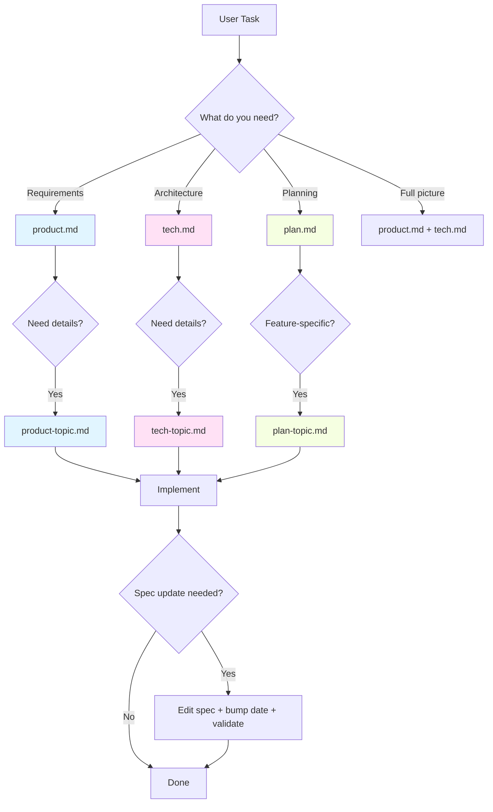
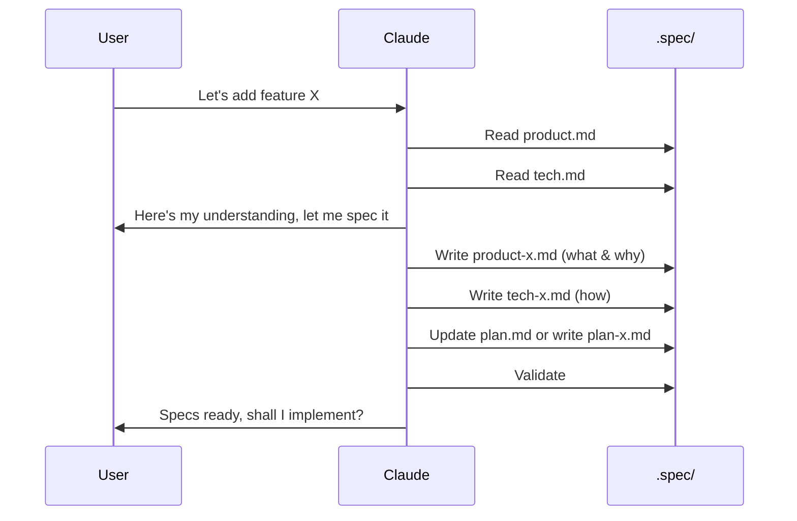

# Spec Skill — Design Documentation System

> **For humans:** This README explains how the spec skill works. Claude reads SKILL.md instead.

## What This Skill Does

The **spec** skill teaches agents to write and maintain design documentation in `.spec/`. It enforces a strict separation between product requirements (what & why) and technical implementation (how), and provides a structured workflow for going from idea to implementation plan.

## Quick Start

```bash
# Initialize .spec/ in your project
/spec setup

# Navigate specs
/spec product          # Load product requirements
/spec tech             # Load technical docs
/spec plan             # Load implementation plan

# Maintenance
/spec validate         # Check consistency
```

## The Spec Writing Workflow

Specs are written in a deliberate order. Each layer builds on the one before it:

```
Step 1:  product.md          — WHAT and WHY (the big picture)
           |
Step 2:  tech.md             — HOW (architecture, stack, patterns)
           |
Step 3:  product-{topic}.md  — Product branch docs (write product first...)
         tech-{topic}.md     — ...then matching tech branch doc
           |
Step 4:  plan.md             — Overall implementation roadmap
           |
Step 5:  plan-{topic}.md     — Feature sub-plans (optional)
```

**Why this order matters:**
- You can't define HOW until you know WHAT
- You can't deep-dive into features until the big picture exists
- You can't plan implementation until product and tech specs are written
- Sub-plans reference both the main plan and their feature's product/tech specs

## Directory Structure

```
.spec/
├── product.md                  # Entrypoint: product requirements
├── tech.md                     # Entrypoint: technical design
├── plan.md                     # Entrypoint: implementation roadmap
├── product-{topic}.md          # Product branch docs
├── tech-{topic}.md             # Tech branch docs
└── plan-{topic}.md             # Feature sub-plans (optional)
```

## File Naming Rules

Entrypoints: `product.md`, `tech.md`, `plan.md` (fixed names).

Branch docs: `{area}-{topic}.md`

- **area:** `product`, `tech`, or `plan`
- **topic:** lowercase-with-hyphens, short and semantic

### Examples
- `product-design.md` — UI/UX design decisions
- `tech-infrastructure.md` — infra and build setup
- `plan-editor.md` — editor feature sub-plan

## Mental Model



## Key Principles

### 1. Strict Separation

**Product specs** (what & why):
- No code, not even pseudocode
- No implementation details
- Describe user experience and requirements

**Tech specs** (how):
- Code examples welcome
- Implementation details and architecture
- Reference product specs for the "why"

**Plans** (when & in what order):
- No code — that's what tech specs are for
- No UX decisions — that's what product specs are for
- Milestones, tasks, validation criteria, progress tracking

### 2. Progressive Disclosure

- **Always** read entrypoints first
- **Never** load all specs at once
- Branch docs assume you've read the parent

### 3. Plans at Two Levels

- **`plan.md`** covers the whole project: all milestones, critical path, overall progress
- **`plan-{topic}.md`** covers one feature area: scoped milestones, feature-specific progress
- Sub-plans exist when a feature is complex enough to need its own breakdown (3+ milestones)
- The main plan references sub-plans but doesn't duplicate their detail

## Workflow Examples

### Starting a New Project

```bash
# 1. Initialize
/spec setup

# 2. Write product.md first (what & why)
# 3. Write tech.md (how)
# 4. Write branch docs for major features (product branch first, then tech branch)
# 5. Write plan.md (implementation roadmap)
# 6. Write plan-{topic}.md for complex features (optional)
# 7. Validate
/spec validate
```

### Starting a New Feature



### Resolving a Design Question


## Validation

The validation script checks:
- Frontmatter structure (type, parent, scope, covers, updated)
- Naming conventions (`{area}-{topic}.md`)
- Broken internal links
- Orphaned children (listed but missing)

```bash
bash ~/.agents/skills/spec/scripts/validate.sh
```

## References

- **Writing product specs:** `reference/product.md`
- **Writing tech specs:** `reference/tech.md`
- **Writing plans:** `reference/plan.md`
- **Templates:** `reference/templates/`
  - `product.md` — product entrypoint
  - `tech.md` — tech entrypoint
  - `plan.md` — plan entrypoint
  - `product-xxx.md` — product branch
  - `tech-xxx.md` — tech branch
  - `plan-xxx.md` — feature sub-plan
- **Scripts:** `scripts/`
  - `setup.sh` — initialize `.spec/` in a project
  - `validate.sh` — validate spec consistency
  - `list-specs.sh` — list all spec files

## FAQ

**Q: Can I have code in product specs?**
No. Product specs describe **what** and **why**, never **how**.

**Q: When should I create a sub-plan?**
When a feature has 3+ milestones of its own and would bloat the main plan with detail. If it fits in one milestone, keep it in `plan.md`.

**Q: What order do I write specs in?**
Product first, then tech, then branch docs (product branch first, then matching tech branch for each), then plan, then sub-plans. Each layer builds on the previous.

**Q: How do I know if I should update vs create?**
- **Update:** Adding to an existing feature or changing details
- **Create:** New feature area needs its own dedicated spec (100+ lines of detail)

**Q: Do I need a sub-plan for every feature?**
No. Most features are fine as milestones in the main plan. Sub-plans are for complex features with 3+ milestones that need their own breakdown and progress tracking.

---
