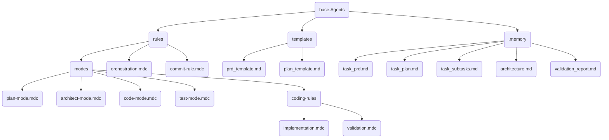
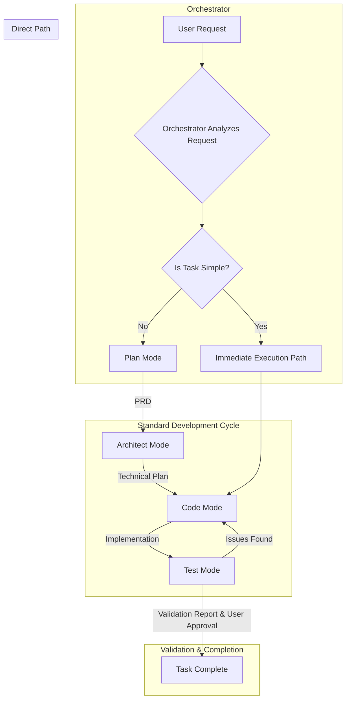

# Base.Agents: An AI-Driven Software Development Framework

Welcome to Base.Agents, a structured, multi-agent framework designed to guide an AI through the software development lifecycle with precision, efficiency, and clarity. This system uses a series of rules and modes to transform user requests into production-ready code.

The core philosophy is to combine a robust, systematic process for complex features with a pragmatic, "immediate execution" path for simple tasks, ensuring that the level of process always matches the complexity of the work.

## Framework Structure

The framework is organized into a clear, machine-readable structure. The rules (`.mdc` files) are designed to be parsed and executed by an AI agent, while the templates provide a consistent format for key documents.

## Development Process

The framework enforces a structured, multi-mode development process, orchestrated by a central decision-making agent. The process is designed to be both thorough and efficient.

### The Modes

1.  **Orchestrator (`orchestration.mdc`)**: The central "brain" of the system. It analyzes every user request and decides the most efficient path forward.
2.  **Plan Mode (`plan-mode.mdc`)**: The requirements engineering phase. Its job is to eliminate ambiguity and produce a comprehensive Product Requirements Document (PRD).
3.  **Architect Mode (`architect-mode.mdc`)**: The system design phase. It translates the PRD into a detailed technical blueprint and an implementation plan.
4.  **Code Mode (`code-mode.mdc`)**: The implementation phase. It follows the architectural plan to write clean, validated code, one step at a time.
5.  **Test Mode (`test-mode.mdc`)**: The final quality assurance phase. It validates the completed work against the original PRD, handles final documentation, and secures user approval.

### The "Immediate Execution" Bypass

A key feature of this framework is the orchestrator's ability to bypass the Plan and Architect modes for simple, low-risk tasks (e.g., fixing a typo, changing a color). This ensures that trivial changes are handled efficiently without unnecessary process overhead, while complex features receive the structured attention they require.
