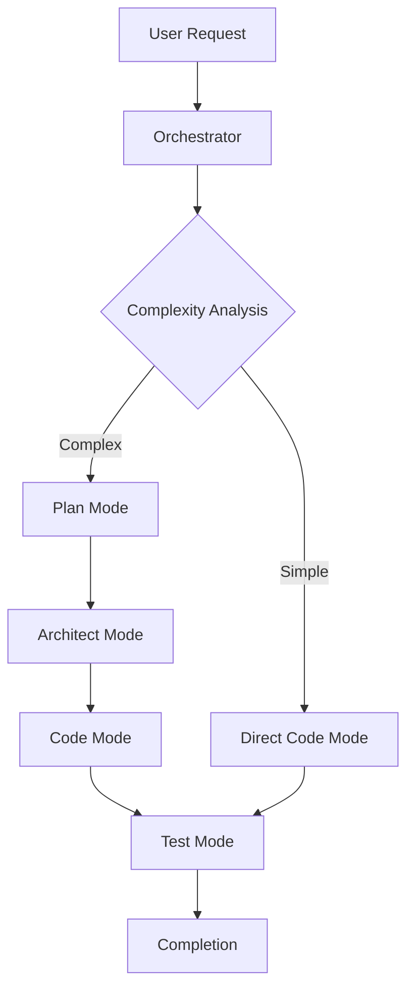

# System Architecture

## Current Architecture Overview

### Unified Monorepo Structure
```
agentkit/
├── app/                   # Website (Next.js)
├── components/            # Shared React components
├── packages/
│   ├── cli/              # CLI package
│   ├── registry/         # AgentKit registry
│   └── core/             # Shared utilities
├── docs/                 # Documentation site
└── .memory/              # Agent memory files
```

## Component Architecture

### Frontend (Website)
- **Pattern**: Component composition with Radix UI primitives
- **State**: React hooks + Context API
- **Routing**: Next.js App Router
- **Styling**: Tailwind CSS with component variants
- **Theme**: System preference detection with toggle

### CLI System
- **Pattern**: Command pattern with Commander.js
- **Operations**: File system operations + Git integration
- **User Interface**: Terminal prompts with ora spinners
- **Distribution**: npm package with binary

### AgentKit System

#### Multi-Mode Framework


#### Memory Management
- **Global Context**: `tech.md`, `brief.md`, `architecture.md`
- **Task Context**: `task_prd.md`, `task_plan.md`, `task_subtasks.md`
- **Lifecycle**: Create → Update → Clear after completion

## Data Flow

### CLI Installation Flow
1. **Detection**: Verify Git repository
2. **Selection**: Choose AgentKit
3. **Installation**: Copy files to `.cursor/` directory
4. **Configuration**: Set up memory structure
5. **Validation**: Confirm successful installation

### Agent Operation Flow
1. **Request Analysis**: Orchestrator evaluates complexity
2. **Mode Selection**: Route to appropriate mode
3. **Context Loading**: Read memory files
4. **Execution**: Follow mode-specific protocols
5. **Memory Update**: Persist state changes

## Integration Points

### Website ↔ CLI
- **Documentation**: Website showcases CLI commands
- **Examples**: Live demos of agent installations
- **Updates**: CLI version sync with website

### AgentKits ↔ Memory
- **Templates**: Provide structure for memory files
- **Rules**: Define behavior patterns
- **Validation**: Ensure memory consistency

## Security Considerations

### CLI Security
- **File Operations**: Validate paths and permissions
- **Git Integration**: Read-only repository detection
- **User Prompts**: Confirm destructive operations

### Agent Security
- **Memory Isolation**: Task-specific file separation
- **Command Validation**: Sanitize user inputs
- **File Access**: Restrict to project directories

## Performance Characteristics

### Website Performance
- **Loading**: Sub-200ms TTFB target
- **Bundling**: Code splitting by route
- **Caching**: Static generation for docs

### CLI Performance
- **Installation**: <30s for typical AgentKit
- **Detection**: <1s for Git operations
- **Feedback**: Real-time progress indicators

## Scalability Design

### AgentKit Distribution
- **Registry**: Centralized AgentKit definitions
- **Versioning**: Semantic versioning for AgentKits
- **Caching**: Local AgentKit cache for faster installs

### Memory Management
- **File Size**: Limit memory files to reasonable sizes
- **Cleanup**: Automatic task context cleanup
- **Backup**: Version control integration

## Error Handling Strategy

### CLI Errors
- **Graceful Degradation**: Continue where possible
- **User Guidance**: Clear error messages with solutions
- **Recovery**: Automatic rollback on failures

### Agent Errors
- **Mode Isolation**: Errors don't cascade between modes
- **Memory Recovery**: Restore from last known good state
- **User Notification**: Clear failure explanations

## Monitoring & Observability

### Website Metrics
- **Core Web Vitals**: Performance tracking
- **User Analytics**: Usage patterns
- **Error Tracking**: Runtime error monitoring

### CLI Metrics
- **Installation Success**: Track completion rates
- **Usage Patterns**: Popular AgentKits and features
- **Error Rates**: Common failure points

## Future Architecture Considerations

### Extensibility
- **Plugin System**: Third-party AgentKits
- **Custom Rules**: User-defined behaviors
- **Integration APIs**: External tool connections

### Distribution
- **CDN**: Global AgentKit distribution
- **Offline**: Local development support
- **Enterprise**: Private AgentKit registries 