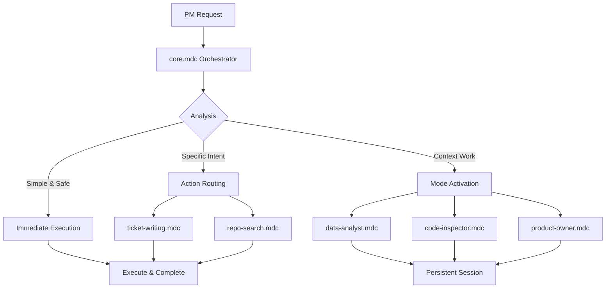

# System Architecture

## Reference Implementation: fl-ai-toolbox

The fl-ai-toolbox repository provides a proven, working implementation of a PM AI workspace in Cursor. Understanding its architecture informs PM Canvas design.

### fl-ai-toolbox Architecture
```
fl-ai-toolbox/
├── .cursor/rules/         # The "Brain" - Orchestration & Modes
│   ├── core.mdc           # Always-on orchestrator
│   ├── index.mdc          # Central rule index
│   ├── setup.mdc          # Environment verification
│   ├── actions/           # Discrete tasks
│   │   ├── ticket-writing.mdc
│   │   └── repo-search.mdc
│   ├── modes/             # Persistent behaviors
│   │   ├── data-analyst.mdc
│   │   ├── code-inspector.mdc
│   │   └── product-owner.mdc
│   └── repositories/      # Per-repo context rules
├── .memory/              # Temporary session context (gitignored)
│   ├── README.md          # Memory system docs
│   ├── prd.md             # Product requirements
│   ├── design_doc.md      # Technical design
│   ├── brief.md           # Project context
│   └── architecture.md    # System architecture
├── workspaces/           # Active work areas
│   ├── projects/          # Project-specific work
│   ├── analysis/          # Data analysis
│   └── code-research/     # Code investigation
├── knowledge/            # Domain knowledge base
│   ├── GLOSSARY.md        # Terminology
│   └── components.md      # Business concepts
├── repositories/         # Code access (git submodules)
├── tools/                # MCP implementations
└── Taskfile.yml          # Automation & setup
```

**Key Architectural Patterns from fl-ai-toolbox:**

1. **Intelligent Orchestration**
   - `core.mdc` analyzes every request
   - Routes to Actions (discrete tasks) or Modes (persistent behaviors)
   - Immediate execution for simple, safe tasks

2. **Action/Mode Distinction**
   - **Actions**: What to do (e.g., create Jira ticket)
   - **Modes**: How to behave (e.g., think like data analyst)

3. **Context-Aware Routing**
   - Folder-based activation (workspaces/analysis/ → data-analyst mode)
   - Intent detection ("create ticket" → ticket-writing action)
   - Automatic mode switching

4. **Memory System**
   - Temporary, local-only (.gitignored)
   - Read at session start
   - Updated during task execution
   - Cleared after completion

5. **MCP Integration Layer**
   - Bridges to external tools (Jira, Confluence, MySQL)
   - Configured via .cursor/mcp.json
   - Error handling and fallback modes

### PM Canvas Target Architecture
Building on fl-ai-toolbox learnings, PM Canvas provides:

```
pm-canvas/
├── .cursor/              # Cursor-specific rules
│   └── rules/            # (Based on fl-ai-toolbox patterns)
├── .warp/               # Warp-specific rules (future)
├── .claude/             # Claude-specific rules (future)
├── templates/           # Generalized PM templates
│   ├── prd/
│   ├── user-stories/
│   ├── specs/
│   └── roadmaps/
├── workflows/          # PM workflow guides
├── knowledge/          # Knowledge base template
├── workspaces/         # Work area template
├── app/               # Documentation website
├── components/        # Website components
└── docs/             # User guides
```

**Purpose:** Multi-platform PM workspace template & documentation
**Target Audience:** PMs using Cursor, Warp, Claude, or similar AI tools
**Key Asset:** Platform-agnostic patterns from proven implementation
- **Pattern**: Command pattern with Commander.js
- **Operations**: File system operations + Git integration
- **User Interface**: Terminal prompts with ora spinners
- **Distribution**: npm package with binary

### PM Workflow System (from fl-ai-toolbox)

#### Orchestration Flow


#### Memory Management (fl-ai-toolbox Pattern)
**Core Memory Files:**
- `prd.md` - Product requirements and clusters
- `design_doc.md` - Technical design and architecture
- `brief.md` - Project context and current status
- `architecture.md` - System diagrams (optional)

**Lifecycle:**
1. Read at session start (mandatory)
2. Update only when scope/architecture changes significantly
3. Never committed to git (.gitignored)
4. Cleared/archived after project completion

**PM Canvas Adaptation:**
- More flexible memory structure for different PM use cases
- Optional templates for common memory file types
- Clear guidance on when to update vs. archive

## Data Flow

### Workspace Initialization Flow
1. **Clone/Fork**: PM clones PM Canvas repository template
2. **Customization**: Configure for specific product/project
3. **Context Setup**: Initialize `.memory/` with product context
4. **Agent Configuration**: Customize `.cursor/` rules for team
5. **First Use**: Generate first template document

### PM-AI Collaboration Flow
1. **Intent Expression**: PM describes desired output/task
2. **Context Loading**: AI loads product context from memory
3. **Template Selection**: Choose appropriate template
4. **Generation**: AI creates initial draft using template
5. **Refinement**: Iterative improvement with PM feedback
6. **Finalization**: Export/commit finalized document
7. **Memory Update**: Update context with new decisions

## Integration Points

### Website ↔ Repository Template
- **Documentation**: Website explains workspace usage
- **Examples**: Live demos of PM workflows
- **Templates**: Showcase available document templates
- **Community**: Share contributed templates and patterns

### Templates ↔ Memory
- **Context Injection**: Templates pull from memory files
- **Consistency**: Ensure terminology alignment
- **Updates**: Memory reflects template outputs

## Security Considerations

### CLI Security
- **File Operations**: Validate paths and permissions
- **Git Integration**: Read-only repository detection
- **User Prompts**: Confirm destructive operations

### Agent Security
- **Memory Isolation**: Task-specific file separation
- **Command Validation**: Sanitize user inputs
- **File Access**: Restrict to project directories

## Performance Characteristics

### Website Performance
- **Loading**: Sub-200ms TTFB target
- **Bundling**: Code splitting by route
- **Caching**: Static generation for docs

### CLI Performance
- **Installation**: <30s for typical AgentKit
- **Detection**: <1s for Git operations
- **Feedback**: Real-time progress indicators

## Scalability Design

### AgentKit Distribution
- **Registry**: Centralized AgentKit definitions
- **Versioning**: Semantic versioning for AgentKits
- **Caching**: Local AgentKit cache for faster installs

### Memory Management
- **File Size**: Limit memory files to reasonable sizes
- **Cleanup**: Automatic task context cleanup
- **Backup**: Version control integration

## Error Handling Strategy

### CLI Errors
- **Graceful Degradation**: Continue where possible
- **User Guidance**: Clear error messages with solutions
- **Recovery**: Automatic rollback on failures

### Agent Errors
- **Mode Isolation**: Errors don't cascade between modes
- **Memory Recovery**: Restore from last known good state
- **User Notification**: Clear failure explanations

## Monitoring & Observability

### Website Metrics
- **Core Web Vitals**: Performance tracking
- **User Analytics**: Usage patterns
- **Error Tracking**: Runtime error monitoring

### CLI Metrics
- **Installation Success**: Track completion rates
- **Usage Patterns**: Popular AgentKits and features
- **Error Rates**: Common failure points

## Future Architecture Considerations

### Extensibility
- **Template Marketplace**: Community-contributed templates
- **Custom Workflows**: Team-specific processes
- **Integration APIs**: PM tools (Jira, Linear, Notion, etc.)
- **CLI Utilities**: Workspace management commands

### Distribution
- **GitHub Template**: Easy repository initialization
- **Version Control**: Template versioning and updates
- **Enterprise**: Private template repositories
- **Marketplace**: Public template sharing platform
