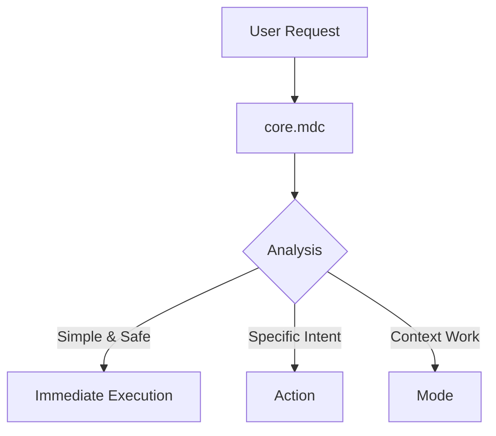

# fl-ai-toolbox Analysis & PM Canvas Direction

## Executive Summary

After analyzing the fl-ai-toolbox repository (`/Users/lennard.zuendorf/dev/fl-ai-toolbox/`), we've discovered that **most of the PM workspace vision has already been implemented** as a working Cursor workspace. This significantly changes PM Canvas's direction from "building a new PM workspace" to "documenting and generalizing proven patterns."

## What fl-ai-toolbox Has Built

### Architecture Components

**1. Intelligent Orchestration System**
- `core.mdc` - Always-on orchestrator that analyzes every request
- `index.mdc` - Central rule index mapping folders and intents to rules
- `setup.mdc` - Environment verification on session start
- Routing logic: Simple tasks → immediate execution, specific intents → actions, context work → modes

**2. Action/Mode System**
- **Actions** (discrete tasks): `ticket-writing.mdc`, `repo-search.mdc`
- **Modes** (persistent behaviors): `data-analyst.mdc`, `code-inspector.mdc`, `product-owner.mdc`
- Clear distinction between "what to do" vs "how to behave"

**3. Memory Management**
- `.memory/` directory (gitignored, temporary)
- Core files: `prd.md`, `design_doc.md`, `brief.md`, `architecture.md`
- Lifecycle: Read at session start → Update during work → Clear after completion
- Template files available for initialization

**4. Workspace Organization**
```
workspaces/
├── projects/       # Project-specific work
├── analysis/       # Data analysis (auto-activates data-analyst mode)
└── code-research/  # Code investigation (auto-activates code-inspector mode)
```

**5. Knowledge Base**
```
knowledge/
├── GLOSSARY.md     # Domain terminology (aviation/flight booking)
├── components.md   # Business concepts
└── ...             # Additional domain docs
```

**6. MCP Integration**
- Jira Cloud integration (create/update tickets)
- Confluence integration (documentation)
- MySQL integration (database queries)
- Configured via `.cursor/mcp.json`

**7. Repository Management**
- Git submodules for code access (`repositories/`)
- Per-repository context rules (`.cursor/rules/repositories/<repo-name>.mdc`)
- Repository search actions

**8. Automation**
- `Taskfile.yml` for setup and maintenance
- Modular, agent-callable commands
- Environment management

## Key Architectural Insights

### Pattern: Intelligent Orchestration


**Learning**: The orchestration layer is the "brain" that makes the workspace intelligent. It prevents analysis paralysis on simple tasks while ensuring complex work gets proper structure.

### Pattern: Action vs Mode
- **Actions**: One-off tasks with specific outputs (create Jira ticket, search code)
- **Modes**: Sustained behavioral states (think like data analyst, act like PM)
- **Why it matters**: Clarifies when to be task-focused vs. context-aware

### Pattern: Context-Aware Routing
- Folder location hints at intent (`workspaces/analysis/` → data analyst)
- Keywords trigger actions ("create ticket" → ticket-writing)
- Automatic but overridable by user

### Pattern: Memory as Session Context
- NOT project documentation (that goes in knowledge/)
- NOT permanent (gitignored)
- Current work context only
- Cleared when task complete

### Pattern: Opinionated Structure
- Enforces workflow through folder organization
- Reduces decision fatigue
- Provides "rails" for AI to stay on track

## What This Means for PM Canvas

### New Strategic Direction

**Previous Vision**: Build a complete PM workspace template
**New Reality**: fl-ai-toolbox has already built this for Cursor
**Updated Direction**: Document, generalize, and expand the proven patterns

### PM Canvas Role

**1. Documentation Hub**
- Explain fl-ai-toolbox architecture
- Document orchestration patterns
- Provide implementation guides
- Share best practices

**2. Multi-Platform Support**
- Cursor (reference fl-ai-toolbox)
- Warp (create equivalent patterns)
- Claude (adapt for Claude Projects)
- Other AI assistants

**3. Generalized Templates**
- Industry-agnostic (not aviation-specific)
- Common PM deliverables (PRDs, specs, roadmaps)
- Workflow guides (discovery, planning, delivery)
- Starter templates

**4. Community Framework**
- Contribution guidelines
- Template sharing
- Pattern discussions
- Use case examples

### What PM Canvas Borrows from fl-ai-toolbox

✅ **Architecture Patterns**
- Orchestration approach
- Action/Mode distinction
- Memory file structure
- Workspace organization
- Knowledge base concept

✅ **Proven Workflows**
- Session initialization
- Context loading
- Mode switching
- MCP integration patterns

✅ **File Structures**
- `.memory/` organization
- Rule file organization
- Workspace folder patterns

### What PM Canvas Adds

🆕 **Cross-Platform Support**
- Not just Cursor
- Warp-specific implementations
- Claude-specific patterns
- Platform comparison guides

🆕 **Simplified Onboarding**
- Less opinionated
- More configurable
- Clearer documentation
- Step-by-step guides

🆕 **Community Ecosystem**
- Template marketplace
- Contribution framework
- Use case showcase
- Community discussions

🆕 **Documentation Website**
- Visual guides
- Interactive examples
- Pattern library
- Best practices

## Relationship Between Projects

| Aspect | fl-ai-toolbox | PM Canvas |
|--------|---------------|-----------|
| **Status** | Working implementation | Documentation + templates |
| **Platform** | Cursor only | Multi-platform |
| **Industry** | Aviation/flight booking | Industry-agnostic |
| **Scope** | Personal workspace | Community ecosystem |
| **Complexity** | Full-featured, opinionated | Simplified, flexible |
| **MCP** | Configured (Jira, Confluence, MySQL) | Patterns/examples only |
| **Knowledge** | Domain-specific | Generic structure |
| **Audience** | Single user/team | Broad PM community |

## Synergy Opportunities

**1. Pattern Extraction**
- Document fl-ai-toolbox's orchestration in PM Canvas
- Create architecture guides
- Explain decision rationale

**2. Cross-Reference**
- PM Canvas docs link to fl-ai-toolbox as reference
- fl-ai-toolbox users discover PM Canvas for multi-platform support
- Shared learnings flow both directions

**3. Template Abstraction**
- Generalize fl-ai-toolbox templates
- Remove aviation-specific elements
- Create industry-agnostic versions

**4. Platform Adaptation**
- Use fl-ai-toolbox Cursor implementation as baseline
- Create equivalent Warp implementation
- Develop Claude Projects version
- Document platform differences

**5. Continuous Learning**
- fl-ai-toolbox improvements inform PM Canvas updates
- PM Canvas community feedback influences fl-ai-toolbox
- Shared evolution

## Implementation Implications for PM Canvas

### Phase 0: Understanding (COMPLETE)
✅ Analyzed fl-ai-toolbox architecture
✅ Documented key patterns
✅ Updated PM Canvas memory files
✅ Revised restructuring plan

### Updated Phase 1: Pattern Documentation
Instead of building from scratch, focus on:
1. Document fl-ai-toolbox orchestration patterns
2. Create `patterns/` directory with architectural guides
3. Extract and generalize templates
4. Create simplified starter based on fl-ai-toolbox

### Updated Phase 2: Multi-Platform Starters
1. Create `starters/cursor/` based on fl-ai-toolbox
2. Develop `starters/warp/` equivalent
3. Design `starters/claude/` adaptation
4. Document platform-specific considerations

### Updated Phase 3: Documentation & Community
1. Build documentation website
2. Create getting started guides
3. Establish contribution framework
4. Launch community

## Key Takeaways

1. **Don't Rebuild**: fl-ai-toolbox works. Document and extend it instead.

2. **Focus on Generalization**: The real value is making these patterns accessible across platforms and industries.

3. **Documentation First**: The architecture is proven. Clear explanation is what's needed.

4. **Community Building**: Enable others to benefit from and contribute to the patterns.

5. **Cross-Platform Support**: Cursor is one tool. Many PMs use Warp, Claude, etc.

6. **Complementary Projects**: fl-ai-toolbox and PM Canvas can coexist and strengthen each other.

## Next Steps

1. ✅ Update memory files (COMPLETE)
2. ✅ Update WARP.md (COMPLETE)
3. ✅ Update restructuring plan (COMPLETE)
4. Create `patterns/` directory with fl-ai-toolbox pattern documentation
5. Extract key patterns: orchestration.md, actions-modes.md, memory-system.md, mcp-integration.md
6. Create simplified Cursor starter based on fl-ai-toolbox
7. Begin Warp-specific implementation
8. Update website with new direction

## Questions for Decision

1. **Relationship**: Should PM Canvas explicitly reference fl-ai-toolbox, or abstract it?
   - Recommendation: Explicit reference as "reference implementation"

2. **Cursor Starter**: Should we copy fl-ai-toolbox structure or create simplified version?
   - Recommendation: Simplified version with clear documentation pointing to fl-ai-toolbox for advanced users

3. **Platform Priority**: Which platform to focus on after Cursor?
   - Recommendation: Warp (since you're using it now)

4. **MCP Integration**: Include actual MCP configs or just patterns?
   - Recommendation: Patterns only, with links to actual implementations

5. **Branding**: Keep "PM Canvas" or rename to reflect documentation focus?
   - Recommendation: Keep "PM Canvas" but clarify positioning as "Documentation & Templates"
