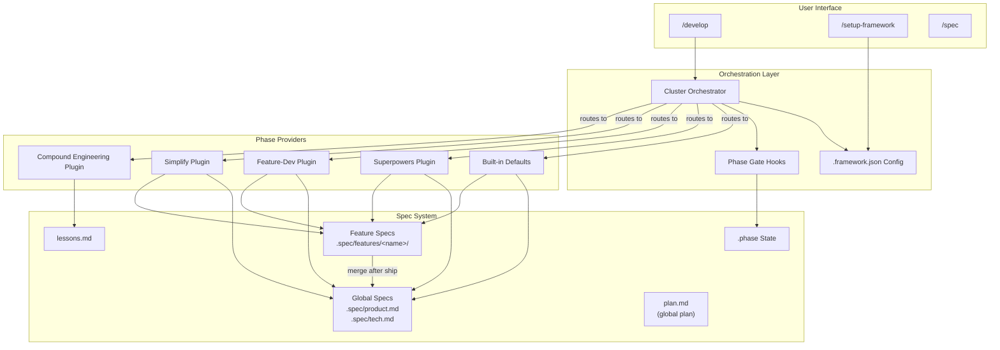
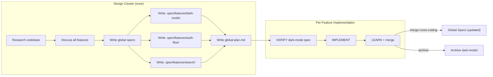
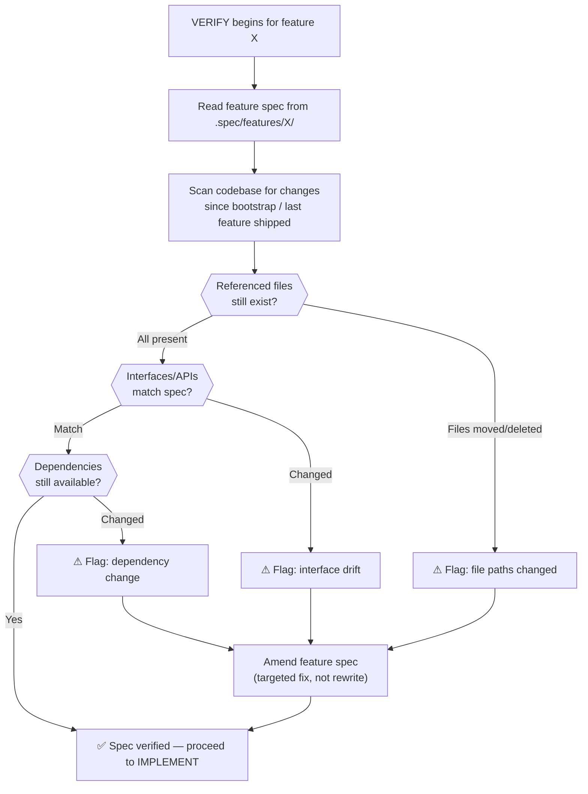
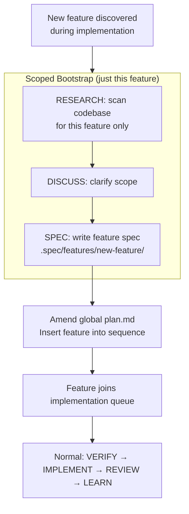
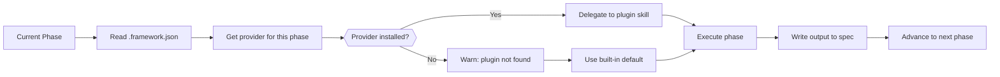
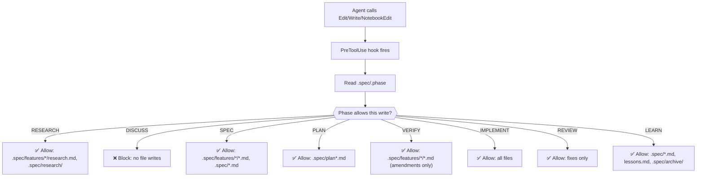
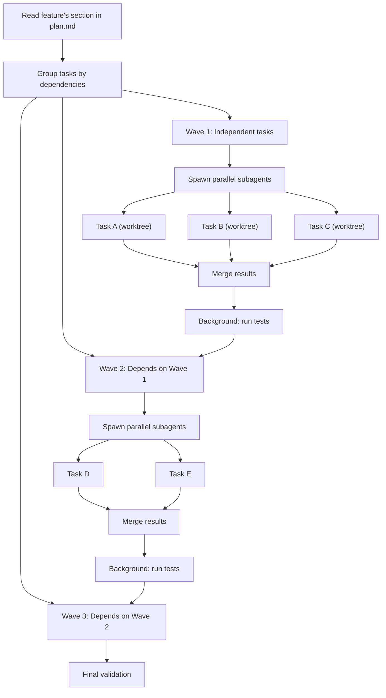
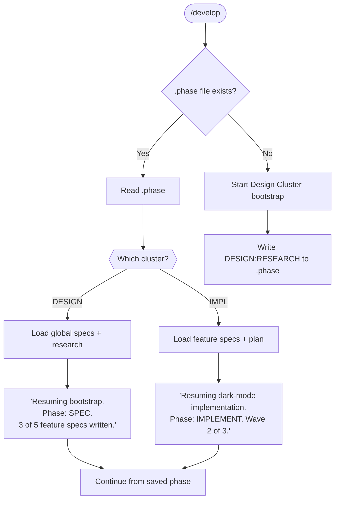
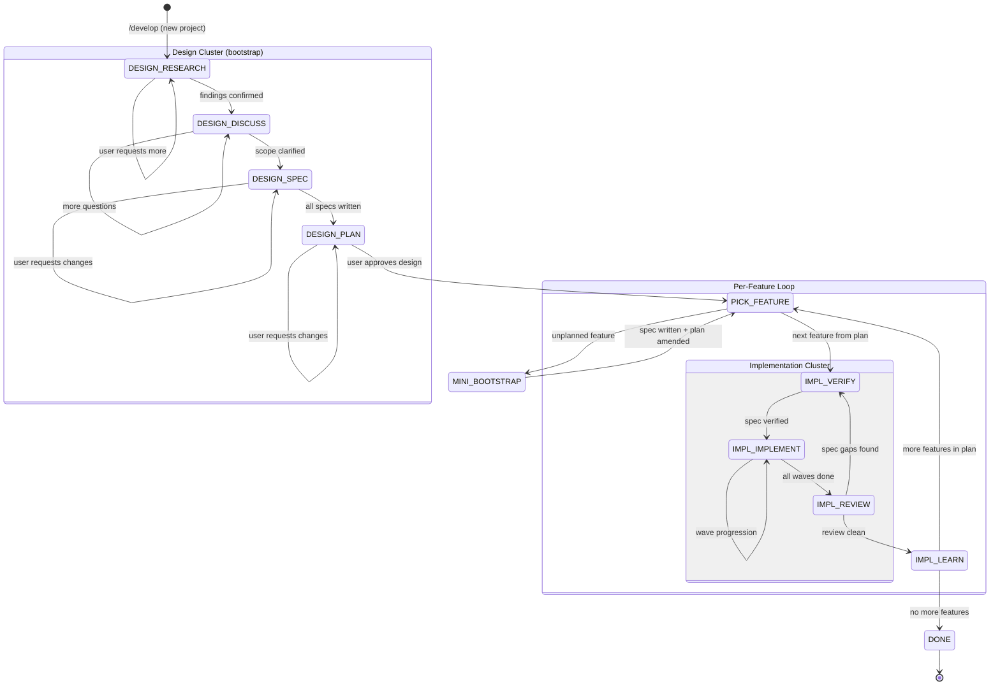

# Engineering Agent — Functional Design

**Parent:** [product.md](product.md)

This document describes the functional design of the engineering agent framework: how the two clusters work at different cadences, how global and feature specs interact, and how plugins integrate.

---

## System Overview



---

## Core Workflow: `/develop`

The lifecycle runs at two cadences. The Design Cluster runs **once** as a project bootstrap. The Implementation Cluster runs **per feature** from the global plan.

```mermaid
flowchart TD
    START(["/develop"]) --> CHECK_PHASE{".phase exists?"}
    CHECK_PHASE -->|No| BOOTSTRAP
    CHECK_PHASE -->|Yes| RESUME["Resume from saved phase"]

    subgraph BOOTSTRAP ["DESIGN CLUSTER — Project Bootstrap (runs once)"]
        direction TB

        RESEARCH["RESEARCH"] --> R1["Read lessons.md + existing global specs"]
        R1 --> R2["Spawn parallel Explore agents on full codebase"]
        R2 --> R3["Write findings to .spec/research/"]
        R3 --> R4["Present findings"]

        R4 --> DISCUSS["DISCUSS"]
        DISCUSS --> D1["Surface ambiguities across ALL features"]
        D1 --> D2["Clarify scope, priorities, constraints"]
        D2 --> D3["Align on architecture and approach"]

        D3 --> SPEC["SPEC"]
        SPEC --> S1["Write/update global product.md + tech.md"]
        S1 --> S2["For each known feature:"]
        S2 --> S3["Create .spec/features/&lt;name&gt;/product.md"]
        S3 --> S4["Create .spec/features/&lt;name&gt;/tech.md"]
        S4 --> S5["Validate all specs"]

        S5 --> PLAN["PLAN"]
        PLAN --> P1["Read all feature specs"]
        P1 --> P2["Sequence features by dependency"]
        P2 --> P3["Group tasks into waves per feature"]
        P3 --> P4["Write global plan.md"]
    end

    P4 --> DESIGN_GATE{{"User approves design?"}}
    DESIGN_GATE -->|No| RESEARCH
    DESIGN_GATE -->|Yes| NEXT_FEATURE

    NEXT_FEATURE["Pick next feature from plan"] --> IMPL_CLUSTER

    subgraph IMPL_CLUSTER ["IMPLEMENTATION CLUSTER — Per Feature (repeats)"]
        direction TB

        VERIFY["VERIFY"] --> V1["Scan codebase against feature spec"]
        V1 --> V2{{"Spec still valid?"}}
        V2 -->|Yes| V3["Confirm: ready to implement"]
        V2 -->|Drift detected| V4["Flag changes, amend spec"]
        V4 --> V3

        V3 --> IMPLEMENT["IMPLEMENT"]
        IMPLEMENT --> I1["Execute wave N"]
        I1 --> I2["Run tests in background"]
        I2 --> I3{{"More waves?"}}
        I3 -->|Yes| I1
        I3 -->|No| I4["All tasks complete"]

        I4 --> REVIEW["REVIEW"]
        REVIEW --> RV1["Goal-backward verification"]
        RV1 --> RV2["Run test suite"]
        RV2 --> RV3["Run /simplify"]
        RV3 --> RV4["Self-review checklist"]

        RV4 --> LEARN["LEARN"]
        LEARN --> L1["Extract session learnings"]
        L1 --> L2["Update lessons.md"]
        L2 --> L3["Prune stale lessons"]
        L3 --> L4["Merge feature spec → global specs"]
        L4 --> L5["Archive feature spec directory"]
    end

    RV4 -->|"Spec gaps found"| V1
    L5 --> MORE{{"More features in plan?"}}
    MORE -->|Yes| NEXT_FEATURE
    MORE -->|No| DONE([ALL DONE])
```



---

## The Two Cadences

| Aspect | Design Cluster | Implementation Cluster |
|--------|---------------|----------------------|
| **When** | Once at project start | Once per feature |
| **Duration** | Heavy — may span sessions | Lightweight — mostly autonomous |
| **User involvement** | High — user drives every decision | Low — user approves at start and end |
| **Scope** | Entire project: all features, architecture, conventions | Single feature from the plan |
| **Outputs** | Global specs, all feature specs, global plan | Working code, merged specs, archived feature |
| **Repeats?** | No (unless triggered by unplanned feature) | Yes, for each feature in the plan |

### The Rhythm

```
Session 1 (heavy):     DESIGN CLUSTER → global specs + feature specs + plan
Session 2:             Feature A: VERIFY → IMPLEMENT → REVIEW → LEARN
Session 3:             Feature B: VERIFY → IMPLEMENT → REVIEW → LEARN
Session 4:             Feature C: VERIFY → IMPLEMENT → REVIEW → LEARN
...
Session N (exception): New unplanned Feature X discovered
                       mini Design Cluster for X → amend plan → continue
Session N+1:           Feature X: VERIFY → IMPLEMENT → REVIEW → LEARN
```

---

## Global vs Feature Spec Lifecycle

How feature specs are created during bootstrap, consumed during implementation, and merged after shipping.



### Feature Spec Directory Structure

```
.spec/
├── product.md                          # GLOBAL: project-wide product spec
├── tech.md                             # GLOBAL: project-wide tech spec
├── product-design.md                   # GLOBAL: project-wide design
├── lessons.md                          # GLOBAL: accumulated learnings
├── plan.md                             # GLOBAL: sequenced roadmap for ALL features
│
├── features/                           # ALL feature specs written during bootstrap
│   ├── dark-mode/
│   │   ├── product.md                  #   What dark mode does (user experience)
│   │   ├── tech.md                     #   How dark mode is built (architecture)
│   │   └── research.md                 #   Research findings from bootstrap
│   │
│   ├── auth-flow/
│   │   ├── product.md
│   │   └── tech.md
│   │
│   └── search/
│       ├── product.md
│       └── tech.md
│
├── archive/                            # Archived feature specs (post-merge)
│   └── dark-mode/                      #   Kept for history, not loaded
│       └── ...
```

**Note:** Feature specs do NOT have their own `plan.md`. All feature implementation plans live in the global `plan.md`, sequenced across features. This prevents plan fragmentation and ensures cross-feature dependencies are visible in one place.

### What Gets Merged vs Archived

| Content | Action | Example |
|---------|--------|---------|
| **Cross-cutting architecture decisions** | Merge into `tech.md` | "We use CSS custom properties for theming" |
| **New design patterns** | Merge into `product-design.md` or `tech.md` | "Toggle components follow X pattern" |
| **Feature-specific implementation detail** | Archive only | "Dark mode uses localStorage key `theme-pref`" |
| **Lessons learned** | Already in `lessons.md` | Captured during LEARN phase |
| **Feature product requirements** | Archive only (they're done) | "Toggle appears in settings panel" |

---

## The VERIFY Phase

The key insight: **pre-implementation codebase research is necessary, but re-doing spec writing is not.** VERIFY is a quick check before each feature's implementation, not a repeat of the Design Cluster.



**What VERIFY does:**
- Reads the feature spec written during bootstrap
- Scans codebase for changes since bootstrap completed (or since the last feature shipped, which may have changed shared code)
- Checks that file paths, interfaces, and dependencies referenced in the spec still hold
- If drift is found: amends the feature spec with targeted fixes

**What VERIFY does NOT do:**
- Rewrite the product spec
- Rewrite the tech spec
- Re-run the full research phase
- Re-discuss scope with the user (unless drift is major enough to invalidate the feature)

**Why this matters between features:** Feature A's implementation may change shared code that Feature B's spec depends on. VERIFY catches this drift before Feature B starts, without requiring a full re-spec.

---

## Unplanned Feature: Exception Path

When a new feature emerges mid-project that wasn't part of the original bootstrap.



The mini Design Cluster:
- Does NOT rewrite global specs (they're already established)
- Only researches, discusses, and specs the new feature
- Amends the global plan to insert the feature at the right point in the sequence
- Then the feature follows the normal per-feature Implementation Cluster

---

## Setup Flow: `/setup-framework`

How users configure which plugins to use.


---

## Plugin Routing: How Providers Are Selected



---

## Phase Gate Enforcement

How hooks prevent premature writes. Gates enforce cluster boundaries and phase-appropriate writes.



---

## Wave-Based Implementation

How tasks are grouped and executed within the IMPLEMENT phase. Waves are scoped to a single feature — the global plan sequences features, waves sequence tasks within a feature.



---

## Session Resumption

How the framework handles interrupted work. The `.phase` file encodes cluster, phase, and current feature.



### Phase File Format

```
# .spec/.phase — encodes cluster:phase:feature
DESIGN:RESEARCH                 # Bootstrap: researching codebase
DESIGN:DISCUSS                  # Bootstrap: discussing scope
DESIGN:SPEC                     # Bootstrap: writing specs
DESIGN:PLAN                     # Bootstrap: writing global plan
IMPL:VERIFY:dark-mode           # Implementing dark-mode: verifying spec
IMPL:IMPLEMENT:dark-mode        # Implementing dark-mode: coding
IMPL:REVIEW:dark-mode           # Implementing dark-mode: reviewing
IMPL:LEARN:dark-mode            # Implementing dark-mode: learning + merging
DONE                            # All features complete
```

---

## Interaction Patterns

### Design Cluster — Heavy Bootstrap Session

The Design Cluster is a deep, collaborative session. The user and agent work through the entire project scope: all features, architecture, and constraints. This is the one heavy session.

```
User: /develop

Agent: No existing specs found. Starting project bootstrap.

  [RESEARCH] Scanning full codebase...
  → Found: React 18 + TypeScript project
  → Found: 47 components, 12 contexts, 8 API routes
  → Found: Existing design tokens in src/styles/
  → Found: No theming system, no auth, basic search
  → Patterns: Component composition, context for state, Tailwind CSS

  [DISCUSS] Let's scope the project. I see several feature areas:
  1. Dark mode / theming — no existing support
  2. Authentication — no auth system
  3. Search — basic, needs improvement
  4. Settings panel — doesn't exist yet

  Questions:
  - Which features are in scope for this round?
  - Priority order?
  - Any architectural constraints I should know?

User: All four. Priority: auth first, then settings, dark mode, search.
      Use Supabase for auth. Keep it simple.

Agent: [SPEC] Writing specs...

  Global specs:
  ✓ product.md — project vision, 4 features, design principles
  ✓ tech.md — React/TS/Supabase stack, component patterns, API layer

  Feature specs:
  ✓ .spec/features/auth/product.md — sign in/up, session, protected routes
  ✓ .spec/features/auth/tech.md — Supabase Auth, context, middleware
  ✓ .spec/features/settings/product.md — user prefs panel
  ✓ .spec/features/settings/tech.md — settings context, localStorage
  ✓ .spec/features/dark-mode/product.md — theme toggle, OS preference
  ✓ .spec/features/dark-mode/tech.md — CSS custom props, ThemeContext
  ✓ .spec/features/search/product.md — improved search UX
  ✓ .spec/features/search/tech.md — search index, debounce, filters

  [PLAN] Global implementation plan:

  Feature 1: auth (3 waves, no dependencies)
    Wave 1: Supabase client + AuthContext + sign-in page
    Wave 2: Protected routes + session management
    Wave 3: Sign-up flow + password reset

  Feature 2: settings (2 waves, depends on auth)
    Wave 1: Settings page + layout
    Wave 2: User preferences + persistence

  Feature 3: dark-mode (3 waves, depends on settings)
    Wave 1: CSS custom properties + toggle component
    Wave 2: ThemeContext + toggle wiring
    Wave 3: Component migration + OS preference

  Feature 4: search (2 waves, independent)
    Wave 1: Search index + improved query
    Wave 2: Filters + results UX

  Ready to start implementing? Any changes?

User: Looks good. Start with auth.
```

### Implementation Cluster — Per-Feature, Mostly Autonomous

Each feature gets a lightweight, mostly autonomous implementation cycle. The agent checks the spec, implements, reviews, learns, and moves on.

```
Agent: Starting auth implementation (Feature 1 of 4).

  [VERIFY] Checking auth feature spec against codebase...
  ✓ No changes since bootstrap
  ✓ Supabase dependency available
  ✓ All referenced files exist
  Spec verified.

  [IMPLEMENT]
  Wave 1: Spawning 3 parallel agents...
    ✓ Supabase client configured
    ✓ AuthContext created
    ✓ Sign-in page built
  Tests: 12 passed, 0 failed

  Wave 2: Spawning 2 parallel agents...
    ✓ Protected routes added
    ✓ Session management wired
  Tests: 18 passed, 0 failed

  Wave 3: Sign-up + password reset...
    ✓ Sign-up flow complete
    ✓ Password reset complete
  Tests: 24 passed, 0 failed

  [REVIEW] Verifying against feature spec...
  ✓ All auth requirements met
  ✓ Tests passing
  ✓ /simplify: no issues

  [LEARN]
  + Lesson: "Supabase client must be initialized before AuthContext"
  → Merged into global tech.md: Supabase auth patterns
  → Archived .spec/features/auth/

  Auth complete ✓. Moving to settings (Feature 2 of 4).

  [VERIFY] Checking settings feature spec...
  ⚠ AuthContext interface changed during auth implementation
    (added `user.preferences` field not in original settings spec)
  → Amended settings feature spec to use new field
  Spec verified.

  [IMPLEMENT] ...
```

### Unplanned Feature — Mini Bootstrap

```
User: We need to add notifications. Wasn't in the original plan.

Agent: Running mini bootstrap for notifications.

  [RESEARCH] Scanning for notification-related code...
  → No existing notification system
  → Toast component exists at src/components/Toast.tsx

  [DISCUSS] Quick questions:
  1. In-app only, or also push/email?
  2. Persistent (stored) or ephemeral (toast only)?

User: In-app toast only for now. Ephemeral.

Agent: [SPEC] Writing feature spec...
  ✓ .spec/features/notifications/product.md
  ✓ .spec/features/notifications/tech.md

  Amended plan.md: notifications inserted after current feature,
  before search (no dependencies).

  Ready to implement notifications?

User: Go.
```

---

## State Machine


