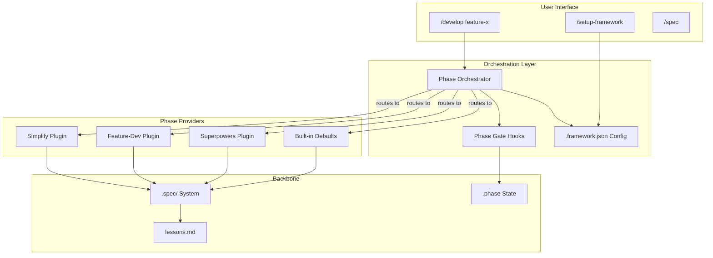
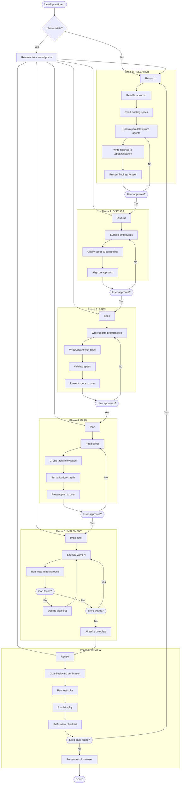
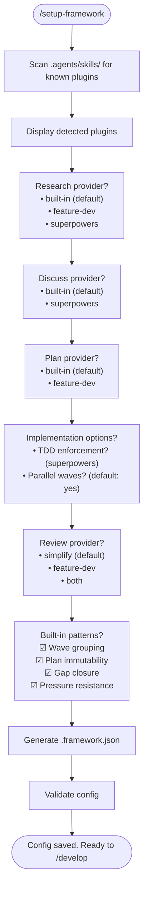
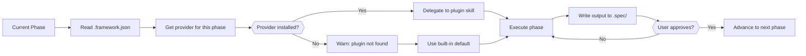
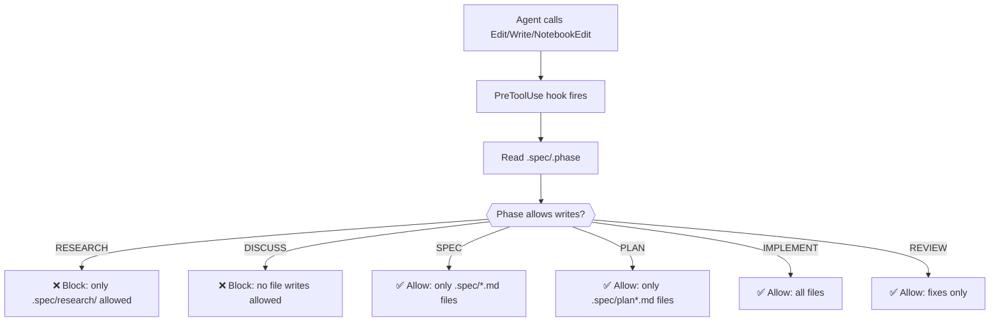
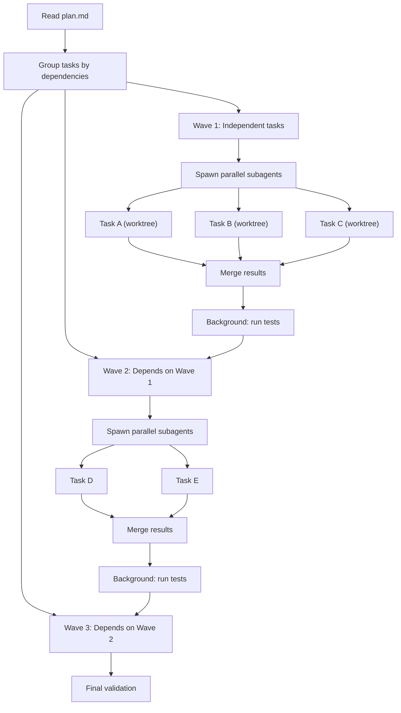
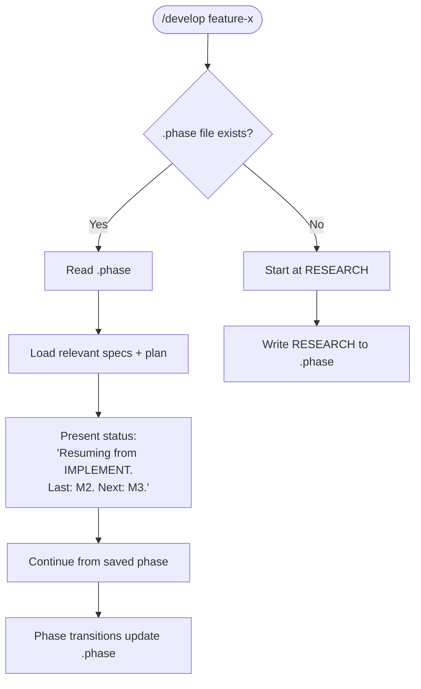
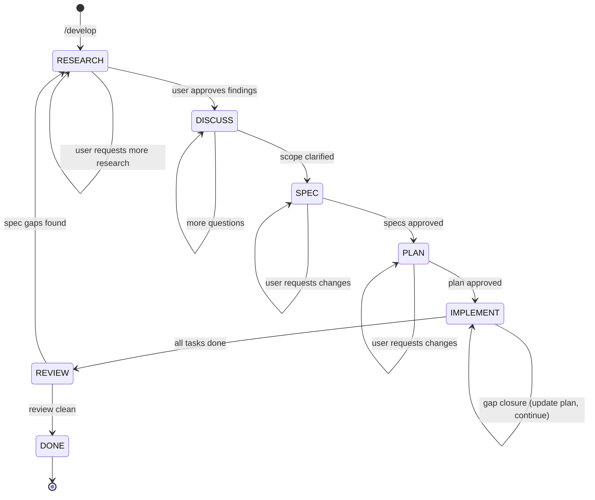

# Engineering Agent — Functional Design

**Parent:** [product.md](product.md)

This document describes the functional design of the engineering agent framework: how users interact with it, how phases flow, and how plugins integrate.

---

## System Overview



---

## Core Workflow: `/develop`

The main user flow. Everything starts with `/develop <description>`.



---

## Setup Flow: `/setup-framework`

How users configure which plugins to use.



---

## Plugin Routing: How Providers Are Selected



---

## Phase Gate Enforcement

How hooks prevent premature writes.



---

## Wave-Based Implementation

How tasks are grouped and executed within the IMPLEMENT phase.



---

## Session Resumption

How the framework handles interrupted work.



---

## Interaction Patterns Per Phase

### RESEARCH: Agent spawns research, user confirms

```
User: /develop "Add dark mode toggle"

Agent: Spawning research agents...
  → Agent 1: Searching for existing theme/color code
  → Agent 2: Searching for related tests
  → Agent 3: Searching for UI component patterns

Agent: Research complete. Here's what I found:
  **Exists:** ThemeContext at src/contexts/theme.tsx
  **Must build:** Toggle component, CSS variables, persistence
  **Risk:** Existing components use hardcoded colors (HIGH - verified)

  Does this match your understanding? Corrections?

User: Looks right, but we also need to check the design tokens file.

Agent: [updates research, re-presents]

User: Good, move on.
```

### DISCUSS: Structured clarification

```
Agent: Before I write specs, let me clarify a few things:

  1. Scope: Should dark mode apply to the entire app or just the main content area?
  2. Persistence: Local storage, user preferences API, or system preference?
  3. Transition: Instant toggle or animated transition?
  4. Default: Start in light mode, or follow OS preference?

User: Entire app, local storage, instant, follow OS.

Agent: Clear. Moving to specs.
```

### SPEC: Structured writing, user reviews

```
Agent: I've written the specs:

  product-dark-mode.md: What users see — toggle location, behavior,
    which surfaces change, accessibility requirements.

  tech-dark-mode.md: How it works — CSS custom properties, ThemeContext
    updates, localStorage key, component migration strategy.

  Specs validated ✓. Want to review them before I plan?
```

### PLAN: Wave-grouped tasks, user approves

```
Agent: Implementation plan:

  Wave 1 (independent):
    □ Add CSS custom properties for all color tokens
    □ Add dark mode toggle component
    □ Add localStorage persistence hook

  Wave 2 (depends on Wave 1):
    □ Update ThemeContext to use custom properties
    □ Wire toggle to ThemeContext

  Wave 3 (depends on Wave 2):
    □ Migrate existing components from hardcoded to token colors
    □ Add prefers-color-scheme media query

  Ready to implement? Changes?
```

---

## State Machine


