# Engineering Agent — Functional Design

**Parent:** [product.md](product.md)

This document describes the functional design of the engineering agent framework: how the two clusters work, how global and feature specs interact, and how plugins integrate.

---

## System Overview

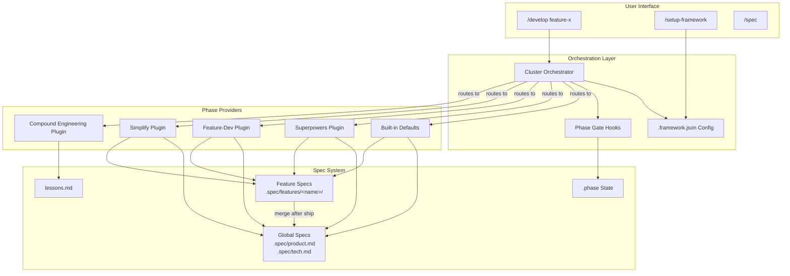

---

## Core Workflow: `/develop`

The main user flow. Two clusters with a handoff gate between them.

```mermaid
flowchart TD
    START(["/develop feature-x"]) --> CHECK_PHASE{".phase exists?"}
    CHECK_PHASE -->|No| DESIGN_CLUSTER
    CHECK_PHASE -->|Yes| RESUME["Resume from saved phase"]

    subgraph DESIGN_CLUSTER ["DESIGN CLUSTER — Front-loaded Thinking"]
        direction TB

        RESEARCH["RESEARCH"] --> R1["Read lessons.md + global specs"]
        R1 --> R2["Spawn parallel Explore agents"]
        R2 --> R3["Write findings to .spec/research/"]
        R3 --> R4["Present findings"]

        R4 --> DISCUSS["DISCUSS"]
        DISCUSS --> D1["Surface ambiguities"]
        D1 --> D2["Clarify scope & constraints"]
        D2 --> D3["Align on approach"]

        D3 --> SPEC["SPEC"]
        SPEC --> S1["Create .spec/features/&lt;name&gt;/"]
        S1 --> S2["Write feature product spec"]
        S2 --> S3["Write feature tech spec"]
        S3 --> S4["Update global specs if cross-cutting"]
        S4 --> S5["Validate all specs"]

        S5 --> PLAN["PLAN"]
        PLAN --> P1["Read feature specs"]
        P1 --> P2["Group tasks into waves"]
        P2 --> P3["Set validation criteria"]
        P3 --> P4["Write feature plan"]
    end

    P4 --> DESIGN_GATE{{"User approves design?"}}
    DESIGN_GATE -->|No| RESEARCH
    DESIGN_GATE -->|Yes| IMPL_CLUSTER

    subgraph IMPL_CLUSTER ["IMPLEMENTATION CLUSTER — Execution"]
        direction TB

        VERIFY["VERIFY"] --> V1["Scan codebase against feature spec"]
        V1 --> V2{{"Spec still valid?"}}
        V2 -->|Yes| V3["Confirm: ready to implement"]
        V2 -->|Drift detected| V4["Flag changes, amend spec"]
        V4 --> V3

        V3 --> IMPLEMENT["IMPLEMENT"]
        IMPLEMENT --> I1["Execute wave N"]
        I1 --> I2["Run tests in background"]
        I2 --> I3{{"More waves?"}}
        I3 -->|Yes| I1
        I3 -->|No| I4["All tasks complete"]

        I4 --> REVIEW["REVIEW"]
        REVIEW --> RV1["Goal-backward verification"]
        RV1 --> RV2["Run test suite"]
        RV2 --> RV3["Run /simplify"]
        RV3 --> RV4["Self-review checklist"]

        RV4 --> LEARN["LEARN"]
        LEARN --> L1["Extract session learnings"]
        L1 --> L2["Update lessons.md"]
        L2 --> L3["Prune stale lessons"]
        L3 --> L4["Merge feature spec → global specs"]
        L4 --> L5["Archive feature spec directory"]
    end

    RV4 -->|"Spec gaps found"| V1
    L5 --> DONE([DONE])
```

---

## Global vs Feature Spec Lifecycle

How feature specs are created, used, and merged.

```mermaid
flowchart LR
    subgraph "Design Cluster"
        READ_GLOBAL["Read global specs"] --> CREATE_FEATURE["Create .spec/features/dark-mode/"]
        CREATE_FEATURE --> WRITE_PRODUCT["Write feature product.md"]
        WRITE_PRODUCT --> WRITE_TECH["Write feature tech.md"]
        WRITE_TECH --> WRITE_PLAN["Write feature plan.md"]
    end

    subgraph "Implementation Cluster"
        VERIFY_SPEC["VERIFY: scan codebase"] --> READ_FEATURE["Read feature specs<br/>(read-only)"]
        READ_FEATURE --> IMPLEMENT_CODE["IMPLEMENT"]
        IMPLEMENT_CODE --> REVIEW_CODE["REVIEW"]
    end

    subgraph "Merge (LEARN Phase)"
        EXTRACT["Extract cross-cutting decisions"] --> UPDATE_GLOBAL["Update global product.md / tech.md"]
        UPDATE_GLOBAL --> ARCHIVE["Archive .spec/features/dark-mode/"]
    end

    WRITE_PLAN --> VERIFY_SPEC
    REVIEW_CODE --> EXTRACT
```

### Feature Spec Directory Structure

```
.spec/
├── product.md                          # GLOBAL: project-wide product spec
├── tech.md                             # GLOBAL: project-wide tech spec
├── product-design.md                   # GLOBAL: project-wide design
├── lessons.md                          # GLOBAL: accumulated learnings
├── plan.md                             # GLOBAL: overall roadmap
│
├── features/
│   ├── dark-mode/                      # FEATURE: ephemeral during development
│   │   ├── product.md                  #   What dark mode does (user experience)
│   │   ├── tech.md                     #   How dark mode is built (architecture)
│   │   ├── plan.md                     #   Implementation waves + tasks
│   │   └── research.md                 #   Research findings (codebase scan)
│   │
│   └── auth-flow/                      # Another feature in parallel
│       ├── product.md
│       ├── tech.md
│       └── plan.md
│
├── archive/                            # Archived feature specs (post-merge)
│   └── dark-mode/                      #   Kept for history, not loaded
│       └── ...
```

### What Gets Merged vs Archived

| Content | Action | Example |
|---------|--------|---------|
| **Cross-cutting architecture decisions** | Merge into `tech.md` | "We use CSS custom properties for theming" |
| **New design patterns** | Merge into `product-design.md` or `tech.md` | "Toggle components follow X pattern" |
| **Feature-specific implementation detail** | Archive only | "Dark mode uses localStorage key `theme-pref`" |
| **Lessons learned** | Already in `lessons.md` | Captured during LEARN phase |
| **Feature product requirements** | Archive only (they're done) | "Toggle appears in settings panel" |

---

## The VERIFY Phase

The key insight: **pre-implementation research on the codebase is necessary, but re-doing spec writing is not.** VERIFY is a lightweight check, not a repeat of the Design Cluster.

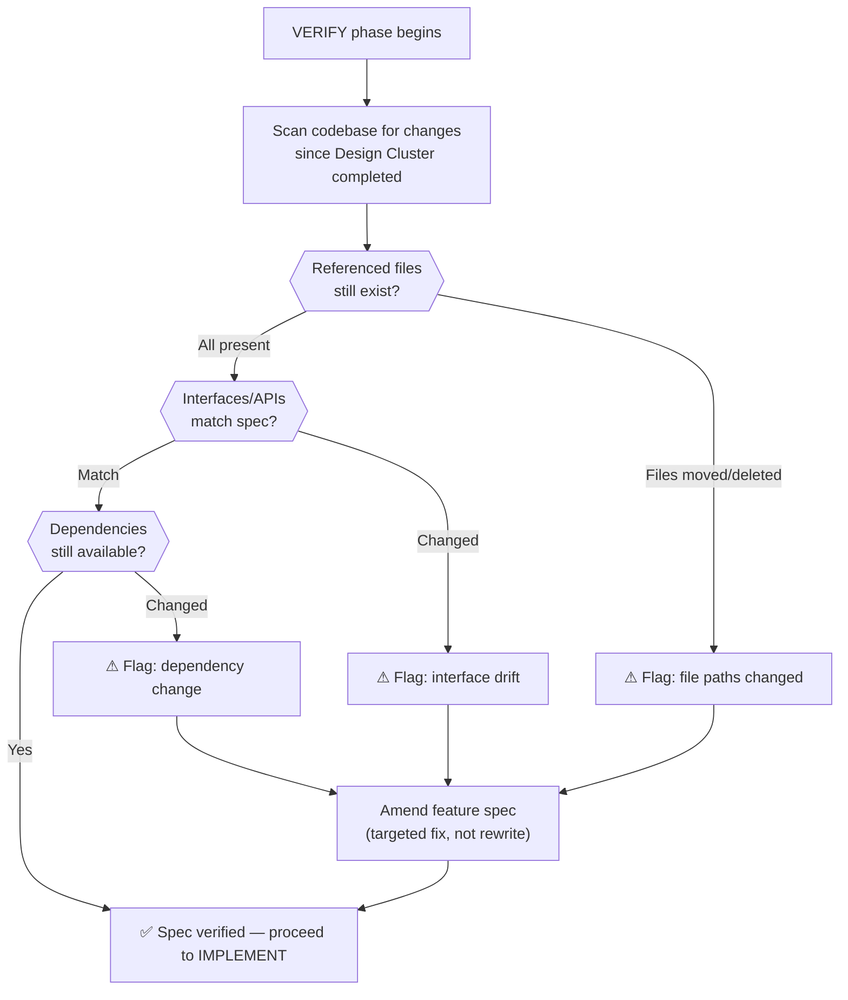

**What VERIFY does:**
- Scans codebase for changes since the Design Cluster completed
- Checks that file paths referenced in the feature spec still exist
- Checks that interfaces/APIs the feature depends on haven't changed
- Checks that dependencies are still available and compatible

**What VERIFY does NOT do:**
- Rewrite the product spec
- Rewrite the tech spec
- Re-run the full research phase
- Re-discuss scope with the user (unless drift is major)

---

## Setup Flow: `/setup-framework`

How users configure which plugins to use.

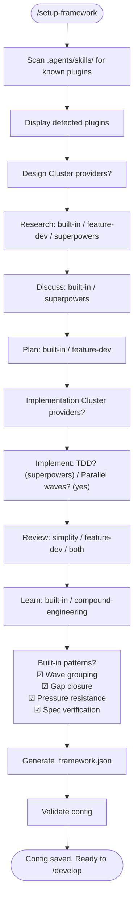

---

## Plugin Routing: How Providers Are Selected

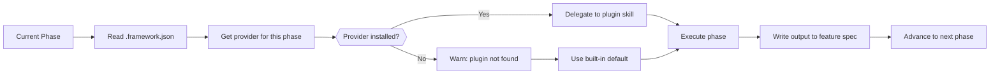

---

## Phase Gate Enforcement

How hooks prevent premature writes. Gates enforce cluster boundaries and phase-appropriate writes.

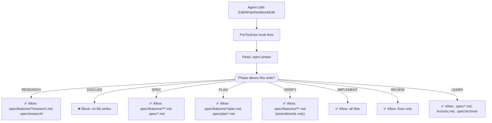

---

## Wave-Based Implementation

How tasks are grouped and executed within the IMPLEMENT phase. Unchanged from previous design — waves are a proven pattern.

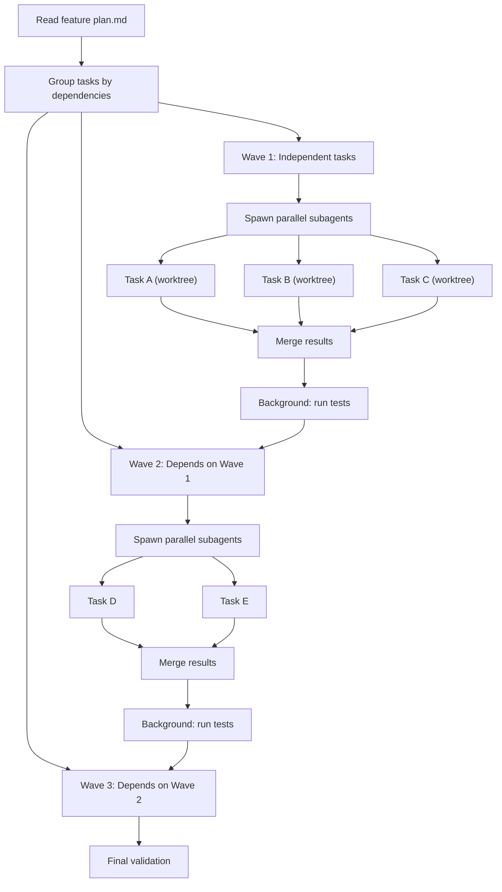

---

## Session Resumption

How the framework handles interrupted work. The `.phase` file now encodes both cluster and phase.

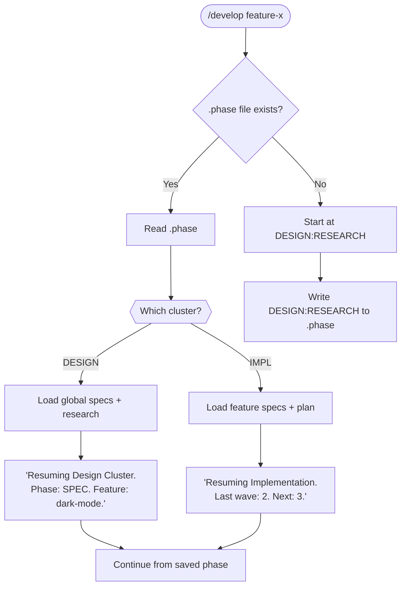

### Phase File Format

```
# .spec/.phase
DESIGN:RESEARCH          # Currently in Design Cluster, RESEARCH phase
DESIGN:DISCUSS           # Currently in Design Cluster, DISCUSS phase
DESIGN:SPEC              # Currently in Design Cluster, SPEC phase
DESIGN:PLAN              # Currently in Design Cluster, PLAN phase
IMPL:VERIFY              # Currently in Implementation Cluster, VERIFY phase
IMPL:IMPLEMENT           # Currently in Implementation Cluster, IMPLEMENT phase
IMPL:REVIEW              # Currently in Implementation Cluster, REVIEW phase
IMPL:LEARN               # Currently in Implementation Cluster, LEARN phase
DONE                     # Feature complete
```

---

## Interaction Patterns

### Design Cluster — Dense, Collaborative

The Design Cluster is a tight conversation between user and agent. Phases flow quickly because they're all about thinking, not coding.

```
User: /develop "Add dark mode toggle"

Agent: [RESEARCH] Scanning codebase + reading global specs...
  → Found: ThemeContext at src/contexts/theme.tsx
  → Found: Design tokens in src/styles/tokens.ts
  → Must build: Toggle component, CSS variables, persistence
  → Risk: Existing components use hardcoded colors (HIGH)

  [DISCUSS] A few questions before I write the feature spec:
  1. Should dark mode apply to the entire app or just the main content area?
  2. Persistence: localStorage, user preferences API, or system preference?
  3. Default: light mode, or follow OS preference?

User: Entire app, localStorage, follow OS.

Agent: [SPEC] Writing feature specs to .spec/features/dark-mode/...
  ✓ product.md — what users experience
  ✓ tech.md — CSS custom properties, ThemeContext updates, migration strategy
  ✓ Updated global tech.md — added theming section to architecture overview

  [PLAN] Implementation plan:
  Wave 1: CSS custom properties + toggle component + persistence hook
  Wave 2: Wire ThemeContext + toggle integration
  Wave 3: Migrate hardcoded colors + prefers-color-scheme

  Ready to implement? Any changes to the design?

User: Looks good. Go.
```

### Implementation Cluster — Autonomous, Verify-First

The Implementation Cluster is mostly autonomous. The agent verifies, implements, reviews, and learns. User is notified at completion.

```
Agent: [VERIFY] Checking feature spec against current codebase...
  ✓ ThemeContext still at src/contexts/theme.tsx
  ✓ Design tokens still at src/styles/tokens.ts
  ✓ No interface changes since design
  Spec verified — proceeding to implement.

  [IMPLEMENT]
  Wave 1: Spawning 3 parallel agents...
    ✓ CSS custom properties added
    ✓ Toggle component created
    ✓ Persistence hook created
  Tests: 42 passed, 0 failed

  Wave 2: Spawning 2 parallel agents...
    ✓ ThemeContext updated
    ✓ Toggle wired
  Tests: 45 passed, 0 failed

  Wave 3: Migrating hardcoded colors...
    ✓ 12 components migrated
    ✓ prefers-color-scheme added
  Tests: 48 passed, 0 failed

  [REVIEW] Verifying against feature spec...
  ✓ All requirements met
  ✓ Tests passing
  ✓ /simplify found 1 suggestion (applied)
  ✓ No spec gaps

  [LEARN] Extracting learnings...
  + Added lesson: "Check for hardcoded colors before theming work"
  - Pruned stale lesson: "Use old color system" (superseded)
  → Merged into global tech.md: CSS custom properties as theming standard
  → Archived .spec/features/dark-mode/ to .spec/archive/dark-mode/

  Feature complete. ✓
```

---

## State Machine

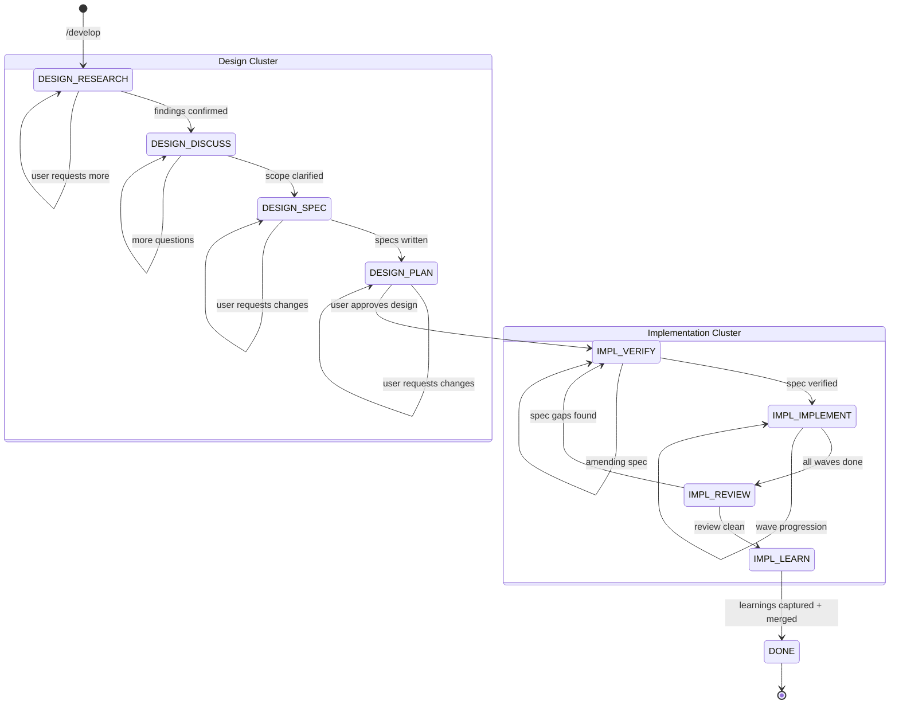

---

## Parallel Feature Development

Because feature specs are isolated in their own directories, multiple features can be designed and implemented in parallel without conflicts.

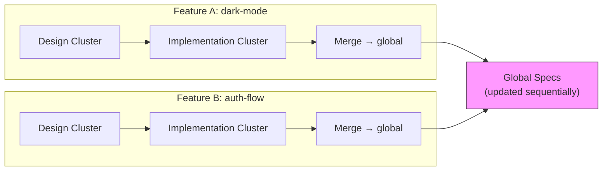

**Conflict resolution:** Merges into global specs happen sequentially. If Feature B's merge conflicts with changes Feature A already merged, the LEARN phase flags it and the user resolves.
