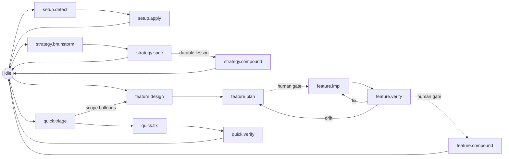

# vibe — Product

vibe is a personal agent workflow framework. It combines a reusable
file-based `spec` framework with a platform-neutral `vibe` flow harness, then
exposes that workflow to Codex, Claude Code, and future agent runtimes through
thin adapters.

**One-liner:** durable specs plus agent skills plus flow state, composed into a
strict personal coding workflow.

---

## Story

My coding workflow has two separate needs. First, decisions need durable memory:
what the project is, why it exists, how it is built, how it should feel, and what
work remains. Second, agents need a runtime harness: clear phases, skill routing,
workspace setup, and guardrails that work across Codex and Claude Code.

vibe exists to combine those pieces without blurring them. The `spec`
framework owns planning memory in `.spec/`. The `vibe` flow owns agent execution
state and skill orchestration in `.agents/`. Platform files such as `AGENTS.md`,
`CLAUDE.md`, and `.claude/*` are adapters over that core, not the source of
truth.

The point is to take the planning load off myself. I should be able to say "I
need X" and have the flow guide the agent through feature spec, planning,
building, and TDD validation — encoding intent and instinct as constraints and
injected resources rather than relying on the agent (or me) to remember the
right next move. It borrows ideas from Compound Engineering — lessons that feed
back, stable plan IDs — while staying KISS and personal, not a second toolchain.

---

## Requirements

At a project level, vibe must:

1. **Keep planning and runtime state separate.** Durable product, tech, design,
   plan, and lessons docs live in `.spec/`; mutable flow state lives outside
   `.spec/`.
2. **Make `spec` reusable on its own.** The `spec` skill must remain useful even
   without the `vibe` flow harness.
3. **Make `vibe` a first-class agent skill.** The workflow is one `vibe` skill
   (router `SKILL.md` + per-phase files) under `.agents/skills/vibe/` that
   delegates to other skills with explicit routing.
4. **Use platform-neutral flow state.** The canonical cursor and state machine
   live under `.agents/skills/vibe/`, not `.claude/` or Codex-specific paths.
5. **Treat Codex and Claude Code as adapters.** `AGENTS.md`, `CLAUDE.md`,
   Claude slash commands, and hooks read the same `.agents/skills/vibe` core.
6. **Inject output paths when delegating.** A `vibe` phase may call
   `superpowers:*`, `spec`, or subagents, but it must tell them exactly which
   `.spec/` paths to write.
7. **Degrade gracefully.** Missing skills, missing adapters, or corrupt flow
   state produce warnings and recovery paths, not session-ending failures.
8. **Ship a Claude Code plugin with hooks.** A Claude Code plugin
   (`.claude-plugin/plugin.json`) bundles the `/flow` command and the three flow
   hooks (`UserPromptSubmit` inject, `PreToolUse` guard, `Stop` gate) via
   `${CLAUDE_PLUGIN_ROOT}`. The plugin **cannot** carry skills outside its own
   `skills/` dir, so the `spec` + `vibe` skills ship as project files through
   `install.sh` instead. The hooks make the flow automatic and guard its
   invariants; they are thin shells over `.agents/skills/vibe/scripts/`, added
   warn-first, earning blocking strength through dogfooding.
9. **Provide a safe install lifecycle.** `install.sh` offers partial install
   (`--only spec|flow`), preview (`--dry-run`), and clean removal
   (`--uninstall`), plus `doctor.sh` health checks and a `deps.json` dependency
   manifest — safe to try and safe to leave.

---

## Design Principles

1. **Composition over reimplementation.** `vibe` phases route to existing
   skills instead of copying their workflows.
2. **Specs are memory, flow is runtime.** `.spec/` records durable thinking;
   `.agents/skills/vibe/` records the current agent state.
3. **Agent skills are the command surface.** The recurring workflow is expressed
   as skills agents can invoke, not as loose markdown snippets.
4. **Adapters stay thin.** Platform-specific files translate runtime events into
   `vibe` skill invocations and `.agents/skills/vibe` reads/writes.
5. **Canonical paths beat skill defaults.** Any delegated skill must write into
   the project’s `.spec/` layout, not its own default doc folder.
6. **Small shims, shared machinery.** State transitions and deterministic checks
   belong in `.agents/skills/vibe/scripts/`; `SKILL.md` files stay concise.

---

## Target User

Me: one developer shaping a portable personal coding workflow across agent
runtimes. The system should be forkable, but decisions optimize for my working
style rather than a broad marketplace audience.

---

## Product Pieces

| Piece | What It Owns | Feature Spec |
|---|---|---|
| `spec` framework | `.spec/` docs, templates, validation, wrap-up rules, feature authoring flow | Bundled [`.agents/skills/spec/`](../.agents/skills/spec/SKILL.md) (done) |
| `vibe` flow | `.agents/skills/vibe/` state, the one `vibe` skill (router + phase files), phase routing | live: `flow/` + `tests/flow/` |
| Platform adapters | `AGENTS.md`, `CLAUDE.md`, and the Claude Code hooks (`.claude/settings.json` wiring) + `install.sh` lifecycle | live: `.claude/` + `install.sh` |

---

## Workflow Surface

The primary user-facing workflow is the one `vibe` skill, whose per-phase files
drive each flow:

| Phase file | When | Main Output |
|---|---|---|
| `setup` | Installing or repairing the workflow harness in a project | `.agents/skills/vibe/`, adapter files, baseline `.spec/` |
| `strategy` | Bootstrapping or refocusing project direction | Root `.spec/{product,tech,design,plan}.md` |
| `feature` | Designing and building a named feature | `.spec/features/<name>/` plus implementation |
| `quick` | Small fixes and bounded maintenance | Workspace edits, optional `.spec/quick/<slug>.md` |
| `verify` | Evidence before completion | Test/build/review findings |
| `compound` | End-of-work consolidation | Lessons, root spec updates, archive moves |
| `amend` | Revising active scope | Updated feature or strategy specs |

These are phase files of one skill, not hidden prompts. Adapters may expose
shortcuts, but the canonical workflow lives in `.agents/skills/vibe/`.

### Flow at a glance

Everything starts at `idle`; the agent self-locates, then drives one flow.
`amend` is a modifier that edits scope from any state and returns there.

### Phase map

Each phase, the `vibe` skill phase file that drives it, the external skills and
feature-dev subagents it delegates to, its caveman density, the spec artifact it
reads/writes, and what the stage is for. This is the canonical workflow contract;
the full per-state record (skill link, `next` arrays, exit predicates — orders
sourced from the linked skill per D12) lives in
`.agents/skills/vibe/state-machine.json` and is detailed in
`flow/state-machine.json` + `flow/README.md`.

| Phase | Phase file | External skills | Subagents | Caveman | Spec artifact (R/W) | What the stage does |
|---|---|---|---|---|---|---|
| `idle` | — | `using-superpowers` | — | lite | R `lessons.md`, `plan.md` | Resting hub between flows. Read lessons/plan, then pick the flow that matches the request. |
| `setup.detect` | `setup` | — | — | lite | R repo, adapters, `.agents`, `.spec` | Read-only audit of repo + harness; report present vs missing and preflight required plugins. |
| `setup.apply` | `setup` | `spec`, `writing-skills` | — | lite | W `.agents/**`, baseline `.spec/**`, adapter blocks | Write/merge the bootstrap without clobbering: constitution block, flow scaffold, baseline specs. |
| `strategy.brainstorm` | `strategy` | `brainstorming` | — | lite | R `lessons.md` | Shape project direction in dialogue; scratch only, no writes yet. |
| `strategy.spec` | `strategy` | `spec` | — | lite | W root `product/tech/design/plan` | Commit the agreed direction into the root specs and validate. |
| `strategy.compound` | `compound` | `spec` | — | lite | W `lessons.md`, adapter blocks | Record a durable strategy lesson and refresh the active-rules digest. |
| `feature.design` | `feature` | `brainstorming` | `code-explorer`, `code-architect` | lite | R `lessons.md`, root `product/tech`; W `features/<f>/{product,tech}` | Trace the codebase and sketch approaches, then write the feature's product + tech specs. |
| `feature.plan` | `feature` | `writing-plans` | `code-architect` | lite | W `features/<f>/plan` | Turn the design into a plan with stable unit IDs (`U1`, `U2`…). Human gate before impl. |
| `feature.impl` | `feature` | `executing-plans`, `test-driven-development` | — | full | R `plan`; W `src/**`, `tests/**` | Build the plan units test-first, citing unit IDs; no spec edits. |
| `feature.verify` | `verify` | `verification-before-completion`, `requesting-code-review`, `systematic-debugging` | `code-reviewer` | full | R `plan`, `src`, `tests` | Gather real evidence per unit ID and review. Human gate before ship; routes pass→compound, fail→impl/plan. |
| `feature.compound` | `compound` | `finishing-a-development-branch`, `spec` | — | lite (receipts ultra) | W `lessons.md`, root specs, archive, adapter blocks | Record the lesson, promote cross-cutting decisions to root, archive the feature, refresh digest. |
| `quick.triage` | `quick` | `systematic-debugging` | — | full | R `lessons.md` | Diagnose the small issue; don't fix yet. Escalate to `feature.design` if scope balloons. |
| `quick.fix` | `quick` | `test-driven-development` | — | full | W `src/**`, opt `.spec/quick/<slug>.md` | Implement the bounded fix test-first; no root spec writes. |
| `quick.verify` | `verify` | `verification-before-completion` | `code-reviewer` | full | R `src`, `tests` | Prove the fix works and breaks nothing. |
| `amend` _(modifier)_ | `amend` | `spec`, `receiving-code-review` | — | lite | target state's surface only | Targeted scope edit within the current state's write rules, then return. |

External skills are `superpowers:*` unless noted (`spec` is bundled). Subagents
are Anthropic's feature-dev agents, cherry-picked per phase. Each phase also emits
one per-turn **inject** — the "current orders" (skill, write surface, caveman
level, next state). Under D12 these orders are sourced from the phase's linked
`vibe-*` skill shim (the single source of truth); skill-less states (`idle`,
`amend`) keep a minimal inline string in `.agents/skills/vibe/state-machine.json`.

## Communication Levels

The `vibe` flow requests a "caveman" communication-density level per state. The
level names (`lite`/`full`/`ultra`) follow the upstream `JuliusBrussee/caveman`
skill; the mapping of *level to workflow phase* is vibe's own policy.
Caveman is **output compression only** — it never reduces reasoning depth, and
code, paths, and commands stay byte-exact.

| Level | Behaviour | Use When |
|---|---|---|
| `lite` | No filler or hedging; keep full sentences. | Strategy, setup, design, compound, amend — where nuance matters. |
| `full` | Drop articles; fragments OK; short synonyms. The working default. | Implementation, verification, and quick fixes/triage. |
| `ultra` | Abbreviate prose; `X → Y` arrows; one word where one word does. | Compound receipts and high-volume subagent→orchestrator summaries. |

`ultra` is *not* used for triage: it can drop edge cases, and triage is where a
missed edge case is expensive. Regardless of level, security warnings and
irreversible-action confirmations stay in normal prose.

State-machine entries name the expected level, and a single inject owner emits it
so adapters and subagents stay consistent (see `flow/README.md`).

---

## Non-Goals

- **Not a replacement for `spec`.** The `vibe` flow uses the spec framework; it
  does not absorb it.
- **Not Claude-only.** Claude Code integration is an adapter, not the core.
- **Not Codex-only.** Codex reads `AGENTS.md`, but the flow state remains under
  `.agents/skills/vibe`.
- **Not a new implementation framework.** The repo is markdown, bash scripts,
  and agent skills.
- **Not strict by accident.** Hard blocks must protect real invariants and stay
  understandable.

---

## Resolved Questions

1. **Git tracking for the cursor.** Resolved — version the static state machine;
   gitignore the mutable `state.json` cursor (installer seeds + ignores it).
2. **Skill count.** Resolved — consolidated the seven `vibe-*` shims into one
   `vibe` skill (router `SKILL.md` + seven phase files), distinct write surfaces
   and caveman levels preserved per phase.
3. **Adapter installation.** Resolved — `install.sh` **copies** the core and
   Claude adapter, merges `AGENTS.md` via markers, symlinks adapters opt-in
   (`--adapters`); partial (`--only`), preview (`--dry-run`), and removal
   (`--uninstall`) are all supported.
4. **Hook strictness.** Resolved — shipped warn-first; only the three
   `detect-context.sh` hard blocks deny, every `Stop` predicate is warn-only.

---

## Features

| Feature | Covers |
|---|---|
| **spec framework (done)** | Durable `.spec/` planning model: two-layer docs, strict templates, warn-first validation, Requirement+Scenario format. Live: [`.agents/skills/spec/`](../.agents/skills/spec/SKILL.md). |
| **vibe-flow (done)** | The one `vibe` skill (router + phase files), `.agents/skills/vibe/` state, state machine, phase routing, delegated skill output paths. Truth: `flow/`. |
| **agent-instructions (done)** | `AGENTS.md` template + marker merge + adapter symlinks (`CLAUDE.md`, `WARP.md`). Truth: `flow/scripts/merge-agents.sh`. |
| **platform-adapters (done)** | Claude Code hooks (inject/guard/gate) + `install.sh` core provisioning. Truth: `.claude/` + `install.sh`. |
| **install-tooling (done)** | Install lifecycle: `--only`/`--dry-run`/`--uninstall`, `doctor.sh`, `deps.json`. Truth: `install.sh` + `flow/scripts/doctor.sh`. |
| **release-docs (done)** | Public release: READMEs, trust rails (LICENSE/CHANGELOG/CI), logo, examples, stranger eval. Truth: `README.md` + `spec/README.md` + `flow/README.md`. |
