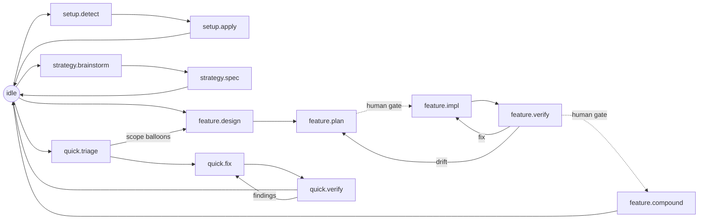

# vibe — Product

vibe is a personal agent workflow toolkit. It combines a reusable file-based
`spec` framework with a `vibe` flow engine, and ships them as a versioned Claude
Code plugin while the durable memory stays committed per repo — readable by
Codex, any agent, or none.

**One-liner:** durable specs plus agent skills plus flow state, composed into a
strict personal coding workflow.

**Carrier split (v0.3):** the *runtime* — engine, hooks, skills, `/flow`,
subagents, content — ships in the plugin, versioned and installed once. The
*memory* — `.spec/**`, the `AGENTS.md` managed block, `.vibe/` content overrides
— is committed per repo and needs no runtime. `vibe vendor` writes the runtime
into a repo as an explicit opt-in for teams and CI.

---

## Story

My coding workflow has two separate needs. First, decisions need durable memory:
what the project is, why it exists, how it is built, how it should feel, and what
work remains. Second, agents need a runtime harness: clear phases, skill routing,
workspace setup, and guardrails that work across Codex and Claude Code.

vibe exists to combine those pieces without blurring them. The `spec`
framework owns planning memory in `.spec/`. The `vibe` flow owns agent execution
state and skill orchestration in `.agents/`. Platform files such as `AGENTS.md`,
`CLAUDE.md`, and `.claude/*` are adapters over that core, not the source of
truth.

The point is to take the planning load off myself. I should be able to say "I
need X" and have the flow guide the agent through feature spec, planning,
building, and TDD validation — encoding intent and instinct as constraints and
injected resources rather than relying on the agent (or me) to remember the
right next move. It borrows ideas from Compound Engineering — lessons that feed
back, stable plan IDs — while staying KISS and personal, not a second toolchain.

---

## Requirements

At a project level, vibe must:

1. **Keep planning and runtime state separate.** Durable product, tech, design,
   plan, and lessons docs live in `.spec/`; mutable flow state lives outside
   `.spec/`.
2. **Make `spec` reusable on its own.** The `spec` skill must remain useful even
   without the `vibe` flow harness.
3. **Make `vibe` a first-class agent skill.** The workflow is one `vibe` skill
   (router `SKILL.md` + per-phase files) under `.agents/skills/vibe/` that
   delegates to other skills with explicit routing.
4. **Use platform-neutral flow state.** The canonical cursor and state machine
   live under `.agents/skills/vibe/`, not `.claude/` or Codex-specific paths.
5. **Treat Codex and Claude Code as adapters.** `AGENTS.md`, `CLAUDE.md`,
   Claude slash commands, and hooks read the same `.agents/skills/vibe` core.
6. **Inject output paths when delegating.** A `vibe` phase may call
   `superpowers:*`, `spec`, or subagents, but it must tell them exactly which
   `.spec/` paths to write.
7. **Degrade gracefully.** Missing skills, missing adapters, or corrupt flow
   state produce warnings and recovery paths, not session-ending failures.
8. **Ship the runtime through the plugin.** The plugin carries hooks, skills,
   `/flow`, the spec subagents, the engine, and the content set; `plugin.json`'s
   `version` is the upgrade lock and `claude plugin update` is the upgrade path.
   Hooks are thin shims over the engine, added warn-first, earning blocking
   strength through dogfooding. (Supersedes the 2026-06-18 retirement rationale
   *and* its 2026-07 partial reversal: a plugin may carry `skills/`,
   `commands/`, `agents/`, and `hooks/` together, and `CLAUDE_PROJECT_DIR` is
   exported to plugin hooks — so per-repo state from a per-user plugin works.
   No `.claude/settings.json` wiring and no copied hook scripts in the target.)
9. **Provide a safe install lifecycle.** `vibe init` seeds a repo (`.spec/`,
   cursor, `.vibe/`, `.gitignore`, `AGENTS.md` merge); `vibe doctor` reports
   health; `vibe vendor` and its inverse handle the opt-in in-repo runtime.
   Every mutation supports preview (`--dry-run`) and clean removal — safe to try
   and safe to leave.
10. **One install covers every repo.** `claude plugin install vibe@vibe` is the
    whole stack; `/vibe init` seeds a repo from inside a session, so npm is
    optional. The `vibe` engine also publishes to npm for non-Claude runtimes.
    Companion plugins (superpowers, feature-dev slot) install opt-in and degrade
    gracefully when absent. The caveman preference ships as a one-line doctrine
    note, not a plugin.
11. **Instructions are injection-first and budgeted.** Doctrine reaches the
    agent through hooks, so the `AGENTS.md` managed block is an optional adapter
    for non-Claude runtimes. Because `UserPromptSubmit` output persists in the
    conversation, injection is **trigger-classed**: *level* (every turn — state
    and its transition command only), *edge* (only when the cursor changes —
    full orders, delegate contracts, lessons by state tag), *event* (only when
    true — drift, warnings). Live state never rides SessionStart, whose output
    is replayed stale on `--resume`.
12. **Delegation overrides destinations, never method.** superpowers owns
    brainstorm/plan/execution method *and format*; vibe redirects the artifacts
    into `.spec/**` — statically via state orders and mechanically via a
    skill-redirect hook (`PostToolUse` on skill load, data-driven
    `redirects.json` map, per-repo overridable).
13. **Deterministic machinery runs on one engine.** State transitions, content
    resolution, merges, validation, and health checks are one JS engine with a
    single cursor reader, one root resolver, and one marker grammar. Hooks are
    shims that `exec` it and exit 0 cleanly when Node is absent.
14. **Enforce in code; explain in prose; never both.** A rule the guard enforces
    is stated in the guard's verdict at the moment of violation, not preloaded
    into always-on context. Prose covers only what the model must *decide*.
    Always-on budget: `AGENTS.md` managed block ≤40 lines, SessionStart ≤15.
15. **The user owns a content layer.** `.vibe/content/**` and `.vibe/compose.json`
    override or extend any shipped block and any channel, survive every upgrade,
    and are never written by the installer.

---

## Design Principles

1. **Composition over reimplementation.** `vibe` phases route to existing
   skills instead of copying their workflows.
2. **Specs are memory, flow is runtime.** `.spec/` records durable thinking;
   `.agents/skills/vibe/` records the current agent state.
3. **Agent skills are the command surface.** The recurring workflow is expressed
   as skills agents can invoke, not as loose markdown snippets.
4. **Adapters stay thin.** Platform-specific files translate runtime events into
   `vibe` skill invocations and `.agents/skills/vibe` reads/writes.
5. **Canonical paths beat skill defaults.** Any delegated skill must write into
   the project’s `.spec/` layout, not its own default doc folder.
6. **Small shims, shared machinery.** State transitions and deterministic checks
   belong in the engine; `SKILL.md` files stay concise.
7. **Context is the scarce resource.** Every always-on line competes with the
   work. Prefer a hook (free) over prose; prefer edge-triggered over per-turn;
   prefer an on-demand skill over a preloaded block.
8. **Say what to do, and why.** Injected text is positive and motivated —
   the desired action plus its reason — not a list of prohibitions. Prohibitions
   that matter belong in the guard, where they are enforced rather than hoped for.
9. **Data over prose.** Anything the machine knows (write surfaces, legal edges,
   delegates, invariants) is interpolated from data, never restated in English.

---

## Target User

Me: one developer shaping a portable personal coding workflow across agent
runtimes. The system should be forkable, but decisions optimize for my working
style rather than a broad marketplace audience.

---

## Product Pieces

| Piece | What It Owns | Lives In |
|---|---|---|
| `spec` framework | `.spec/` docs, templates, validation, wrap-up rules, feature authoring flow | [`.agents/skills/spec/`](../.agents/skills/spec/SKILL.md) |
| `vibe` flow | Cursor, state machine, the one `vibe` skill (router + phase files), phase routing | [`.agents/skills/vibe/`](../.agents/skills/vibe/SKILL.md) |
| Content set | `policy.json` invariants, composition channels, authored blocks — the single source for every injected sentence | `flow/content/**` (shipped), `.vibe/content/**` (yours) |
| Engine | `vibe` CLI: `init state orders doctrine render doctor validate drift promote vendor` | `engine/` → plugin payload, npm |
| Carriers | Plugin manifest, hook shims, marketplace; the `AGENTS.md` managed block for non-Claude runtimes | `plugin/**`, `flow/reference/templates/AGENTS.md` |

---

## Workflow Surface

The primary user-facing workflow is the one `vibe` skill, whose per-phase files
drive each flow:

| Phase file | When | Main Output |
|---|---|---|
| `setup` | Installing or repairing the workflow harness in a project | `.agents/skills/vibe/`, adapter files, baseline `.spec/` |
| `strategy` | Bootstrapping or refocusing project direction | Root `.spec/{product,tech,design,plan}.md` |
| `feature` | Designing and building a named feature | `.spec/features/<name>/` plus implementation |
| `quick` | Small fixes and bounded maintenance | Workspace edits, optional `.spec/quick/<slug>.md` |
| `verify` | Evidence before completion | Test/build/review findings |
| `compound` | End-of-work consolidation | Lessons, root spec updates, archive moves |

These are phase files of one skill, not hidden prompts. Adapters may expose
shortcuts, but the canonical workflow lives in `.agents/skills/vibe/`.

### Flow at a glance

Everything starts at `idle`; the agent self-locates, then drives one flow. A
scope edit is not a state: the agent edits within the current state's write
surface and stays put.

```mermaid
flowchart LR
    I((idle)) --> SD[setup.detect] --> SA[setup.apply] --> I
    I --> SB[strategy.brainstorm] --> SS[strategy.spec]
    SS --> I
    I --> FD[feature.design] --> FP[feature.plan]
    FP -. human gate .-> FI[feature.impl] --> FV[feature.verify]
    FV -. human gate .-> FC[feature.compound] --> I
    FV -->|fix| FI
    FV -->|drift| FP
    I --> QT[quick.triage] --> QF[quick.fix] --> QV[quick.verify] --> I
    QV -->|findings| QF
    QT -->|scope balloons| FD
```

### Phase map

Each phase, the `vibe` skill phase file that drives it, the external skills and
feature-dev subagents it delegates to, the spec artifact it reads/writes, and what
the stage is for. This is the canonical workflow contract;
the full per-state record (skill link, `next` arrays, exit predicates — orders
sourced from the linked skill per D12) lives in
`.agents/skills/vibe/state-machine.json` and is summarized in the root
[tech.md](tech.md). The two human gates are
keyed by **edge** in the machine's `gates` object
(`feature.plan>feature.impl`, `feature.verify>feature.compound`), not by state —
so `feature.verify`'s fix/drift back-edges to `feature.impl`/`feature.plan` stay
ungated while its ship edge stops for approval.

Delegates, write surfaces, and legal edges are **data** — read them from
`state-machine.json`, which is the only place they are stated. This table
carries only what the machine cannot say: what each stage is *for*.

| Phase | What the stage does |
|---|---|
| `idle` | Resting hub between flows. Read lessons/plan, then pick the flow that matches the request. |
| `setup.detect` | Read-only audit of repo + harness; report present vs missing and preflight required plugins. |
| `setup.apply` | Write/merge the bootstrap without clobbering: AGENTS.md block, flow scaffold, baseline specs. |
| `strategy.brainstorm` | Shape project direction in dialogue; scratch only, no writes yet. |
| `strategy.spec` | Commit the agreed direction into the root specs and validate. |
| `feature.design` | Trace the codebase and sketch approaches, then write the feature's product + tech specs. |
| `feature.plan` | Turn the design into stable unit IDs (`<feature>/1`, `/2`…). Human gate before impl. |
| `feature.impl` | Build the plan units test-first, citing unit IDs. |
| `feature.verify` | Gather real evidence per unit ID and review. Human gate before ship. |
| `feature.compound` | Record the lesson, promote cross-cutting decisions to root, archive the feature. |
| `quick.triage` | Diagnose the small issue; don't fix yet. Escalate to `feature.design` if scope balloons. |
| `quick.fix` | Implement the bounded fix test-first. |
| `quick.verify` | Prove the fix works and breaks nothing. |

Each phase also emits per-turn **orders**. Under D12 these are authored once as
content blocks and resolved by the engine; the machine carries the link, not the
prose. Orders interpolate machine fields (`{{writes}}`, `{{next}}`,
`{{delegates}}`) rather than restating them.

## Style

Output density is governed by one machine-level `style` note (in
`.agents/skills/vibe/state-machine.json`), not a per-state level: no filler or
hedging, compress receipts and subagent→orchestrator summaries. Compression is
**output only** — it never reduces reasoning depth, and code, paths, and
commands stay byte-exact. Regardless of density, security warnings and
irreversible-action confirmations stay in full prose. A single inject owner
emits the same note each turn so adapters and subagents stay consistent (see
the Vibe Flow Contract in [tech.md](tech.md)).

---

## Non-Goals

- **Not a replacement for `spec`.** The `vibe` flow uses the spec framework; it
  does not absorb it.
- **Not Claude-only.** Claude Code integration is an adapter, not the core.
- **Not Codex-only.** Codex reads `AGENTS.md` and `.spec/`, which stay committed
  and runtime-free; the flow engine is a Claude Code plugin.
- **Not a general-purpose framework.** The repo is markdown, JSON, agent skills,
  and one small JS engine. (Reversed 2026-08-10: the prior "bash scripts, no
  runtime" non-goal was costing five cursor readers, four marker parsers, and a
  hand-maintained jq-optional path in every script. Node is the dependency; the
  scope discipline it protected stays.)
- **Not strict by accident.** Hard blocks must protect real invariants and stay
  understandable.
- **Not a second context budget.** vibe must not crowd out the work it serves;
  always-on instruction stays inside its stated line budget.

---

## Resolved Questions

1. **Git tracking for the cursor.** Resolved — version the static state machine;
   gitignore the mutable `state.json` cursor (installer seeds + ignores it).
2. **Skill count.** Resolved — consolidated the seven `vibe-*` shims into one
   `vibe` skill (router `SKILL.md` + per-phase files), distinct write surfaces
   preserved per phase.
3. **Adapter installation.** Resolved — `install.sh` **copies** the core and
   Claude adapter, merges `AGENTS.md` via markers, symlinks adapters opt-in
   (`--adapters`); partial (`--only`), preview (`--dry-run`), and removal
   (`--uninstall`) are all supported.
4. **Hook strictness.** Resolved — shipped warn-first; only the three
   `detect-context.sh` hard blocks deny, every `Stop` predicate is warn-only.

---

## Features

All features below are **delivered**; their branch specs were compounded into these
root docs and the feature folders removed (see the Delivered history in [plan.md](plan.md)).

| Feature | Covers | Lives in |
|---|---|---|
| **spec framework** | Durable `.spec/` planning model: two-layer docs, strict templates, warn-first validation, Requirement+Scenario format. | [`.agents/skills/spec/`](../.agents/skills/spec/SKILL.md) |
| **vibe-flow** | The one `vibe` skill (router + phase files), `.agents/skills/vibe/` state, state machine, phase routing, delegated skill output paths. | [`.agents/skills/vibe/`](../.agents/skills/vibe/SKILL.md) |
| **agent-instructions** | `AGENTS.md` template + marker merge + adapter symlinks (`CLAUDE.md`, `WARP.md`). | `flow/reference/templates/AGENTS.md`, `flow/scripts/merge-agents.sh` |
| **platform-adapters** | Claude Code adapter (`/flow` + three hooks via `.claude/settings.json`) + `install.sh` core provisioning. | `.claude/**`, `install.sh` |
| **install-tooling** | Install lifecycle: `--only`/`--dry-run`/`--uninstall`, one-command curl bootstrap, `doctor.sh`, `deps.json`. | `install.sh`, `flow/scripts/doctor.sh` |
| **install-distribution** | One-command `install.sh` (local default / `--global` per-user plugin / interactive), `--with-plugins` companion set, self-hosting plugin + marketplace, self-detecting doctrine hook, `doctor` instruction-coverage. Full stateful-flow-via-plugin deferred. | `install.sh`, `build-plugin.sh`, `.claude-plugin/`, `plugin/` |
| **release-docs** | Public release: READMEs, trust rails (LICENSE/CHANGELOG/CI), logo. | `README.md`, `spec/README.md`, `flow/README.md` |
| **flow-mvp** | Personal operating layer: precedence + delegation contract blocks, hybrid plan grammar, auto-advance with two edge-keyed gates, a quick-flow compound state, evidence-receipt verify tooth, output-density demoted to frozen vocabulary. | `flow/`, `flow/state-machine.json` |
