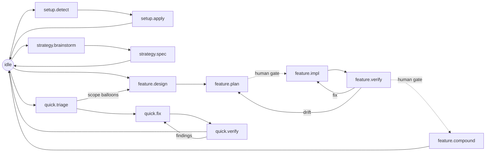

# vibe — Product

vibe is three small, independent tools for coding with agents — **spec**
(durable planning memory), **flow** (a state-machine workflow with real teeth),
and **instruct** (layered, budgeted instruction injection) — each a single
static Rust binary with no runtime dependency, each a Claude Code plugin and an
OpenCode plugin, each installable and useful alone, composing through
file-based contracts when co-installed. One repo, one installer, three release
trains. The repo's own memory stays committed Markdown, readable by any agent
or none.

**One-liner:** durable specs, a flow with teeth, and budgeted instructions —
three binaries, no bundle.

**Carrier model (v0.4 target).** Each tool — `spec`, `flow`, `instruct` — is a
static Rust binary shipping as its own Claude Code plugin and its own OpenCode
plugin, installable and useful alone. `contracts/` holds the versioned schemas
the three tools exchange as files under `.vibe/`; no tool imports another. One
shared `install.sh` and one marketplace list all three; each keeps its own
release train and version.

> **Shipped today:** vibe is still one repo running a Node engine (`flow/engine/`), with `install.sh` copying `.agents/skills/{spec,vibe}` and `.claude/**` into a target repo. The cursor lives at `.agents/skills/vibe/state.json`; specs live in `.spec/`. Everything three-binary and Rust above is the v0.4 target — build order and gates are in [plan.md](plan.md).

---

## Story

vibe started as one kit: a Node engine, two skills, a plugin that carried only part of the runtime, and companion plugins — one of which (caveman) was a hard dependency until `flow-mvp` demoted it to frozen vocabulary. That is the bundle-everything shape that makes today's agent tooling hard to compose, and it left real gaps. `vibe state set` validated a state name but never checked `next` membership or the two human gates — approval was honour-system prose. Every hook shelled out to Node; without it, guidance went quiet and only the two hard blocks survived on frozen bash. And one managed block mixed shared repo conventions with one developer's personal workflow.

v0.4 splits vibe into three small, independent tools — `spec`, `flow`, and `instruct` — each a static Rust binary with zero runtime dependency, each useful with the other two absent. The state-machine writer becomes the gate itself: `vibe-flow state set` refuses an illegal target and a gated edge without `--confirm`, in Rust, with no Node in the path. Instruction injection moves from one hand-rolled content layer into `instruct`'s four-tier system, budgeted per trigger class at the same line counts vibe already proved. Coupling between the three tools moves from shared code to versioned file contracts under `.vibe/`. When it ships, installing one tool or all three is the same command, and losing any one of them degrades the others gracefully instead of breaking them.

---

## Requirements

At a project level, vibe must:

1. **Three independent tools.** Each installable alone, useful alone; no umbrella binary — anti-bundling is a design value.
2. **Static binaries, no runtime.** Rust, zero runtime deps; a missing binary degrades to the frozen bash fallbacks for the two hard blocks and to silence elsewhere.
3. **Two platforms from one source.** Claude Code and OpenCode plugins per tool; Codex and other agents read the committed memory.
4. **Committed memory is portable.** The spec tree and each tool's `AGENTS.md` block are Markdown, readable by any agent or none.
5. **Contracts are the only coupling.** Versioned, golden-tested, additive within a major version.
6. **flow stands alone.** A standalone `AGENTS.md` block makes the agent drive the flow without instruct; instruct only strengthens adherence.
7. **The writer is the gate.** Legal edges and human gates are enforced by the cursor writer, not by prose.
8. **Injection is layered and budgeted.** Four tiers; trigger classes level/edge/event; line budgets linted; no live state at session start.
9. **Enforce in code, explain in prose, never both.** Data over prose: anything the machine knows is interpolated, never restated in English.
10. **Degrade gracefully.** Missing peers, binaries, networks, or trees warn; sessions never break.
11. **One installer, safe lifecycle.** Subsets, platforms, dry-run, and an uninstall that reverses only recorded actions.
12. **spec is OpenSpec-grammar compatible and layout-native.** Interchange works both ways; vibe's own document model stays.
13. **Strictness ratchets.** Every check ships warn-first; it becomes an error only after migration.
14. **Signals never gate.** Progress signals are advisory by construction.
15. **Ported code proves itself.** Frozen oracles, differential parity, and blast-radius order — highest-risk units port first.

---

## Design Principles

1. **Composition over reimplementation.** Flow phases route to existing skills instead of copying their workflows.
2. **Specs are memory, flow is runtime.** The spec tree records durable thinking; the flow cursor records the current agent state.
3. **Agent skills are the command surface.** The recurring workflow is expressed as skills agents can invoke, not as loose markdown snippets.
4. **Adapters stay thin.** Platform-specific files translate runtime events into tool invocations; they own no state of their own.
5. **Canonical paths beat skill defaults.** Any delegated skill must write into the project's spec layout, not its own default doc folder.
6. **Small shims, shared machinery.** State transitions and deterministic checks belong in the core crate; each tool's surface stays concise.
7. **Context is the scarce resource.** Every always-on line competes with the work. Prefer a hook (free) over prose; prefer edge-triggered over per-turn; prefer an on-demand skill over a preloaded block.
8. **Say what to do, and why.** Injected text is positive and motivated — the desired action plus its reason — not a list of prohibitions. Prohibitions that matter belong in the guard, where they are enforced rather than hoped for.
9. **Data over prose.** Anything the machine knows (write surfaces, legal edges, delegates, invariants) is interpolated from data, never restated in English.
10. **Independence over convenience — each tool is a whole product.** spec, flow, and instruct each install, run, and prove useful with the other two absent; convenience coupling belongs in the installer, not the binaries.
11. **Contracts, not imports.** Tools exchange versioned files under `.vibe/` and one soft probe call, never a shared library or an in-process import.
12. **Signals advise, gates enforce.** A progress signal is evidence for the TUI and injected text; only the state-machine writer and the guard refuse an action.

---

## Target User

Me: one developer shaping a portable personal coding workflow across agent
runtimes. The system should be forkable, but decisions optimize for my working
style rather than a broad marketplace audience.

---

## Product Pieces

| Piece | What It Owns | Lives In |
|---|---|---|
| `spec` | The spec tree (`docs/spec/`, or `.spec/` today), templates, validators, OpenSpec interchange, four subagents | `spec/` |
| `flow` | State machine, cursor, guard/stop hooks, ledger, advisory signals, the TUI | `flow/` |
| `instruct` | Instruction tiers, blocks, channels, budgets, providers, sync | `instruct/` |
| `contracts` | Versioned schemas + golden fixtures every tool's CI runs against | `contracts/` |
| installer | One POSIX `install.sh`: subsets, platforms, dry-run, uninstall | `install.sh` |

Each of the three tools also ships as its own Claude Code plugin and its own
OpenCode plugin — see Carrier model above.

---

## Workflow Surface

The primary user-facing workflow is the `flow` skill, whose per-phase files
drive each flow:

| Phase file | When | Main Output |
|---|---|---|
| `setup` | Installing or repairing the workflow harness in a project | flow's skill files, adapter files, baseline specs |
| `strategy` | Bootstrapping or refocusing project direction | Root `product.md`/`tech.md`/`design.md`/`plan.md` |
| `feature` | Designing and building a named feature | Spec root's `features/<name>/` plus implementation |
| `quick` | Small fixes and bounded maintenance | Workspace edits, optional `quick/<slug>.md` |
| `verify` | Evidence before completion | Test/build/review findings |
| `compound` | End-of-work consolidation | Lessons, root spec updates, archive moves |

These are phase files of one skill, not hidden prompts. Adapters may expose
shortcuts, but the canonical workflow lives in the `flow` skill.

### Flow at a glance

Everything starts at `idle`; the agent self-locates, then drives one flow
through the `flow` skill. A scope edit is not a state: the agent edits within
the current state's write surface and stays put.

```mermaid
flowchart LR
    I((idle)) --> SD[setup.detect] --> SA[setup.apply] --> I
    I --> SB[strategy.brainstorm] --> SS[strategy.spec]
    SS --> I
    I --> FD[feature.design] --> FP[feature.plan]
    FP -. human gate .-> FI[feature.impl] --> FV[feature.verify]
    FV -. human gate .-> FC[feature.compound] --> I
    FV -->|fix| FI
    FV -->|drift| FP
    I --> QT[quick.triage] --> QF[quick.fix] --> QV[quick.verify] --> I
    QV -->|findings| QF
    QT -->|scope balloons| FD
```

### Phase map

Each phase, the skill link that drives it, the external skills and subagents it delegates to, the spec artifact it reads/writes, and what the stage is for. This is the canonical workflow contract; the full per-state record (skill link, `next` arrays, exit predicates) lives in `flow`'s `state-machine.json`. The two human gates are keyed by **edge** in the machine's `gates` object (`feature.plan>feature.impl`, `feature.verify>feature.compound`), not by state — so `feature.verify`'s fix/drift back-edges to `feature.impl`/`feature.plan` stay ungated while its ship edge stops for approval.

Delegates, write surfaces, and legal edges are **data** — read them from `state-machine.json`, the only place they are stated. This table carries only what the machine cannot say: what each stage is *for*.

| Phase | What the stage does |
|---|---|
| `idle` | Resting hub between flows. Read lessons/plan, then pick the flow that matches the request. |
| `setup.detect` | Read-only audit of repo + harness; report present vs missing and preflight required plugins. |
| `setup.apply` | Write/merge the bootstrap without clobbering: AGENTS.md block, flow scaffold, baseline specs. |
| `strategy.brainstorm` | Shape project direction in dialogue; scratch only, no writes yet. |
| `strategy.spec` | Commit the agreed direction into the root specs and validate. |
| `feature.design` | Trace the codebase and sketch approaches, then write the feature's product + tech specs. |
| `feature.plan` | Turn the design into stable unit IDs (`<feature>/1`, `/2`…). Human gate before impl. |
| `feature.impl` | Build the plan units test-first, citing unit IDs. |
| `feature.verify` | Gather real evidence per unit ID and review. Human gate before ship. |
| `feature.compound` | Record the lesson, promote cross-cutting decisions to root, archive the feature. |
| `quick.triage` | Diagnose the small issue; don't fix yet. Escalate to `feature.design` if scope balloons. |
| `quick.fix` | Implement the bounded fix test-first. |
| `quick.verify` | Prove the fix works and breaks nothing. |

Each phase also emits per-turn **orders**, authored once as content blocks in the linked skill's phase file and resolved by `flow` at the cursor (`.vibe/run/flow/state.json` in v0.4; `.agents/skills/vibe/state.json` today). `instruct` composes these orders into the level/edge/event channels; `flow` works standalone off its own `AGENTS.md` block when `instruct` is absent.

## Style

Output density is governed by one machine-level `style` note carried in `flow`'s `state-machine.json`, not a per-state level: no filler or hedging, compress receipts and subagent→orchestrator summaries. Compression is **output only** — it never reduces reasoning depth, and code, paths, and commands stay byte-exact. Regardless of density, security warnings and irreversible-action confirmations stay in full prose. `instruct` composes and injects the same note every turn so adapters and subagents stay consistent (see [tech-instruct.md](tech-instruct.md)).

---

## Non-Goals

- **Not an umbrella binary.** No `vibe` binary ties the three tools together at runtime; the installer is the only umbrella.
- **Not the OpenSpec layout or CLI.** `spec` adopts OpenSpec's requirement/scenario grammar for interchange; it keeps its own root, document model, and commands.
- **Not a model-enforced gate.** Progress signals, including any future embedded model, are advisory; only the state-machine writer and the guard refuse a transition.
- **Not Claude-only or Codex-only.** Each tool ships a Claude Code plugin and an OpenCode plugin; committed memory reads plain for any agent or none.
- **Not a second context budget.** Injected text stays inside its trigger-class line budget so vibe never crowds out the work it serves.
- **Not Mojo.** Rejected for no CLI/TUI ecosystem and no native Windows target.
- **Not a general-purpose framework.** The repo is three Rust binaries, Markdown memory, and file contracts — not a platform for arbitrary agent tooling.

---

## Resolved Questions

1. **Cursor git tracking.** Version the static state machine; gitignore the mutable cursor (installer seeds + ignores it).
2. **Skill count (v0.3).** Consolidated seven `vibe-*` shims into one `vibe` skill (router + phase files).
3. **Adapter installation.** `install.sh` copies the core + Claude adapter, merges `AGENTS.md` via markers, supports `--only`, `--dry-run`, `--uninstall`.
4. **Hook strictness.** Shipped warn-first; only the guard's hard blocks deny, every `Stop` predicate is warn-only.
5. **Skill count (v0.4).** Supersedes #2 — three skills, one per tool (`spec`, `flow`, `instruct`), each shipped by its own plugin.
6. **Engine language.** Rust, static binaries, zero runtime deps — supersedes the Node engine.
7. **Spec root.** Default `docs/spec/`, legacy `.spec/` still resolves; configurable via `.vibe/spec.json` or `$VIBE_SPEC_ROOT`.
8. **OpenSpec.** Adopt the Requirement/Scenario grammar for interchange; keep vibe's own root and layout — grammar, not layout.

---

## Features

| Tool | Covers | Lives in |
|---|---|---|
| **spec** | Durable planning memory: spec tree, templates, validators, OpenSpec interchange, four subagents. | [`spec/`](../spec/README.md) |
| **flow** | State-machine workflow with real teeth: cursor, guard/stop hooks, ledger, signals, TUI. | [`flow/`](../flow/README.md) |
| **instruct** | Layered, budgeted instruction injection: tiers, blocks, channels, providers, sync. | `instruct/` |

Build order and status: see the F1–F24 feature sequence in [plan.md](plan.md).
