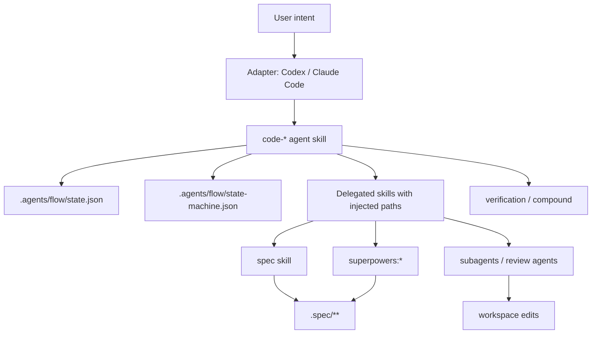

# shards-code — Technical Architecture

Project-level architecture for the combined `spec` framework and `code` flow
harness. Feature-level implementation detail lives under `.spec/features/<name>/`.

---

## Design Philosophy

1. **File-based contracts.** Specs, flow state, skills, and adapter instructions
   are ordinary files that agents can inspect and tools can validate.
2. **Separation of durability.** `.spec/` is durable project memory;
   `.agents/flow/` is runtime workflow state.
3. **Skills as orchestration units.** `code-*` skills are first-class agent
   skills with `SKILL.md` frontmatter, concise instructions, and optional
   scripts/references.
4. **Platform-neutral core.** Claude Code and Codex files are adapters that read
   `.agents/flow` and invoke `.agents/skills/code-*`.
5. **Delegation with constraints.** `code-*` skills call `spec`,
   `superpowers:*`, and subagents with explicit path instructions.
6. **Scripts for deterministic machinery.** State reads/writes, validation, and
   adapter installation use bash scripts rather than repeated prose.

---

## Architecture Overview



---

## Layers

| Layer | Files | Role |
|---|---|---|
| Spec framework | `.agents/skills/spec/`, `.spec/**` | Durable project planning and validation. |
| Code flow core | `.agents/flow/**` | Platform-neutral flow state, state machine, transition scripts. |
| Code skills | `.agents/skills/code-*/SKILL.md` | Agent-facing workflow shims that delegate to real skills. |
| Platform adapters | `AGENTS.md`, `CLAUDE.md`, `.claude/**` | Runtime-specific integration over the same core. |

---

## File Layout

```text
shards-code/
├── AGENTS.md
├── CLAUDE.md
├── README.md
├── install.sh
├── .agents/
│   ├── flow/
│   │   ├── state-machine.json          # static flow definition
│   │   ├── state.example.json          # neutral cursor template
│   │   └── scripts/
│   │       ├── detect-context.sh       # read flow + repo state, emit JSON
│   │       ├── set-state.sh            # validated state writer
│   │       └── validate-state.sh       # state-machine consistency checks
│   └── skills/
│       ├── spec/
│       ├── code-strategy/
│       ├── code-feature/
│       ├── code-quick/
│       ├── code-verify/
│       ├── code-compound/
│       └── code-amend/
├── .claude/
│   ├── commands/flow.md                # Claude adapter, reads .agents/flow
│   └── hooks/                          # optional adapter hooks
└── .spec/
    ├── product.md
    ├── tech.md
    ├── design.md
    ├── plan.md
    ├── lessons.md
    ├── features/<name>/
    └── archive/<name>/
```

Target projects receive the same `.agents/skills` and `.agents/flow` core, plus
adapter files for the agent runtimes they use.

---

## Spec Framework Contract

The spec framework owns only durable planning artifacts:

```text
.spec/
├── product.md
├── tech.md
├── design.md
├── plan.md
├── lessons.md
├── product-<topic>.md
├── tech-<topic>.md
├── plan-<topic>.md
├── features/<feature>/
│   ├── product.md
│   ├── tech.md
│   ├── design.md       # optional
│   ├── plan.md         # optional
│   └── research.md     # optional
└── archive/<feature>/
```

No mutable cursor, phase file, turn counter, hook cache, or runtime lock belongs
under `.spec/`.

---

## Code Flow Contract

The flow state lives under `.agents/flow`:

```json
{
  "flow": "idle | setup | strategy | feature | quick",
  "phase": "idle | detect | apply | plan | impl | verify | compound",
  "feature": null,
  "updated": "2026-05-14T00:00:00Z"
}
```

`state-machine.json` defines valid states, transitions, required `code-*` skill,
allowed write surfaces, and exit predicates. `set-state.sh` is the only sanctioned
writer. Adapter hooks may block direct writes to mutable state in target projects.

---

## Code Skill Contract

Each `code-*` skill is a normal agent skill:

```text
.agents/skills/code-strategy/
└── SKILL.md
```

The body must stay small and procedural:

1. Read `.agents/flow/state.json` and relevant `.spec/` entrypoints.
2. Confirm the current phase or transition through `.agents/flow/scripts/set-state.sh`.
3. Delegate to the correct external skill with explicit output paths.
4. Validate the expected files or verification evidence.
5. Report the next legal transition.

Example delegation:

```text
Use superpowers:brainstorming to clarify strategy. Then use the spec skill to
write only .spec/product.md, .spec/tech.md, .spec/design.md, and .spec/plan.md.
Do not use the delegated skill's default documentation path.
```

---

## Adapter Contract

Adapters never own canonical state. They read `.agents/flow` and invoke
`.agents/skills/code-*`.

| Adapter | Owns | Does Not Own |
|---|---|---|
| Codex | `AGENTS.md` instructions, optional desktop/thread affordances | Flow state, spec layout |
| Claude Code | `CLAUDE.md`, `.claude/commands/*`, `.claude/hooks/*` | Canonical skills, state machine |
| Installer | Copy/symlink adapter files and core `.agents` files | Project-specific product decisions |

---

## Build Sequence

| Order | Component | Feature |
|---|---|---|
| 1 | Update `spec` skill for product/tech/design/plan model | spec-framework |
| 2 | Create `.agents/flow/state-machine.json` and state scripts | code-flow |
| 3 | Create `code-strategy`, `code-feature`, `code-quick` skills | code-flow |
| 4 | Create `code-verify`, `code-compound`, `code-amend` skills | code-flow |
| 5 | Update `AGENTS.md` and `CLAUDE.md` as thin adapters | platform-adapters |
| 6 | Add Claude command/hook adapters that read `.agents/flow` | platform-adapters |
| 7 | Add installer/setup flow for target projects | platform-adapters |

---

## Risks & Mitigations

| Risk | Mitigation |
|---|---|
| Dual state systems return | Remove `.spec/.phase` and `.claude/state.json` as canonical concepts; document `.agents/flow` only. |
| `code-feature` becomes a mega-skill | Keep state data in JSON/scripts and split verify/compound/amend into separate skills. |
| Delegated skills write to wrong paths | Every `code-*` skill injects explicit `.spec/` paths before delegating. |
| Mutable state creates git noise | Version static definitions; gitignore target-project cursors/caches. |
| Adapter leakage | Root specs name `.agents/flow` and `.agents/skills` as canonical; `.claude` is adapter-only. |

---

## Features

| Feature | Covers |
|---|---|
| **[features/spec-framework/](features/spec-framework/tech.md)** | Spec skill, templates, validation, root/feature document contracts. |
| **[features/code-flow/](features/code-flow/tech.md)** | `.agents/flow` state machine, scripts, `code-*` skill contracts. |
| **[features/platform-adapters/](features/platform-adapters/tech.md)** | Codex/Claude adapter files and installer behavior. |
