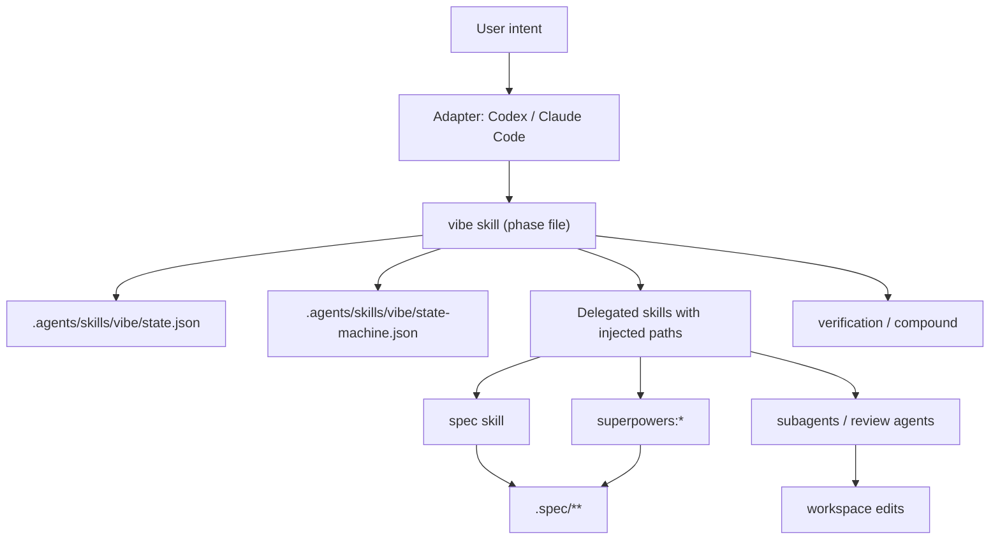

# vibe — Technical Architecture

Project-level architecture for the combined `spec` framework and `vibe` flow
harness. Feature-level implementation detail lives under `.spec/features/<name>/`.

---

## Design Philosophy

1. **File-based contracts.** Specs, flow state, skills, and adapter instructions
   are ordinary files that agents can inspect and tools can validate.
2. **Separation of durability.** `.spec/` is durable project memory;
   `.agents/skills/vibe/` is runtime workflow state.
3. **One skill, many phases.** `vibe` is a first-class agent skill — a router
   `SKILL.md` plus per-phase files (setup/strategy/feature/quick/verify/compound),
   with shared scripts and references.
4. **Platform-neutral core.** Claude Code and Codex files are adapters that read
   `.agents/skills/vibe` and invoke the `vibe` skill.
5. **Delegation with constraints.** `vibe` phases call `spec`, `superpowers:*`,
   and subagents with explicit path instructions.
6. **Scripts for deterministic machinery.** State reads/writes, validation, and
   adapter installation use bash scripts rather than repeated prose.

---

## Architecture Overview



---

## Layers

| Layer | Files | Role |
|---|---|---|
| Spec framework | `.agents/skills/spec/` (→ `spec/`), `.spec/**` | Durable project planning and validation. |
| Vibe flow core | `.agents/skills/vibe/**` (→ `flow/`) | Platform-neutral flow state, state machine, transition + health scripts. |
| Vibe skill | `.agents/skills/vibe/` | One agent skill — router `SKILL.md` + per-phase files — that delegates to real skills. |
| Install tooling | `install.sh`, `flow/scripts/doctor.sh`, `flow/reference/deps.json` | Copy/merge provisioning, partial/dry-run/uninstall, health report, dep manifest. |
| Platform adapters | `AGENTS.md`, `CLAUDE.md`, `.claude/**` (`commands/`, `hooks/`, `settings.json`) | Runtime-specific integration over the same core, incl. the Claude Code `/flow` command + hooks wired via `settings.json`. |

---

## File Layout

```text
vibe/
├── AGENTS.md
├── CLAUDE.md
├── README.md
├── install.sh
├── spec/                               # symlink → .agents/skills/spec
├── flow/                               # symlink → .agents/skills/vibe
├── .agents/
│   └── skills/
│       ├── spec/                       # spec skill (symlink target)
│       └── vibe/                       # workflow skill (SKILL.md + phase files + state machine + scripts)
├── .claude/
│   ├── settings.json                   # event → hook-script wiring (installer-written)
│   ├── commands/flow.md                # Claude adapter, reads .agents/skills/vibe
│   └── hooks/
│       ├── user-prompt-submit-inject.sh  # inject linked skill's orders each turn
│       ├── pre-tool-use-guard.sh         # allow/warn/block via detect-context.sh
│       └── stop-gate.sh                  # end-of-turn exit-predicate checks
└── .spec/
    ├── product.md
    ├── tech.md
    ├── design.md
    ├── plan.md
    ├── lessons.md
    ├── features/<name>/
    └── archive/<name>/
```

Target projects receive the same `.agents/skills` core, plus
adapter files for the agent runtimes they use.

---

## Spec Framework Contract

The spec framework owns only durable planning artifacts. It does **not** own flow
state, agent instruction files, or platform hooks (see feature boundaries in root
[plan.md](plan.md)).

```text
.spec/
├── product.md
├── tech.md
├── design.md
├── plan.md
├── lessons.md
├── product-<topic>.md
├── tech-<topic>.md
├── plan-<topic>.md
├── features/<feature>/     # ephemeral; archive after compound
│   ├── product.md          # required — WHAT: Requirement+Scenario format
│   ├── tech.md             # required — HOW: files, contracts
│   ├── design.md           # optional (full-rigor / UI)
│   ├── plan.md             # recommended — ### <feature>/n units, Requirements Trace
│   └── research.md         # optional
└── archive/<feature>/      # post-merge history
```

No mutable cursor, phase file, turn counter, hook cache, or runtime lock belongs
under `.spec/`.

### Bundled skill layout

```text
.agents/skills/spec/
├── SKILL.md
├── strategy.md
├── feature.md              # 6-step feature authoring interview flow (SF16)
├── scripts/
│   ├── setup.sh            # bootstrap root entrypoints + lessons.md (**Tags:**)
│   ├── validate.sh         # warn-first structural checks (SF8–SF12)
│   └── list-specs.sh       # root + feature doc inventory
└── reference/
    ├── product.md, tech.md, plan.md, design.md
    └── templates/          # hard-floor root + feature templates (SF5–SF7)

spec/tests/run.sh           # repo-root behaviour tests (SF0–SF19)
tests/run.sh                # combined runner: spec + flow + adapters (run bash tests/run.sh)
```

`setup.sh` resolves templates relative to its script directory (vendored or
`~/.agents/skills/spec`).

### Validation

- Root entrypoints: `product.md`, `tech.md`, `design.md`, `plan.md`.
- Feature folders: require `product.md` + `tech.md`; optional docs need frontmatter.
- **Warn-first** structural checks (SF8–SF12): Scope table, frontmatter, Requirement+
  Scenario (RFC-2119 + Given/When/Then), plan units, ID traceability. Promote to
  errors after live specs migrate.
- **Design tokens (SF3):** local empty-group check (offline floor).
- **External linter (SF4, OPEN-5):** opt-in `VIBE_DESIGN_LINT=1` →
  `npx @google/design.md lint`; skips when offline or unset.
- **Lessons (D8):** format owned here (`**Tags:**` per entry); vibe-flow owns
  read-on-entry; the `compound` phase writes + `regen-active-rules.sh` digest.

Feature specs are ephemeral: design → plan → impl → verify → compound →
`archive/<feature>/`. Cross-cutting decisions promote into root specs; feature-only
detail stays in archive. Promotable tech blocks use `<!-- merge -->` markers.

---

## Vibe Flow Contract

The flow state lives under `.agents/skills/vibe`. States are compound `<flow>.<phase>`
keys; the cursor carries only the moving parts and no turn-varying fields:

```json
{
  "flow": "idle | setup | strategy | feature | quick",
  "phase": "idle | detect | apply | brainstorm | spec | design | plan | impl | verify | compound | triage | fix",
  "feature": null,
  "updated": "2026-06-02T00:00:00Z"
}
```

`state-machine.json` defines each `<flow>.<phase>` state with its linked `vibe`
phase, allowed write surfaces, and exit predicate; a single top-level `style` note
governs output density for every state. The `skill` field
**links** the state to the `vibe` skill; under D12 the per-turn orders are sourced
from that linked skill's phase block rather than a hand-written `inject` string. A single inject
owner (the `UserPromptSubmit` hook) pulls the current state's orders from its
linked skill and injects them once per turn,
keeping the inject byte-stable and prompt-cache-safe. `set-state.sh` is the only
sanctioned writer. The full per-state mapping is the data in
`.agents/skills/vibe/state-machine.json` itself.

---

## Code Skill Contract

`vibe` is one agent skill: a router plus per-phase files and shared machinery.

```text
.agents/skills/vibe/            # → flow/
├── SKILL.md                    # router + D12 orders blocks
├── {setup,strategy,feature,quick,verify,compound}.md   # per-phase guides
├── state-machine.json          # states, links, next, style
├── state.example.json          # cursor template (state.json gitignored)
├── reference/deps.json         # external dependency manifest
└── scripts/                    # set-state, validate-state, detect-context,
                                # orders, check-skills, regen-active-rules,
                                # doctor, merge-agents
```

Each phase body must stay small and procedural:

1. Read `.agents/skills/vibe/state.json` and relevant `.spec/` entrypoints.
2. Confirm the current phase or transition through `.agents/skills/vibe/scripts/set-state.sh`.
3. Delegate to the correct external skill with explicit output paths.
4. Validate the expected files or verification evidence.
5. Report the next legal transition.

Example delegation:

```text
Use superpowers:brainstorming to clarify strategy. Then use the spec skill to
write only .spec/product.md, .spec/tech.md, .spec/design.md, and .spec/plan.md.
Do not use the delegated skill's default documentation path.
```

---

## Adapter Contract

Adapters never own canonical state. They read `.agents/skills/vibe` and invoke
the `vibe` skill.

| Adapter | Owns | Does Not Own |
|---|---|---|
| Codex | `AGENTS.md` instructions, optional desktop/thread affordances | Flow state, spec layout |
| Claude Code | `CLAUDE.md`, `.claude/settings.json`, `.claude/commands/*`, `.claude/hooks/*` | Canonical skills, state machine, the allow/warn/block policy (that lives in `detect-context.sh`) |
| Installer | Copy core `.agents` files + Claude adapter, merge `AGENTS.md`, seed+gitignore the cursor; `--only`/`--dry-run`/`--uninstall`; `doctor.sh` health; write `.claude/settings.json` hook wiring | Project-specific product decisions |

### Claude Code adapter & hooks

The Claude Code adapter wires the `/flow` command and the flow **hooks** through
`.claude/settings.json` (installer-written); the hook scripts resolve their data
via `$CLAUDE_PROJECT_DIR`. The earlier plugin packaging
(`.claude-plugin/plugin.json` + `hooks.json`) was **retired**: a plugin cannot
carry skills outside its own `skills/` dir (see the "plugin cannot bundle skills"
lesson), so the `spec` + `vibe` skills always had to ship as project files
through `install.sh` — the `settings.json` wiring drops the plugin without losing
anything. The hooks are the Stage 2 enforcement layer — what makes the flow fire
every turn rather than only when the agent remembers:

| Hook | Event | Role |
|---|---|---|
| Inject | `UserPromptSubmit` | Pull the current state's orders from its linked `vibe` phase and inject them every turn (D12). |
| Guard | `PreToolUse` (`Edit\|Write\|NotebookEdit`) | Hard-block the three invariants, warn elsewhere, via `detect-context.sh decide`. |
| Gate | `Stop` | Warn-first exit-predicate checks (stuck phase, impl-without-tests, forgotten `set-state.sh`). |
| Doctrine | `SessionStart` (+ `compact` matcher) | Deliver the working-model doctrine (session-start reads, write invariants, two gates, "you drive the flow" contract) + cursor summary each session; re-inject on `compact`. Single-sourced from the `<!-- vibe:doctrine -->` block via `doctrine.sh` — shared with the AGENTS.md template, making that block optional. |
| Redirect *(rework, planned)* | `PostToolUse` (`Skill`) | On delegate-skill load, inject the artifact redirect (`redirects.json`, `{feature}` interpolated) so superpowers keeps its method but writes into `.spec/**`. |

**2026-07-18 rework.**
**Delivered by flow-legibility:** orders are self-carrying (imperative, the
transition command included every turn); the `SessionStart` doctrine hook above;
the machine's loop edges (design↔research, `strategy.spec→brainstorm`,
`plan→design`); drift-first nudges (drift warnings surface as the first inject
line); and model-tier pins in every delegation contract (mechanical→sonnet,
review/architecture→opus). **Delivered by install-distribution:** the per-user
plugin + self-hosting marketplace and the one-command installer (the leaner
successor to the old vibe-plugin/stack-installer sketches; full
stateful-flow-via-plugin deferred). **Still forward-looking:** the
`PostToolUse`/`Skill` redirect hook + superpowers-native plan format
(delegation-redirect) and the header-keyed spec-delta promotion engine (spec-delta).

Each hook is a thin shell over `.agents/skills/vibe/scripts/`; the allow/warn/block
policy lives once in `detect-context.sh` and is never duplicated. Hooks are
earned warn-first and degrade gracefully (exit 0 on any missing keystone). The
live wiring is `.claude/settings.json` (installer-written) + `.claude/hooks/`.

---

## Build Sequence

Historical construction order. The seven `vibe-*` skills below were later
consolidated into one `vibe` skill (router + per-phase files); the split at
build time does not reflect the current layout.

| Order | Component | Feature |
|---|---|---|
| 1 | Update `spec` skill for product/tech/design/plan model | `spec` skill bundle (M0 done) |
| 2 | Create `.agents/skills/vibe/state-machine.json` and state scripts | vibe-flow |
| 3 | Create `vibe-strategy`, `vibe-feature`, `vibe-quick` skills | vibe-flow |
| 4 | Create `vibe-verify`, `vibe-compound`, `vibe-amend` skills | vibe-flow |
| 5 | Update `AGENTS.md` and `CLAUDE.md` as thin adapters | platform-adapters |
| 6 | Add the `/flow` command adapter that reads `.agents/skills/vibe` | platform-adapters |
| 7 | Wire the three hooks (inject / guard / gate), each a thin shell over `.agents/skills/vibe/scripts/`, into Claude Code — originally via a `.claude-plugin/plugin.json` + `hooks/hooks.json`, **later retired** for direct `.claude/settings.json` wiring | platform-adapters |
| 8 | Add installer/setup flow for target projects (writes `.claude/settings.json`) | platform-adapters |

---

## Risks & Mitigations

| Risk | Mitigation |
|---|---|
| Dual state systems return | Remove `.spec/.phase` and `.claude/state.json` as canonical concepts; document `.agents/skills/vibe` only. |
| The `vibe` skill becomes a mega-skill | Keep state data in JSON/scripts; keep each flow in its own per-phase file under one skill (resolved by the seven-shim → one-skill consolidation). |
| Delegated skills write to wrong paths | Every `vibe` phase injects explicit `.spec/` paths before delegating. |
| Mutable state creates git noise | Version static definitions; gitignore target-project cursors/caches. |
| Adapter leakage | Root specs name `.agents/skills/vibe` and `.agents/skills` as canonical; `.claude` is adapter-only. |

---

## Features

All delivered; branch specs were compounded into these root docs and the feature
folders removed (see [plan.md](plan.md)).

| Feature | Covers | Lives in |
|---|---|---|
| **spec framework** | Spec skill, templates, validation, authoring flow. | [`.agents/skills/spec/`](../.agents/skills/spec/SKILL.md) |
| **vibe-flow** | `.agents/skills/vibe/` state machine, scripts, the one `vibe` skill's contracts. | `flow/`, `flow/state-machine.json` |
| **agent-instructions** | `AGENTS.md` template + `merge-agents.sh` marker merge + adapter symlinks. | `flow/reference/templates/AGENTS.md`, `flow/scripts/merge-agents.sh` |
| **platform-adapters** | Claude adapter (`/flow` + three hooks via `.claude/settings.json`), `install.sh` core provisioning. | `.claude/**`, `install.sh` |
| **install-tooling** | `install.sh` flags + curl bootstrap, `doctor.sh`, `deps.json`. | `install.sh`, `flow/scripts/doctor.sh`, `flow/reference/deps.json` |
| **install-distribution** | `install.sh` local/global/`--with-plugins` + curl bootstrap; `build-plugin.sh` generates the marketplace plugin (symlinked skills, self-detecting `session-start.sh` doctrine hook); `doctor.sh` instruction-coverage. Tests: install modes + plugin-packaging integrity in `flow/tests/adapters/run.sh`, portable validator paths in `spec/tests/run.sh`. | `install.sh`, `build-plugin.sh`, `.claude-plugin/marketplace.json`, `plugin/**`, `flow/scripts/doctrine.sh` |
| **release-docs** | READMEs, rails (LICENSE/CHANGELOG/CI/runner), logo. | `README.md`, `spec/README.md`, `flow/README.md` |
| **flow-mvp** | Operating-layer MVP: precedence + contract-block delegation, hybrid plan grammar, `gates` on edges, a quick-flow compound state, evidence-receipt Stop tooth, output-density demoted to frozen vocabulary. | `flow/`, `flow/state-machine.json` |
