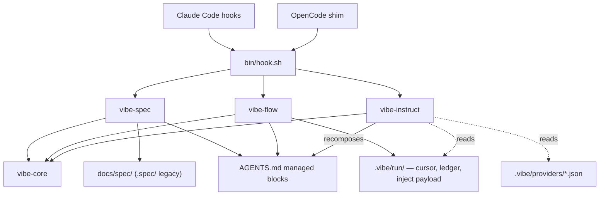

# vibe — Technical Architecture

vibe is three independent tools — spec, flow, instruct — each a single static
Rust binary with no runtime dependency, each a Claude Code plugin and an
OpenCode plugin, each installable and useful alone. They compose through
file-based contracts, never through imports. One repo, one installer, three
release trains. **Shipped today:** one Node engine (`flow/engine/`) plus bash
oracles drive all machinery, hooks run through `.claude/settings.json`, and
the cursor lives at `.agents/skills/vibe/state.json`. This document describes
the v0.4 target unless a callout says otherwise.

---

## Design Philosophy

1. **File-based contracts.** Specs, cursor, injection payload, and marker
   blocks are ordinary files any tool or agent can read and validate.
2. **Separation of durability.** The spec tree is committed memory; the
   cursor, ledger, and injection payload are runtime state, gitignored under
   `.vibe/run/`.
3. **Independence over convenience.** Each tool installs and works alone.
   Anti-bundling is a design value, not a phase: no umbrella binary, ever.
4. **One core crate, three binaries.** `vibe-core` holds every primitive a
   tool needs — root resolution, atomic writes, marker grammar, hook-input
   parsing. No tool crate depends on another.
5. **Contracts are the only coupling.** Cross-tool traffic is versioned files
   under `.vibe/` plus one soft exec, never an import.
6. **Injection is budgeted and trigger-classed.** Per-turn payload splits
   level / edge / event so live state never balloons the transcript.
7. **Enforce in code, explain in prose, never both.** An invariant the guard
   blocks is rendered in the guard's verdict, not preloaded into always-on
   context.
8. **The writer is the gate.** `state set` itself refuses an illegal or
   unconfirmed transition — approval is a mechanism, not a convention.
9. **Ported code proves itself.** Every Rust unit ships against a frozen
   oracle and a differential parity harness before it replaces the original.

---

## Architecture Overview


```mermaid
flowchart TD
  CC["Claude Code hooks"] --> SHIM["bin/hook.sh"]
  OC["OpenCode shim"] --> SHIM
  SHIM --> SP["vibe-spec"]
  SHIM --> FL["vibe-flow"]
  SHIM --> IN["vibe-instruct"]
  SP --> CORE["vibe-core"]
  FL --> CORE
  IN --> CORE
  FL --> RUN[".vibe/run/ — cursor, ledger, inject payload"]
  IN -.reads.-> RUN
  IN -.reads.-> PROV[".vibe/providers/*.json"]
  SP --> DOCS["docs/spec/ (.spec/ legacy)"]
  SP --> MD["AGENTS.md managed blocks"]
  FL --> MD
  IN -->|recomposes| MD
```

---

## Layers

| Layer | Owns | Carrier |
|---|---|---|
| Memory | `docs/spec/` (`.spec/` legacy), AGENTS.md managed blocks, `.vibe/*.json`, `.vibe/blocks/` | repo, committed |
| Spec | spec tree, templates, validation, OpenSpec interchange | plugin (`spec/`) |
| Flow | state machine, cursor, guard, ledger, signals, TUI | plugin (`flow/`) |
| Instruct | tiers, blocks, channels, budgets, sources | plugin (`instruct/`) |
| Core | root resolution, atomic writes, marker grammar, hook parsing | crate (`vibe-core`, internal) |
| Contracts | payload v1, marker grammar v1, spec JSON v1, provider manifest v1 | `contracts/` schemas + goldens |
| Carriers | hook shims, plugin manifests, `install.sh` | `bin/hook.sh`, `.claude-plugin/` |

---

## File Layout

```text
vibe/
├── crates/{vibe-core,vibe-spec,vibe-flow,vibe-instruct,vibe-signals,vibe-parity}/
├── spec/        # plugin: .claude-plugin/ skills/spec/ commands/ agents/ hooks/ bin/ opencode/ reference/
├── flow/        # plugin: … + state-machine.json policy.json bin/fallback/
├── instruct/    # plugin: … + blocks/ (shipped defaults)
├── contracts/   # schemas + goldens + run.sh
├── oracles/{js,bash}/ + MANIFEST.sha256
├── tests/parity/ (corpus, GREEN.hard)   tests/run.sh
├── .claude-plugin/marketplace.json
├── install.sh
├── .vibe/       # this repo's own config + blocks (+ run/, local/ ignored)
├── docs/spec/   # this repo's memory (after migration; .spec/ until then)
└── .agents/skills/{spec,flow,instruct} → ../../<tool>/skills/<tool>  (compat)
```

A target repo receives config (`.vibe/spec.json`, `.vibe/flow.json`,
`.vibe/instruct.json`), repo-shared blocks (`.vibe/blocks/*.md`), provider
manifests (`.vibe/providers/*.json`), the spec tree (`docs/spec/`), and each
tool's AGENTS.md managed block — all committed. Runtime (`.vibe/run/`) and
the personal tier (`.vibe/local/`) are never committed; a fresh clone
regenerates both.

---

## Spec Framework Contract

Default root `docs/spec/`; `.spec/` legacy. Layout unchanged from today:

```text
docs/spec/
├── product.md · tech.md · design.md · plan.md · lessons.md
├── {product,tech,plan}-<topic>.md
├── features/<feature>/{product,tech,design,plan,research}.md
└── archive/<feature>/
```

The marker grammar and every validation rule live once, in `vibe-spec`; the
framework owns no cursor, no injection, no block composition. Full
discovery order, migration, OpenSpec interchange, and validation:
[tech-spec.md](tech-spec.md).

---

## Vibe Flow Contract

Cursor JSON is unchanged in shape, at a new path,
`.vibe/run/flow/state.json`:

```json
{
  "flow": "idle | setup | strategy | feature | quick",
  "phase": "idle | detect | apply | brainstorm | spec | design | plan | impl | verify | compound | triage | fix",
  "feature": null,
  "updated": "2026-06-02T00:00:00Z"
}
```

`state-machine.json` defines each `<flow>.<phase>` state's phase-file link,
delegates, write surface, exit predicate, and legal `next`; edge-keyed
`gates` name the two human approvals. **The writer is the gate:** `vibe-flow
state set` refuses a target outside `next` and a gated edge without
`--confirm` — `/flow` becomes a thin wrapper over the same check. A
`.vibe/run/flow/ledger.jsonl` records every transition, hook verdict, and
advisory signal; `vibe-flow tui` reads the same cursor and ledger for a live
pane and recorded-flow playback. Full contract: [tech-rust.md](tech-rust.md).

---

## Instruct Contract

Four tiers layer over one another — global, repo-shared, repo-local,
session-runtime — later wins per block `id`; only repo-shared may compose
the `agents-md` channel. Channels are trigger-classed and budgeted:

| Channel | Trigger | Budget |
|---|---|---|
| `user-prompt.level` | every turn | ≤2 lines |
| `user-prompt.edge` | cursor advanced since session ledger | ≤15 lines |
| `user-prompt.event` | event occurred | ≤10 lines |
| `session-start` | session, `compact`, `resume` | ≤15 lines |
| `agents-md` | install, `write --check` | ≤80 lines |

Per-turn total (level + edge + event) ≤20 lines. instruct reads provider
payload files and manifests under `.vibe/`; it never learns a peer's tool
name. Full contract, tiers, sources, and lints:
[tech-instruct.md](tech-instruct.md).

---

## Cross-Tool Contracts

Four versioned contracts under `contracts/`, additive within a major,
tested byte-exact by every tool's CI:

- **Payload v1** — `.vibe/run/inject/<provider>.json`: `level`/`edge`/`event`
  fields plus `session` doctrine lines and `seq` for edge detection.
- **Provider manifest v1** — `.vibe/providers/<id>.json`: command or file
  source, channel, trigger, budget, timeout.
- **Marker grammar v1** — `<!-- vibe:<owner>:begin v=1 hash=<sha256:12> -->`
  … `<!-- vibe:<owner>:end -->`, owners spec/flow/instruct.
- **Spec JSON v1** — `root`, `lessons-for`, `plan`, `feature` queries,
  exit 3 on no tree.

Full schemas, examples, and the exit-code contract:
[tech-contracts.md](tech-contracts.md).

---

## Adapter Contract

| Platform | spec | flow | instruct |
|---|---|---|---|
| Claude Code | `Stop` (`validate --changed`), `PostToolUse` (`validate --file`) | `PreToolUse` guard, `PostToolUse` sniffer + Task redirect, `Stop` tooth, `SubagentStop`, `SessionEnd` | `SessionStart` (+compact/resume), `UserPromptSubmit`, `PreCompact` reset |
| OpenCode | `tool.execute.after` shim | `tool.execute.before/after`, `event` | `chat.message`, `system.transform`, `session.compacting`, `config` |
| Codex / other AGENTS.md readers | reads committed spec tree | reads AGENTS.md flow block; no enforcement | reads committed AGENTS.md instruct block |

Each plugin ships `bin/hook.sh`, a POSIX sh shim invoked as
`"${CLAUDE_PLUGIN_ROOT}/bin/hook.sh" <event>`. Discovery order:
`$VIBE_<TOOL>_BIN` → `$CLAUDE_PLUGIN_ROOT/bin/<os>-<arch>/vibe-<tool>` →
`command -v vibe-<tool>` → (flow guard/stop only) frozen bash
`bin/fallback/<event>.sh` → exit 0 with one stderr line. Never downloads.
Full discovery, fallback set, and exit codes: [tech-rust.md](tech-rust.md).

---

## Engine Module Boundaries

`vibe-core` is `publish = false`, internal-only, and holds every shared
primitive: root resolution, atomic writes, marker grammar, layered JSON
config, hook-input parsing, peer probe, contract types, ledger. No tool
crate depends on another — asserted by a `cargo metadata` CI test. No
module names a state, a spec path, or a channel outside its own tool. Two
orders are pinned by test: repo-root resolution in core (`CLAUDE_PROJECT_DIR`
→ `VIBE_ROOT` → upward search for `.vibe/`/`.git` → cwd) and spec-root
discovery in `vibe-spec` (`--root` → env → config → `docs/spec/` → `.spec/`
→ walk up to `.git`). Ported units carry a frozen oracle and a
differential parity harness before they replace the original — order,
corpus, and the deletion gate: [tech-rust.md](tech-rust.md).

---

## Risks & Mitigations

| Risk | Mitigation |
|---|---|
| Binary absent on a target platform/arch | Shim discovery falls to frozen bash fallback (guard/stop) or exits 0 with one line elsewhere; `doctor` reports it. |
| Plugin installed without a binary present | `install.sh` falls back to `cargo install --locked`; the two hard blocks still run bash. |
| Cross-version drift between the three tools | `contracts/run.sh` is byte-exact CI for every tool; additive-only within a major; `doctor` warns on major mismatch. |
| Dual-runtime limbo during the port | `port-order` CI job fails if TUI or signals code exists before `tests/parity/GREEN.hard`. |
| Global instruct tier makes every repo noisy | Global blocks default to `session-start`; `user-prompt.level` entry is explicit opt-in, hard-linted. |
| A strictness bump breaks an install overnight | Every check ships `warn`; promotion to `error` happens only in the compound that migrated the last live spec. |
| `docs/spec` rename breaks a live repo | `migrate` asserts population (before ≥1, after ==0, files ≥ floor) and inserts allow markers before any check can fire. |
| Windows lacks symlinks and `~/.config` | `@AGENTS.md` import instead of symlink; `%APPDATA%\vibe\` global tier; cargo-dist ships an msvc target. |

---

## Branch Documents

| Document | Covers |
|---|---|
| [tech-contracts.md](tech-contracts.md) | Payload, marker grammar, provider manifest, spec JSON — schemas, examples, exit codes, versioning. |
| [tech-rust.md](tech-rust.md) | Workspace, crates, shim discovery, oracles and parity, TUI, signals, distribution, CI. |
| [tech-instruct.md](tech-instruct.md) | Tiers, budgets, block format, lints, sources and sync, platform file targets. |
| [tech-spec.md](tech-spec.md) | Root discovery, migration, OpenSpec interchange, strictness, subagents, hooks. |

---

## Features

Feature inventory and delivery status live in [plan.md](plan.md)'s Feature
Sequence — the single place cross-feature order is stated. This document
describes the architecture those features build, not their status.
