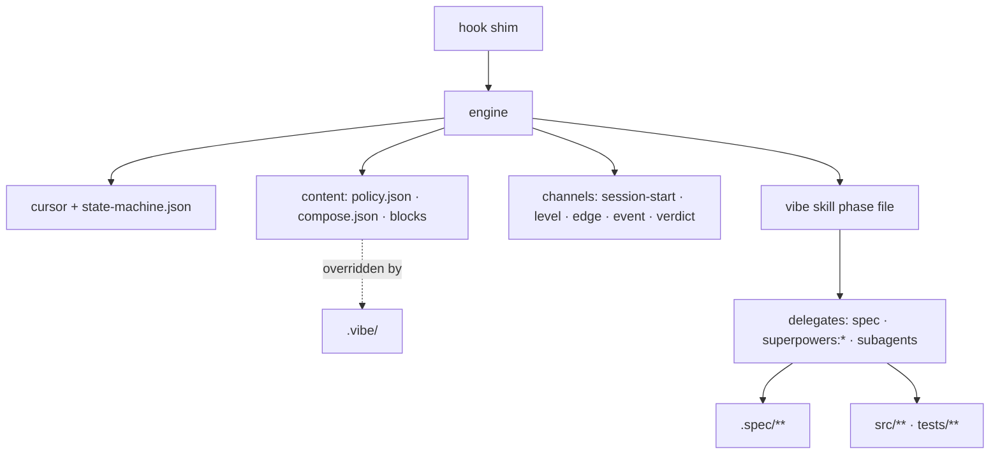

# vibe — Technical Architecture

Project-level architecture for the combined `spec` framework and `vibe` flow
harness. Feature-level implementation detail lives under `.spec/features/<name>/`.

---

## Design Philosophy

1. **File-based contracts.** Specs, flow state, skills, and adapter instructions
   are ordinary files that agents can inspect and tools can validate.
2. **Separation of durability.** `.spec/` is durable project memory committed to
   the repo; the cursor and receipts are runtime state, gitignored.
3. **One skill, many phases.** `vibe` is a first-class agent skill — a router
   `SKILL.md` plus per-phase files (setup/strategy/feature/quick/verify/compound),
   with shared machinery.
4. **Memory is portable; runtime is not.** `.spec/` and the `AGENTS.md` block
   are readable by any agent or none. Enforcement is a Claude Code plugin,
   because hooks are a Claude Code mechanism — an honest boundary, not a gap.
5. **Delegation with constraints.** `vibe` phases call `spec`, `superpowers:*`,
   and subagents with explicit path instructions.
6. **One engine for deterministic machinery.** State reads/writes, content
   resolution, merges, validation, and health checks are one JS engine — a single
   cursor reader, one root resolver, one marker grammar. Hooks are shims.
7. **Injection is budgeted and trigger-classed.** `UserPromptSubmit` output
   persists in the conversation, so per-turn payload is minimized and heavy
   payload fires on cursor change. Live state never rides `SessionStart`, whose
   output replays stale on `--resume`.
8. **Enforced rules are not also prose.** An invariant the guard blocks is
   rendered in the guard's verdict, not preloaded into always-on context.

---

## Architecture Overview


```mermaid
flowchart TD
  H["hook shim"] --> E["engine"]
  E --> C["cursor + state-machine.json"]
  E --> N["content: policy.json · compose.json · blocks"]
  N -. overridden by .-> O[".vibe/"]
  E --> INJ["channels: session-start · level · edge · event · verdict"]
  E --> K["vibe skill phase file"]
  K --> D["delegates: spec · superpowers:* · subagents"]
  D --> SPEC[".spec/**"]
  D --> SRC["src/** · tests/**"]
```

---

## Layers

| Layer | Files | Role | Carrier |
|---|---|---|---|
| Memory | `.spec/**`, `AGENTS.md` block, `.vibe/**` | Durable project planning; user content overrides. Runtime-free. | repo, committed |
| Spec framework | `spec/` | Templates, validation, authoring flow. | plugin |
| Vibe flow core | `flow/` | State machine, phase files, the `vibe` skill. | plugin |
| Content set | `flow/content/**` | `policy.json` invariants, `compose.json` channels, authored blocks — every injected sentence, authored once. | plugin (overridable from `.vibe/`) |
| Engine | `engine/` | `vibe` CLI: cursor, content resolution, merges, validation, health. | plugin + npm |
| Carriers | `plugin/**`, `.claude-plugin/`, hook shims | Manifest, marketplace, `exec`-to-engine shims. | — |

---

## File Layout

```text
vibe/                                   # the source repo
├── AGENTS.md · CLAUDE.md → AGENTS.md · README.md
├── engine/                             # the JS engine (vibe CLI)
│   ├── cli.mjs                         # command dispatch
│   ├── cursor.mjs · machine.mjs        # the ONE cursor reader / machine loader
│   ├── content.mjs                     # blocks, channels, placeholders, one marker grammar
│   ├── policy.mjs                      # reads content/policy.json — the enforcer
│   └── commands/                       # init, state, orders, doctrine, render,
│                                       # doctor, validate, drift, promote, vendor
├── spec/                               # spec skill (canonical)
├── flow/                               # flow engine data + skill (canonical)
│   ├── SKILL.md · {setup,strategy,feature,quick,verify,compound}.md
│   ├── state-machine.json              # states, phase link, next, gates
│   └── content/
│       ├── policy.json                 # write invariants AS DATA
│       ├── compose.json                # channel → ordered block ids
│       └── blocks/**.md                # id + channels + summary frontmatter
├── plugin/                             # generated payload (build-plugin)
│   ├── .claude-plugin/plugin.json      # version = the upgrade lock
│   ├── skills/{spec,vibe} · commands/ · agents/
│   └── hooks/{hooks.json, *.sh}        # shims: exec node → engine
├── .claude-plugin/marketplace.json
├── .agents/skills/{spec,vibe}          # compat symlinks → ../../spec, ../../flow
└── .spec/                              # this repo's own memory
    ├── product.md · tech.md · design.md · plan.md · lessons.md
    ├── features/<name>/
    └── archive/<name>/
```

A **target repo** receives only memory — `.spec/**`, the `AGENTS.md` managed
block, `.vibe/` overrides, and a gitignored cursor. The runtime lives in the
plugin. `vibe vendor` is the opt-in that also writes the engine, hook shims, and
`.claude/settings.json` into a target for teams and CI.

---

## Spec Framework Contract

The spec framework owns only durable planning artifacts. It does **not** own flow
state, agent instruction files, or platform hooks (see feature boundaries in root
[plan.md](plan.md)).

```text
.spec/
├── product.md
├── tech.md
├── design.md
├── plan.md
├── lessons.md
├── product-<topic>.md
├── tech-<topic>.md
├── plan-<topic>.md
├── features/<feature>/     # ephemeral; archive after compound
│   ├── product.md          # required — WHAT: Requirement+Scenario format
│   ├── tech.md             # required — HOW: files, contracts
│   ├── design.md           # optional (full-rigor / UI)
│   ├── plan.md             # recommended — ### <feature>/n units, Requirements Trace
│   └── research.md         # optional
└── archive/<feature>/      # post-merge history
```

No mutable cursor, phase file, turn counter, hook cache, or runtime lock belongs
under `.spec/`.

### Bundled skill layout

`spec/` carries `SKILL.md`, `strategy.md`, `feature.md` (the 6-step authoring
interview), `agents/` (four subagents, registered through the plugin manifest),
`reference/` authoring guides and templates, and `tests/`. Spec machinery —
setup, validate, drift, promote, list, scan, lessons-for — moves into the engine
as `vibe` subcommands; the skill prose names them by command, never by an
install-specific script path.

### Validation

Root entrypoints are required; feature folders require `product.md` + `tech.md`.
Structural checks ship **warn-first** and are promoted to errors only after live
specs migrate. The check inventory (SF-numbers, what each asserts) is owned by
the spec skill and its suite — not restated here. D8 stands: the lesson *format*
belongs to the spec half, read-on-entry to the flow half.

Feature specs are ephemeral: design → plan → impl → verify → compound →
`archive/<feature>/`. Cross-cutting decisions promote into root specs; feature-only
detail stays in archive. Promotable tech blocks use `<!-- merge -->` markers.

---

## Vibe Flow Contract

The flow state lives under `.agents/skills/vibe`. States are compound `<flow>.<phase>`
keys; the cursor carries only the moving parts and no turn-varying fields:

```json
{
  "flow": "idle | setup | strategy | feature | quick",
  "phase": "idle | detect | apply | brainstorm | spec | design | plan | impl | verify | compound | triage | fix",
  "feature": null,
  "updated": "2026-06-02T00:00:00Z"
}
```

`state-machine.json` defines each `<flow>.<phase>` state with its **phase-file
link**, delegates, allowed write surfaces, exit predicate, and legal `next` set;
edge-keyed `gates` name the two human approvals. Every field is read by code —
a field nothing reads is deleted, not carried.

`vibe state set <target>` is the only sanctioned writer **and the gate**:

- rejects a target outside the current state's `next`,
- rejects a gated edge without an explicit `--confirm`,
- writes atomically, preserving `feature` carry-forward.

This is the correction to the previous design, where `gates` was read by no code
and every orders block instructed the model to call the writer directly — making
the documented happy path the gate bypass. Approval is now enforced at the
writer, so prose cannot route around it.

Orders **interpolate** machine fields (`{{writes}}`, `{{next}}`, `{{delegates}}`,
`{{gate}}`) instead of restating them, so renaming a state is a one-file change.

---

## Content & Injection Contract

Every injected sentence is authored once as a **block** and composed into a
**channel**, under one marker grammar and one resolver. `policy.json` is the sole
write-invariant source — the guard evaluates it, the renderer prints it, so
parity is by construction rather than by test. Because `UserPromptSubmit` output
persists in the transcript, channels are trigger-classed (level / edge / event)
with per-channel line budgets linted in CI.

Full contract — block format, the `.vibe/` override layer, the channel table and
its budgets, and the authoring lints — lives in
[tech-content.md](tech-content.md).


---

## Code Skill Contract

`vibe` is one agent skill: a router plus per-phase files and shared machinery.

```text
.agents/skills/vibe/            # → flow/
├── SKILL.md                    # router + D12 orders blocks
├── {setup,strategy,feature,quick,verify,compound}.md   # per-phase guides
├── state-machine.json          # states, links, next, style
├── state.example.json          # cursor template (state.json gitignored)
├── reference/deps.json         # external dependency manifest
└── scripts/                    # set-state, validate-state, detect-context,
                                # orders, check-skills, regen-active-rules,
                                # doctor, merge-agents
```

Each phase body must stay small and procedural:

1. Read `.agents/skills/vibe/state.json` and relevant `.spec/` entrypoints.
2. Confirm the current phase or transition through `.agents/skills/vibe/scripts/set-state.sh`.
3. Delegate to the correct external skill with explicit output paths.
4. Validate the expected files or verification evidence.
5. Report the next legal transition.

Delegation names the executor, the injected scope, and the redirect target;
the `PostToolUse` redirect hook enforces the destination so the instruction is
not the only thing standing between a delegate and its default doc folder.

---

## Adapter Contract

Adapters never own canonical state. They read `.agents/skills/vibe` and invoke
the `vibe` skill.

| Adapter | Owns | Does Not Own |
|---|---|---|
| Codex / any AGENTS.md reader | The `agents-md` channel output; reads `.spec/` directly | Flow state, enforcement (no hook mechanism exists) |
| Claude Code plugin | Hook registration, `/flow`, skill + subagent registration, the engine payload, version | Canonical content (that is `flow/content/`), the policy (that is `policy.json`) |
| `vibe init` | Seed `.spec/`, cursor, `.vibe/`, `.gitignore`, merge the `AGENTS.md` block | Runtime installation — the plugin owns that |
| `vibe vendor` | Opt-in in-repo runtime: engine, hook shims, `.claude/settings.json` | Default behaviour; it is never implicit |

### Claude Code plugin & hooks

The plugin is the runtime carrier. `plugin.json` declares `skills`, `commands`,
and `agents`; `hooks/hooks.json` auto-loads and is **not** declared in the
manifest. Hook commands are three-line shims that `exec` the engine and exit 0
when Node is absent. `CLAUDE_PROJECT_DIR` is exported to plugin hooks, so a
per-user plugin resolves per-repo state correctly — which is what retires the
"one shared cursor" objection that previously kept the stateful flow out of the
plugin.

| Hook | Event | Role |
|---|---|---|
| Inject | `UserPromptSubmit` | Emit the level channel every turn; the edge channel only when the cursor changed; the event channel only when there is drift or a queued warning. |
| Guard | `PreToolUse` (`Edit\|Write\|NotebookEdit\|Bash`) | Evaluate `policy.json`; block with a rendered verdict, warn elsewhere. |
| Gate | `Stop` | The evidence-receipt tooth in `*.verify`. Note the platform ends the turn after 8 consecutive blocks — the tooth is finite, not absolute. |
| Doctrine | `SessionStart` (+ `compact`) | Timeless doctrine only. Carries **no cursor line**: resumed sessions replay saved hook output, which would make live state stale. |
| Redirect | `PostToolUse` (`Skill`) | On delegate-skill load, inject the artifact redirect (`redirects.json`, `{{feature}}` interpolated) so superpowers keeps its method but writes into `.spec/**`. |

Every hook is a shim over the engine; the allow/warn/block policy lives once in
`policy.json` and is never duplicated. Hooks are earned warn-first and degrade
gracefully (exit 0 on any missing keystone). Delivery history lives in
[plan.md](plan.md), not here.

---

## Risks & Mitigations

| Risk | Mitigation |
|---|---|
| Node absent on a target | Hook shims `exec` the engine and `exit 0` cleanly when it is missing; `vibe doctor` reports it. The flow degrades to unenforced, never to a broken session. |
| Plugin-only enforcement leaves teammates and CI bare | `vibe vendor` writes the runtime in-repo as an explicit opt-in; `.spec/` and the `AGENTS.md` block are committed regardless, so the *memory* always travels. |
| Big-bang rewrite strands the harness mid-flight | The engine lands first while the shell still runs; scripts cut over one at a time, each with its suite green before the shell copy is deleted. |
| Version skew between plugin and a repo's `.spec/` | `plugin.json` `version` is the lock; `vibe doctor` compares it against a stamp written by `init`. |
| Injection creeps back over budget | Per-channel line budgets are linted by `vibe render` and asserted in CI, not left to discipline. |
| Delegated skills write to wrong paths | Static orders plus the `PostToolUse` redirect hook; the redirect is mechanical, not a request. |
| Mutable state creates git noise | Version static definitions; gitignore target cursors, receipts, and the inject marker. |
| Plugin payload symlinks break on Windows | Symlinks resolving inside the marketplace are dereferenced at install; `build-plugin --check` asserts the payload shape. |

---

## Features

Feature inventory and delivery status are owned by [plan.md](plan.md)'s Feature
Sequence — the single place cross-feature order is stated. This document
describes the architecture those features build, not their status.
