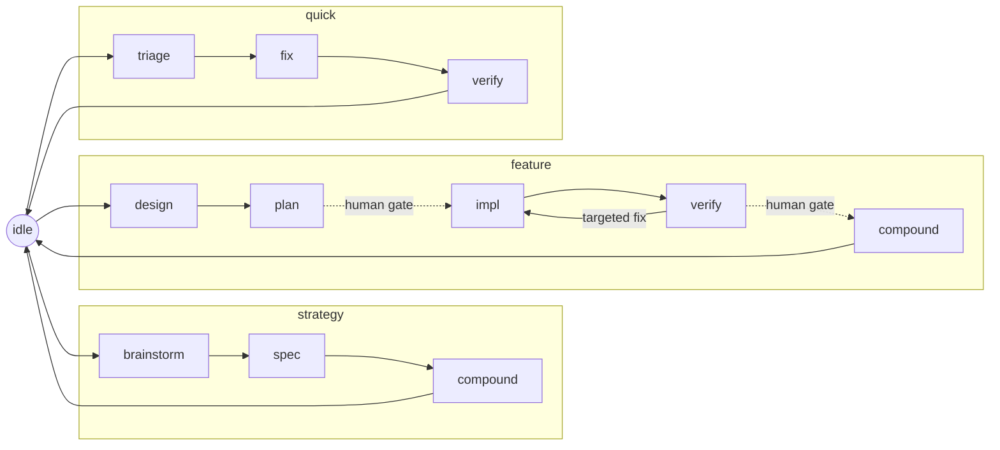

<div align="center">


**A self-hosting spec + workflow harness for coding with agents.**

[](https://github.com/LennardZuendorf/vibe/actions/workflows/ci.yml)
[](LICENSE)


</div>

---

vibe is two things that ship together but stand alone:

- **The spec framework** — a durable `.spec/` planning layer (product / tech /
  design / plan / lessons) with templates and a validator. Works with **any**
  agent, or none.
- **The vibe flow** — a state-machine workflow for **Claude Code** that routes
  each phase (strategy / feature / quick) to the right skills and subagents,
  injects per-turn "orders", and guards its own write invariants with hooks.

Everything is bash, Markdown, and JSON — no runtime, no build step. The repo
builds itself with its own harness (it is self-hosting), so what you install is
exactly what is dogfooded here.

## Which half do you want?

| You want… | Install | Needs Claude Code? |
|---|---|---|
| **Durable, validated planning docs** for a project (any agent, or solo) | `./install.sh <repo> --only spec` | No |
| **The full workflow harness** — flow state machine, per-turn routing, hooks | `./install.sh <repo>` (both halves) | Yes, for the hooks |
| **Just the flow engine** without the spec skill | `./install.sh <repo> --only flow` | Yes |

New here? Read the first two screens and you will know which command to run.

## Install

**Prerequisites:** `bash` and [`jq`](https://jqlang.github.io/jq/) (the scripts
degrade gracefully without `jq`, but it is recommended). `git` for the target repo.

```bash
git clone https://github.com/LennardZuendorf/vibe.git
cd vibe

# Full install into your project (spec framework + flow + Claude adapter):
./install.sh /path/to/your/repo

# Preview first — prints the plan, writes nothing:
./install.sh /path/to/your/repo --dry-run

# Spec framework only (no flow, no hooks, no plugin):
./install.sh /path/to/your/repo --only spec

# Also symlink CLAUDE.md -> AGENTS.md (opt-in, never clobbers a real file):
./install.sh /path/to/your/repo --adapters claude
```

The installer **copies** the platform-neutral core into `<repo>/.agents/skills/`,
**merges** `AGENTS.md` inside managed markers (your prose is never touched),
seeds and gitignores the flow cursor, and prints how to register the plugin.
Re-running is idempotent and preserves a live flow cursor.

**Activate the Claude Code hooks** (full / flow install): register the repo as a
plugin in Claude Code with the `/plugin` command — it ships
`.claude-plugin/plugin.json`, which wires the `/flow` command and the three hooks.
Until the plugin is loaded, the spec + vibe skills still work as project files.

**Uninstall** removes only what vibe installed and keeps your content
(`.spec/**`, your `AGENTS.md` prose, and the flow cursor unless `--yes`):

```bash
./install.sh /path/to/your/repo --uninstall            # preview-safe, cursor kept
./install.sh /path/to/your/repo --uninstall --only spec  # remove just one half
```

## The spec framework

Every project using vibe gets a `.spec/` tree — the single source of truth for
what you are building, why, and how. It ships as a bundled skill (`spec`) that
works standalone or drives the flow's authoring phases.

```
.spec/
├── product.md, tech.md, design.md, plan.md, lessons.md   ← ROOT (persistent role, current content)
└── features/<name>/
    ├── product.md    required     what this feature does (requirements + Scope)
    ├── tech.md       required     how it is built (paths, contracts, layout)
    ├── plan.md       recommended  stable <name>/n unit IDs; verification per unit
    └── design.md     optional     UI/UX or design-system fragment
```

Root files carry no backlog and no archaeology; feature folders are
branch-scoped — written at design, consumed at impl, merged (cross-cutting parts)
at compound, then deleted before the branch merges. **Code is truth.**

```bash
/spec setup            # initialise .spec/ with templates
/spec strategy         # write root product/tech/design/plan
/spec feature <name>   # scope and design a named feature
/spec validate         # check structural consistency
```

Deep dive: [`spec/README.md`](spec/README.md).

## The vibe flow

Everything starts at `idle`. The agent self-locates, then drives one flow. The
cursor `.agents/skills/vibe/state.json` = `{flow, phase, feature}` points at one
state in `state-machine.json` — the source of truth for each state's skill,
delegates, caveman level, write surface, and legal `next`. Transition only via
`set-state.sh <flow.phase>`.



The workflow is **one skill** (`vibe`) with a router plus per-phase files
(`setup`, `strategy`, `feature`, `quick`, `verify`, `compound`, `amend`). Each
turn, the `UserPromptSubmit` hook injects the current state's orders (resolved
from the linked skill by `orders.sh` — D12); a `PreToolUse` hook guards the three
write invariants; a `Stop` hook runs warn-first exit checks. `amend` is a
modifier, not a flow: a scoped edit from any state that returns there.

Deep dive: [`flow/README.md`](flow/README.md).

## Dependencies

vibe bundles only the `spec` skill. The flow *delegates* to external skills and
subagents, declared once in [`flow/reference/deps.json`](flow/reference/deps.json)
and reported by `doctor.sh`. **Every dependency degrades gracefully — a missing
one warns, never hard-fails.**

| Dependency | Kind | Source | If absent |
|---|---|---|---|
| superpowers | skill-collection | [obra/superpowers](https://github.com/obra/superpowers) | flow phases self-execute from their constraint documents |
| feature-dev | subagent-collection | Claude Code plugin: feature-dev | the orchestrator performs the explore / architect / review step inline |
| caveman | skill-collection | [JuliusBrussee/caveman](https://github.com/JuliusBrussee/caveman) | `check-skills.sh` prints the level definition inline (output compression only) |

## Platform support

vibe is portable by design; capability scales with the host.

| Host | What works | What is absent |
|---|---|---|
| **Claude Code** | Everything: spec skill, flow, `/flow` command, per-turn inject, guard + gate hooks | — |
| **Other `AGENTS.md` readers** (Codex, etc.) | Spec framework + instructions; agents follow the written flow manually | Hooks (no per-turn inject / guard / gate) |
| **Bare git / any editor** | Spec framework: `.spec/` docs, templates, `validate.sh` | Flow automation, hooks, plugin |

## Health & updates

```bash
# One-command install health report (warn-only, always exits 0):
bash /path/to/your/repo/.agents/skills/vibe/scripts/doctor.sh

# Update: re-run the installer. It refreshes the managed core and preserves your
# .spec/, AGENTS.md prose, and live flow cursor.
./install.sh /path/to/your/repo
```

## Layout

```text
your-repo/                     # after install
├── .agents/skills/
│   ├── spec/                  # bundled spec framework (real dir)
│   └── vibe/                  # flow: router, phase files, state machine, scripts
├── .claude/                   # Claude adapter: /flow command + three hooks (flow half)
├── .claude-plugin/            # plugin.json (flow half)
├── .spec/                     # your durable project memory
└── AGENTS.md                  # merged instructions (CLAUDE.md may symlink here)
```

In **this** repo the canonical halves live at [`spec/`](spec/) and
[`flow/`](flow/); `.agents/skills/{spec,vibe}` are compatibility symlinks (the
portable runtime interface). The installer dereferences them into real
directories in your target.

## Tests

```bash
bash tests/run.sh      # spec (123) + flow (55) + adapters (66) — 244 assertions
```

CI runs `shellcheck` on every tracked `*.sh`, the combined suite, and
`spec/scripts/validate.sh` on every push and PR.

## Documentation

- [`spec/README.md`](spec/README.md) — the spec framework, standalone.
- [`flow/README.md`](flow/README.md) — the flow: states, orders, hooks, degrade.
- [`.spec/product.md`](.spec/product.md) · [`.spec/tech.md`](.spec/tech.md) ·
  [`.spec/plan.md`](.spec/plan.md) — the harness's own specs.
- [`CHANGELOG.md`](CHANGELOG.md) — release notes.

## License

[MIT](LICENSE) © 2026 Lennard Zündorf
