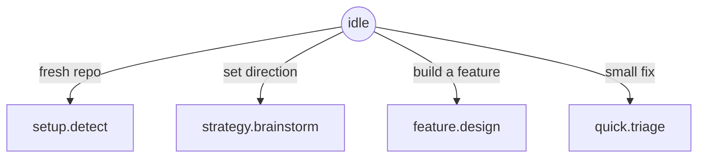
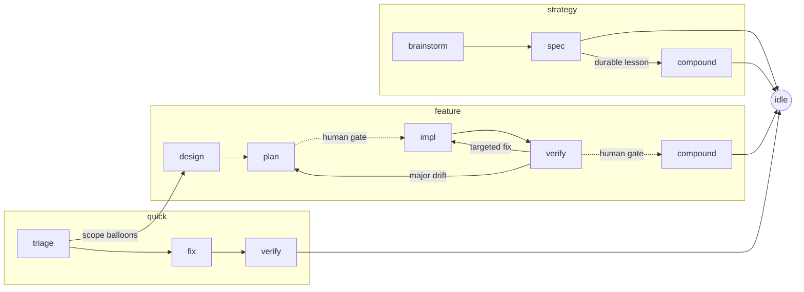

# vibe

A personal **toolbox for vibe coding** — a small, growing collection of things
that make coding with an agent easier and more productive. Built mainly for my
own private use, but structured to be forkable.

The idea is to **stop guiding the agent turn-by-turn and start instructing it**:
say "I need X", and the tooling already knows the phase, the skills and subagents
to use, and how terse to be — so attention goes to *what* to build, not *how* to
walk the agent through it.

---

## What's in the box

| Tool | What it gives you | Lives in |
|---|---|---|
| **Vibe flow** | A state-machine-driven coding workflow (strategy / feature / quick) that routes each phase to the right skills, subagents, and output paths. The centerpiece. | `.agents/skills/vibe/`, `.agents/skills/vibe-*` |
| **Spec framework** | A durable `.spec/` planning skill — product/tech/design/plan/lessons docs with templates and validation. Usable on its own, with or without the flow. | `.agents/skills/spec/` |
| **Agent-file template** | `AGENTS.md` template + `merge-agents.sh` (managed `vibe:instructions` block) and opt-in adapter symlinks (`CLAUDE.md`, `WARP.md`), so any runtime reads the same neutral core. | `CLAUDE.md`, `AGENTS.md`, `.agents/skills/vibe-setup/` |
| **Claude Code plugin** | `.claude-plugin/plugin.json` + three hooks (inject / guard / gate) + `install.sh`, so the flow fires every turn and guards its invariants. | `.claude/`, `install.sh` |

More tools will land over time; this is a personal collection, not a product.
The three above are the first cut.

---

## The vibe flow

Everything starts at `idle`. The agent self-locates, then drives one flow. The
cursor `.agents/skills/vibe/state.json` = `{flow, phase, feature}` points at one entry
in `.agents/skills/vibe/state-machine.json` — the source of truth that holds each
state's skill, delegates, caveman level, write surface, and legal
`next`. Transition only via `set-state.sh <flow.phase>`.





`amend` is a **modifier**, not a flow: it makes a targeted scope edit from any
state, within that state's write rules, then returns there. The cursor is
unchanged.

### Phase map

Every phase, the skill shim that drives it, the external skills and feature-dev
subagents it delegates to, its caveman density, the spec artifact it reads or
writes, and what the stage is for. This mirrors `state-machine.json`.

| Phase | Skill shim | External skills | Subagents | Caveman | Spec artifact (R/W) | What the stage does |
|---|---|---|---|---|---|---|
| `idle` | — | `using-superpowers` | — | lite | R `lessons.md`, `plan.md` | Resting hub between flows. Read lessons/plan, then pick the flow that matches the request. |
| `setup.detect` | `vibe-setup` | — | — | lite | R repo, adapters, `.agents`, `.spec` | Read-only audit of repo + harness; report present vs missing and preflight required plugins. |
| `setup.apply` | `vibe-setup` | `spec`, `writing-skills` | — | lite | W `.agents/**`, baseline `.spec/**`, adapter blocks | Write/merge the bootstrap without clobbering: constitution block, flow scaffold, baseline specs. |
| `strategy.brainstorm` | `vibe-strategy` | `brainstorming` | — | lite | R `lessons.md` | Shape project direction in dialogue; scratch only, no writes yet. |
| `strategy.spec` | `vibe-strategy` | `spec` | — | lite | W root `product/tech/design/plan` | Commit the agreed direction into the root specs and validate. |
| `strategy.compound` | `vibe-compound` | `spec` | — | lite | W `lessons.md`, adapter blocks | Record a durable strategy lesson and refresh the active-rules digest. |
| `feature.design` | `vibe-feature` | `brainstorming` | `code-explorer`, `code-architect` | lite | R `lessons.md`, root `product/tech`; W `features/<f>/{product,tech}` | Trace the codebase and sketch approaches, then write the feature's product + tech specs. |
| `feature.plan` | `vibe-feature` | `writing-plans` | `code-architect` | lite | W `features/<f>/plan` | Turn the design into a plan with stable unit IDs (`U1`, `U2`…). **Human gate** before impl. |
| `feature.impl` | `vibe-feature` | `executing-plans`, `test-driven-development` | — | full | R `plan`; W `src/**`, `tests/**` | Build the plan units test-first, citing unit IDs in tests/commits; no spec edits. |
| `feature.verify` | `vibe-verify` | `verification-before-completion`, `requesting-code-review`, `systematic-debugging` | `code-reviewer` | full | R `plan`, `src`, `tests` | Gather real evidence per unit ID and review. **Human gate** before ship; routes pass→compound, fail→impl/plan. |
| `feature.compound` | `vibe-compound` | `finishing-a-development-branch`, `spec` | — | lite (receipts ultra) | W `lessons.md`, root specs, archive, adapter blocks | Record the lesson, promote cross-cutting decisions to root, archive the feature, refresh digest. |
| `quick.triage` | `vibe-quick` | `systematic-debugging` | — | full | R `lessons.md` | Diagnose the small issue; don't fix yet. Escalate to `feature.design` if scope balloons. |
| `quick.fix` | `vibe-quick` | `test-driven-development` | — | full | W `src/**`, opt `.spec/quick/<slug>.md` | Implement the bounded fix test-first; no root spec writes. |
| `quick.verify` | `vibe-verify` | `verification-before-completion` | `code-reviewer` | full | R `src`, `tests` | Prove the fix works and breaks nothing. |
| `amend` _(modifier)_ | `vibe-amend` | `spec`, `receiving-code-review` | — | lite | target state's surface only | Targeted scope edit within the current state's write rules, then return to that state. |

External skills are `superpowers:*` unless noted (`spec` is bundled). Subagents
are Anthropic's feature-dev agents, cherry-picked per phase.

### Per-turn orders (D12)

One inject owner delivers one set of "current orders" per state — the skill, the
write surface, the caveman level, and the next state. Under **D12** those orders
are **sourced from the state's linked `vibe-*` skill** (the single source of
truth), not a hand-written string duplicated here; only `idle` keeps a minimal
inline fallback in `state-machine.json` (`amend` is a modifier, never a cursor
state — `set-state.sh` rejects it — so `orders.sh` is never resolved for it; its
skill carries a reference-only block). The orders are
static per state (byte-stable so the prompt cache holds; only `<feature>`
interpolates), resolved by `.agents/skills/vibe/scripts/orders.sh` and delivered every
turn by the `UserPromptSubmit` inject hook. See the phase map above for each
state's skill, delegates, and write surface.

### Caveman levels

Output **compression only** — never reasoning depth. Code, paths, and commands
stay byte-exact; security warnings and irreversible-action confirmations stay in
normal prose at every level.

| Level | Behaviour | Phases |
|---|---|---|
| `lite` | No filler; full sentences | strategy, setup, design, plan, compound, amend |
| `full` | Drop articles; fragments OK | impl, verify, quick.* |
| `ultra` | Arrows, one word where one does | compound receipts, subagent→orchestrator summaries (never triage) |

---

## Spec framework

Every project using vibe gets a `.spec/` tree — the single source of truth for
what you're building, why, and how. It ships as a bundled skill (`spec`) that
works standalone (no flow required) or integrates with the vibe flow phases.

### Two-layer model

```
.spec/
├── product.md, tech.md, design.md, plan.md, lessons.md   ← ROOT (persistent, high-level)
└── features/<name>/
    ├── product.md    required   what this feature does (requirements + Scope table)
    ├── tech.md       required   how it's built (paths, contracts, file layout)
    ├── plan.md       recommended  stable <name>/n unit IDs; verification per unit
    └── design.md     optional   UI/UX or design-system fragment
```

Root files are **persistent in role, current in content** — no backlog, no
archaeology. Feature folders are **branch-scoped** — written during design,
consumed during impl, merged (cross-cutting sections only) at compound, then
deleted before the branch merges. CODE IS TRUTH.

### Superpowers integration

The spec skill is a **format + constraints + validation** layer. Execution at
each authoring step is delegated to the appropriate superpower, with the spec
skill supplying the constraint document:

| Phase | Spec supplies | Executor |
|---|---|---|
| `feature.design` step 2 (WHAT) | `feature.md § Interview for WHAT` as constraint | `superpowers:brainstorming` |
| `feature.design` steps 3–4 (HOW) | `reference/tech.md` + feature template | `code-explorer`, `code-architect` |
| `feature.plan` step 5 | `reference/plan.md` + stable-ID rules | `superpowers:writing-plans` |
| `feature.verify` | `validate.sh` output as structured context | `superpowers:verification-before-completion` |
| `feature.compound` | `promote.sh` + lesson format | `superpowers:finishing-a-development-branch` |

This separation means improving the spec constraints (templates, reference guides,
validators) immediately improves every superpower's output without touching the
executors.

### Quick start

```bash
/spec setup                    # initialise .spec/ with templates
/spec strategy                 # write root product/tech/design/plan
/spec feature <name>           # scope and design a named feature
/spec validate                 # check structural consistency
```

Skill entrypoint: [`.agents/skills/spec/SKILL.md`](.agents/skills/spec/SKILL.md).
Human-facing overview: [`.agents/skills/spec/README.md`](.agents/skills/spec/README.md).

---

## Architecture

Three strictly separated layers keep the toolbox portable:

| Layer | Lives in | Role |
|---|---|---|
| **Durable memory** | `.spec/**` | What we're building, why, how, lessons |
| **Runtime state** | `.agents/skills/vibe/**` | Where we are now (cursor + state machine) |
| **Workflow shims** | `.agents/skills/vibe-*` | Skills that delegate to real skills |
| **Adapters** | `CLAUDE.md`, `AGENTS.md`, `.claude/**` | Thin per-runtime translation |

### Invariants (the three hard blocks)

The write-decision policy lives once, in `detect-context.sh`. These three are
hard blocks; everything else is a warning:

1. `.spec/lessons.md` — writable only during a `*.compound` state.
2. Root `.spec/{product,tech,design,plan}.md` — only during `strategy.spec`,
   `feature.compound`, or `setup.apply`.
3. `.agents/skills/vibe/state.json` — only via `set-state.sh`, never by direct edit.

The active-rules block in `CLAUDE.md`/`AGENTS.md` is **generated** from
`.spec/lessons.md` by `regen-active-rules.sh` (top-5, pinned first) — a warning,
not a block.

---

## Layout

```text
.agents/
├── flow/
│   ├── state-machine.json      # the flow, as data — reshape by editing this
│   ├── state.example.json      # neutral cursor template (state.json is gitignored)
│   └── scripts/
│       ├── set-state.sh         # only sanctioned cursor writer
│       ├── validate-state.sh    # cursor sanity
│       ├── detect-context.sh    # snapshot + allow/warn/block decision policy
│       ├── orders.sh            # D12: resolve per-state orders from linked skill
│       ├── check-skills.sh      # external-skill availability + caveman fallback
│       └── regen-active-rules.sh# lessons → adapter digest
└── skills/
    ├── vibe-{setup,strategy,feature,quick,verify,compound,amend}/SKILL.md
    └── spec/                    # bundled spec framework
.spec/                           # durable memory (product/tech/design/plan/lessons)
CLAUDE.md · AGENTS.md            # thin per-runtime adapters
```

Required external skills (assumed installed, not bundled): `superpowers:*`,
feature-dev subagents (`code-explorer`, `code-architect`, `code-reviewer`),
optional `caveman`. Only `spec` ships in-repo. Missing skills degrade with a
warning, never a hard fail.

---

## Status

**Stage 1 & 2 complete** — the flow runs end-to-end. State machine as data,
deterministic scripts, seven `vibe-*` skill shims, D12 orders sourced from each
linked skill (resolved by `orders.sh`), and the generated active-rules digest.

**Stage 2 (earn the teeth) shipped** — vibe ships as a **Claude Code plugin**
(`.claude-plugin/plugin.json`) bundling the `/flow` command and three **hooks**: a
`UserPromptSubmit` inject (delivers the current state's linked-skill orders every
turn — D12), a `PreToolUse` guard (hard-blocks the three invariants via the shared
`detect-context.sh` policy), and a `Stop` gate (warn-first exit-predicate checks).
Hooks are thin shells over `.agents/skills/vibe/scripts/`, added warn-first and promoted
to blocking only as dogfooding earns it. `install.sh` provisions the core + adapter
into any repo. See
[features/platform-adapters](.spec/features/platform-adapters/product.md).

Tests: `tests/spec/run.sh` (44), `tests/flow/run.sh` (26), `tests/adapters/run.sh`
(39) — all green; every script is shellcheck-clean.

| Milestone | Status |
|---|---|
| M0 Spec cleanup · M1 Flow core · M2 Vibe skills · M3 Verify/compound | done |
| M4 Adapters + Claude Code plugin (template merge, three hooks, plugin manifest, installer) | done |
| M5 Dogfood (hook/merge/install behaviours, scripted) | done |

---

## Documentation

- **[.spec/product.md](.spec/product.md)** — story, requirements, principles, phase map.
- **[.spec/tech.md](.spec/tech.md)** — architecture, state contracts.
- **[.spec/plan.md](.spec/plan.md)** — milestones, open decisions.
- **[.spec/features/vibe-flow/](.spec/features/vibe-flow/product.md)** — the flow in depth.
- **[.agents/skills/spec/SKILL.md](.agents/skills/spec/SKILL.md)** — bundled spec skill.
