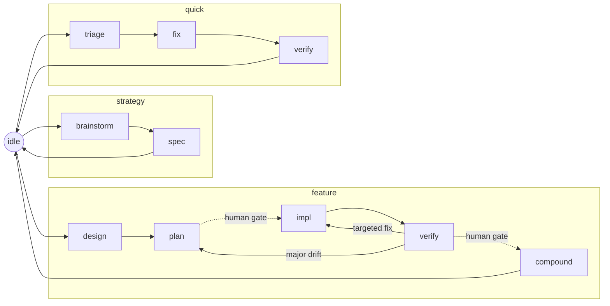

<div align="center">


**A self-hosting spec + workflow harness for coding with agents.**

[](https://github.com/LennardZuendorf/vibe/actions/workflows/ci.yml)
[](LICENSE)


</div>

---

vibe is two things that ship together but stand alone:

- **The spec framework** — a durable `.spec/` planning layer (product / tech /
  design / plan / lessons) with templates and a validator. Works with **any**
  agent, or none.
- **The vibe flow** — a state-machine workflow for **Claude Code** that routes
  each phase (strategy / feature / quick) to the right skills and subagents,
  injects per-turn "orders", and guards its own write invariants with hooks.

All bash, Markdown, and JSON — no runtime, no build step. The repo builds itself
with its own harness, so what you install is exactly what is dogfooded here.

## Install

**Prerequisites:** `bash`, plus `git` for the target repo.
[`jq`](https://jqlang.github.io/jq/) is recommended (scripts degrade gracefully
without it). The `claude` CLI is needed only for the plugin / `--global` install.

### One command

```bash
git clone https://github.com/LennardZuendorf/vibe.git && cd vibe
./install.sh
```

Run it from inside the repo you want vibe in, or pass a target path. A bare run
searches upward for the enclosing repo (a `.spec`/`.git` marker) and, on a
terminal, asks which mode you want:

| Mode | Command | What you get |
|---|---|---|
| **local** (default) | `./install.sh <repo>` | Full **stateful** vibe into that repo: the spec + vibe skills, the `/flow` command, and the four Claude Code hooks wired via `.claude/settings.json`. Self-contained — teammates get it through git. |
| **global** | `./install.sh --global` | The **per-user plugin** (`vibe@vibe`, user scope): only the portable, stateless surface — the spec + vibe skills and the doctrine hook — applied in **every** vibe repo. Needs the `claude` CLI. |

```bash
./install.sh <repo>              # local: full vibe into <repo>
./install.sh --global            # per-user plugin (across all your repos)
./install.sh --with-plugins      # also install companion plugins (superpowers)
./install.sh <repo> --only spec  # spec framework only (any agent, or none)
./install.sh <repo> --only flow  # flow engine only (no spec skill)
./install.sh <repo> --adapters claude   # symlink CLAUDE.md -> AGENTS.md (opt-in, never clobbers)
./install.sh <repo> --dry-run    # preview; writes nothing
```

### As a Claude Code plugin

The repo **is** its own marketplace, so you can install the per-user plugin
directly:

```bash
claude plugin marketplace add LennardZuendorf/vibe
claude plugin install vibe@vibe
```

That is exactly what `./install.sh --global` runs for you. The plugin ships the
spec + vibe skills and a self-detecting `SessionStart` doctrine hook — **not** the
stateful flow (`/flow`, cursor, guard hooks), which stays a local install.

### What a local install does

Copies the platform-neutral core into `<repo>/.agents/skills/`, merges `AGENTS.md`
inside managed markers (your prose is never touched), seeds and gitignores the flow
cursor, and wires the four Claude hooks (`SessionStart`, `UserPromptSubmit`,
`PreToolUse`, `Stop`) into `.claude/settings.json`. Re-running is idempotent and
preserves a live cursor. No plugin to register — `/flow` is a native project command.

### Companion tools

`--with-plugins` installs a companion set via the `claude` CLI at user scope —
currently **superpowers**, with a **feature-dev** slot ready to fill in. It
degrades gracefully when the CLI is absent. "caveman" is **not** a plugin: vibe
injects a one-line *caveman style* brevity note into the doctrine each session.

### Uninstall

Removes only what vibe installed and keeps your content (`.spec/**`, your
`AGENTS.md` prose, and the flow cursor unless `--yes`):

```bash
./install.sh /path/to/your/repo --uninstall             # cursor kept; --dry-run to preview
./install.sh /path/to/your/repo --uninstall --yes        # also remove the flow cursor
./install.sh /path/to/your/repo --uninstall --only spec  # remove just one half
```

## The spec framework

Every vibe project gets a `.spec/` tree — the single source of truth for what you
are building, why, and how. It ships as a bundled skill (`spec`) that works
standalone or drives the flow's authoring phases.

```
.spec/
├── product.md, tech.md, design.md, plan.md, lessons.md   ← ROOT (persistent role, current content)
└── features/<name>/
    ├── product.md    required     what this feature does (requirements + Scope)
    ├── tech.md       required     how it is built (paths, contracts, layout)
    ├── plan.md       recommended  stable <name>/n unit IDs; verification per unit
    ├── design.md     optional     UI/UX or design-system fragment
    └── research.md   optional     findings from spikes / investigations
```

Root files carry no backlog and no archaeology; feature folders are branch-scoped —
written at design, consumed at impl, merged (cross-cutting parts) at compound, then
deleted before the branch merges. **Code is truth.**

```bash
/spec setup            # initialise .spec/ with templates
/spec strategy         # write root product/tech/design/plan
/spec feature <name>   # scope and design a named feature
/spec validate         # check structural consistency
```

Deep dive: [`spec/README.md`](spec/README.md).

## The vibe flow

Everything starts at `idle`. The agent self-locates, then drives one flow. The
cursor `.agents/skills/vibe/state.json` = `{flow, phase, feature}` points at one
state in `state-machine.json` — the source of truth for each state's skill,
delegates, write surface, and legal `next`. Transition only via
`set-state.sh <flow.phase>`.



> Simplified view — see [`flow/README.md`](flow/README.md) for the setup states.

The workflow is **one skill** (`vibe`): a router plus per-phase files (`setup`,
`strategy`, `feature`, `quick`, `verify`, `compound`). Four hooks drive it:

- `SessionStart` re-injects the working-model doctrine each session (and on `compact`).
- `UserPromptSubmit` injects the current state's **imperative** orders — naming the
  literal transition command to run when the job is done (resolved from the linked
  skill by `orders.sh`) — and prepends a `vibe-drift:` nudge when working-tree
  activity contradicts the cursor.
- `PreToolUse` guards the three write invariants.
- `Stop` runs warn-first exit checks and blocks in `*.verify` without a fresh
  evidence receipt.

A scope edit is not a state: edit within the current write surface and stay put —
`set-state.sh idle` always aborts.

### Driving the flow with `/flow`

`/flow` is the transition command. Pass the target state — plus a feature name
when entering a feature flow:

```text
/flow feature.design my-feature   # start a feature; names the feature
/flow feature.plan                # advance to planning
/flow idle                        # abort — always legal
```

It reads the cursor, refuses a target that is not in the state's `next`, and
otherwise calls `set-state.sh` for you — you never hand-edit the cursor. Most edges
**auto-advance**. The flow stops only at a **gated edge**, which needs an explicit
confirm token before `/flow` will cross it: `feature.plan → feature.impl` (approve
the plan units + pick the impl mode) and `feature.verify → feature.compound`
(approve shipping). The `quick.triage → feature.design` escalation also confirms,
because it renames the work.

### A worked first run

A one-line bug, start to finish on the **quick** flow. You type the `/flow`
command; the inject hook answers with that state's telegraphic orders:

```text
> /flow quick.triage

skill=vibe · READ .spec/lessons.md first · defect: delegate superpowers:systematic-debugging (diagnose only, no fix) | non-defect: self-scope, no delegate · escalation to feature.design: announce AND confirm · done → set-state.sh quick.fix
```

Reproduce the bug, then advance and write the fix + its test:

```text
> /flow quick.fix

skill=vibe · delegate TDD + receiving-code-review on verify-routed re-entry · WRITE src/** (+ optional .spec/quick/<slug>.md note) · no root spec writes · done → set-state.sh quick.verify
```

Then verify:

```text
> /flow quick.verify

skill=vibe · delegate verification-before-completion + code-reviewer · gather EVIDENCE the fix works and breaks nothing · no root spec writes · ... · findings → set-state.sh quick.fix | else → set-state.sh idle
```

Now the `Stop` gate has teeth: in `quick.verify` it **refuses to end the turn**
until a fresh `evidence/quick.md` receipt exists (staleness is git-derived). Write
the receipt, and `set-state.sh idle` closes the loop.

### What actually enforces what

Only a few things are *hard*; the rest is convention the flow surfaces but does
not block on.

| Mechanism | Strength | What it does |
|---|---|---|
| `PreToolUse` guard — 3 write invariants | **Hard block** (exit 2) | `state.json` only via `set-state.sh`; `.spec/lessons.md` and the root `.spec/{product,tech,design,plan}.md` docs are writable only in their flow-end states — the exact per-state sets live in the doctrine block, parity-tested against `detect-context.sh decide` (the single source of truth) |
| `PreToolUse` guard — Bash sniffer | **Warning** | the hard blocks intercept **file-tool** calls (Edit / Write / NotebookEdit) only; a raw `echo >> .spec/lessons.md` is caught by a text-scan sniffer that **warns**, never blocks (false positives are certain, so it can only nudge) |
| `Stop` gate — evidence receipt | **Hard block** (exit 2) | in a `*.verify` state, refuses to stop until a fresh `evidence/…` receipt exists (staleness is git-derived). This tooth fires **with or without `jq`** — jq-less, the cursor is read via sed and the block is byte-identical |
| `set-state.sh` — the cursor writer | **Not a gate** | it validates the target state *name* and writes the cursor; it does **not** enforce edge legality. Which edges are legal (and which need a confirm) is `/flow` convention, not a hook |
| everything else | **Warning** | auto-advance nudges, stuck-phase / impl-without-tests smells, per-turn orders — advisory only. Warnings are relayed back and appear at your **next prompt**, not mid-turn |

Everything degrades gracefully: a missing script or an unreadable cursor exits 0
and never ends the session. Without `jq` you lose only the machine-derived warn
nudges — the write invariants and the evidence-receipt block still fire (they read
the flat cursor via sed).

Deep dive: [`flow/README.md`](flow/README.md).

## Dependencies

vibe bundles only the `spec` skill. The flow *delegates* to external skills and
subagents, declared once in [`flow/reference/deps.json`](flow/reference/deps.json)
and reported by `doctor.sh`. **Every dependency degrades gracefully — a missing
one warns, never hard-fails.**

| Dependency | Kind | Source | If absent |
|---|---|---|---|
| superpowers | skill-collection | [obra/superpowers](https://github.com/obra/superpowers) | flow phases self-execute from their constraint documents |
| feature-dev | subagent-collection | Claude Code plugin: feature-dev | the orchestrator performs the explore / architect / review step inline |

## Platform support

vibe is portable by design; capability scales with the host.

| Host | What works | What is absent |
|---|---|---|
| **Claude Code** | Everything: spec skill, flow, `/flow` command, per-turn inject, guard + gate hooks | — |
| **Other `AGENTS.md` readers** (Codex, etc.) | Spec framework + instructions; agents follow the written flow manually | Hooks (no per-turn inject / guard / gate) |
| **Bare git / any editor** | Spec framework: `.spec/` docs, templates, `validate.sh` | Flow automation, hooks |

## Health & updates

```bash
# One-command install health report (warn-only, always exits 0):
bash /path/to/your/repo/.agents/skills/vibe/scripts/doctor.sh

# Update: re-run the installer. It refreshes the managed core and preserves your
# .spec/, AGENTS.md prose, and live flow cursor.
./install.sh /path/to/your/repo
```

## Layout

```text
your-repo/                     # after install
├── .agents/skills/
│   ├── spec/                  # bundled spec framework (real dir)
│   └── vibe/                  # flow: router, phase files, state machine, scripts
├── .claude/                   # Claude adapter: /flow command + four hooks + settings.json (flow half)
├── .spec/                     # your durable project memory
└── AGENTS.md                  # merged instructions (CLAUDE.md may symlink here)
```

In **this** repo the canonical halves live at [`spec/`](spec/) and
[`flow/`](flow/); `.agents/skills/{spec,vibe}` are compatibility symlinks (the
portable runtime interface). The installer dereferences them into real
directories in your target.

## Tests

```bash
bash tests/run.sh      # spec + flow + adapters suites; CI runs the full matrix
```

CI runs `shellcheck` on every tracked `*.sh`, the combined suite,
`spec/scripts/validate.sh`, and `spec/scripts/check-drift.sh` (compound / doc-drift
gate) on every push and PR.

## Documentation

- [`spec/README.md`](spec/README.md) — the spec framework, standalone.
- [`flow/README.md`](flow/README.md) — the flow: states, orders, hooks, degrade.
- [`.spec/product.md`](.spec/product.md) · [`.spec/tech.md`](.spec/tech.md) ·
  [`.spec/plan.md`](.spec/plan.md) — the harness's own specs (a living worked
  example of a filled-in `.spec/` tree).
- [`CHANGELOG.md`](CHANGELOG.md) — release notes.

## License

[MIT](LICENSE) © 2026 Lennard Zündorf
