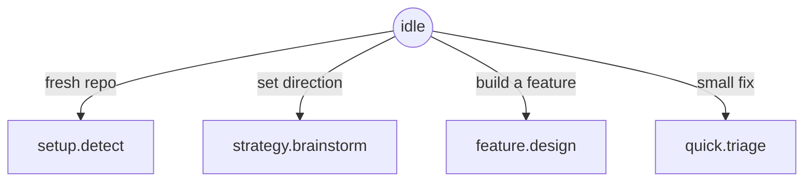
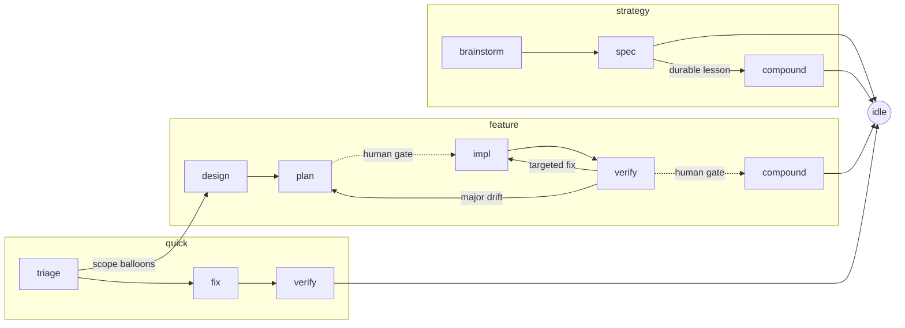

# vibe

A personal **toolbox for vibe coding** — a small, growing collection of things
that make coding with an agent easier and more productive. Built mainly for my
own private use, but structured to be forkable.

The idea is to **stop guiding the agent turn-by-turn and start instructing it**:
say "I need X", and the tooling already knows the phase, the skills and subagents
to use, and how terse to be — so attention goes to *what* to build, not *how* to
walk the agent through it.

---

## What's in the box

| Tool | What it gives you | Lives in |
|---|---|---|
| **Vibe flow** | A state-machine-driven coding workflow (strategy / feature / quick) that routes each phase to the right skills, subagents, and output paths. The centerpiece. | `.agents/flow/`, `.agents/skills/vibe-*` |
| **Spec framework** | A durable `.spec/` planning skill — product/tech/design/plan/lessons docs with templates and validation. Usable on its own, with or without the flow. | `.agents/skills/spec/` |
| **Agent-file template** | `AGENTS.md` / `CLAUDE.md` adapters + a managed constitution block, so any runtime reads the same neutral core. | `CLAUDE.md`, `AGENTS.md` |

More tools will land over time; this is a personal collection, not a product.
The three above are the first cut.

---

## The vibe flow

Everything starts at `idle`. The agent self-locates, then drives one flow. The
cursor `.agents/flow/state.json` = `{flow, phase, feature}` points at one entry
in `.agents/flow/state-machine.json` — the source of truth that holds each
state's skill, delegates, caveman level, write surface, frozen inject, and legal
`next`. Transition only via `set-state.sh <flow.phase>`.





`amend` is a **modifier**, not a flow: it makes a targeted scope edit from any
state, within that state's write rules, then returns there. The cursor is
unchanged.

### Phase map

Every phase, the skill shim that drives it, the external skills and feature-dev
subagents it delegates to, its caveman density, the spec artifact it reads or
writes, and what the stage is for. This mirrors `state-machine.json`.

| Phase | Skill shim | External skills | Subagents | Caveman | Spec artifact (R/W) | What the stage does |
|---|---|---|---|---|---|---|
| `idle` | — | `using-superpowers` | — | lite | R `lessons.md`, `plan.md` | Resting hub between flows. Read lessons/plan, then pick the flow that matches the request. |
| `setup.detect` | `vibe-setup` | — | — | lite | R repo, adapters, `.agents`, `.spec` | Read-only audit of repo + harness; report present vs missing and preflight required plugins. |
| `setup.apply` | `vibe-setup` | `spec`, `writing-skills` | — | lite | W `.agents/**`, baseline `.spec/**`, adapter blocks | Write/merge the bootstrap without clobbering: constitution block, flow scaffold, baseline specs. |
| `strategy.brainstorm` | `vibe-strategy` | `brainstorming` | — | lite | R `lessons.md` | Shape project direction in dialogue; scratch only, no writes yet. |
| `strategy.spec` | `vibe-strategy` | `spec` | — | lite | W root `product/tech/design/plan` | Commit the agreed direction into the root specs and validate. |
| `strategy.compound` | `vibe-compound` | `spec` | — | lite | W `lessons.md`, adapter blocks | Record a durable strategy lesson and refresh the active-rules digest. |
| `feature.design` | `vibe-feature` | `brainstorming` | `code-explorer`, `code-architect` | lite | R `lessons.md`, root `product/tech`; W `features/<f>/{product,tech}` | Trace the codebase and sketch approaches, then write the feature's product + tech specs. |
| `feature.plan` | `vibe-feature` | `writing-plans` | `code-architect` | lite | W `features/<f>/plan` | Turn the design into a plan with stable unit IDs (`U1`, `U2`…). **Human gate** before impl. |
| `feature.impl` | `vibe-feature` | `executing-plans`, `test-driven-development` | — | full | R `plan`; W `src/**`, `tests/**` | Build the plan units test-first, citing unit IDs in tests/commits; no spec edits. |
| `feature.verify` | `vibe-verify` | `verification-before-completion`, `requesting-code-review`, `systematic-debugging` | `code-reviewer` | full | R `plan`, `src`, `tests` | Gather real evidence per unit ID and review. **Human gate** before ship; routes pass→compound, fail→impl/plan. |
| `feature.compound` | `vibe-compound` | `finishing-a-development-branch`, `spec` | — | lite (receipts ultra) | W `lessons.md`, root specs, archive, adapter blocks | Record the lesson, promote cross-cutting decisions to root, archive the feature, refresh digest. |
| `quick.triage` | `vibe-quick` | `systematic-debugging` | — | full | R `lessons.md` | Diagnose the small issue; don't fix yet. Escalate to `feature.design` if scope balloons. |
| `quick.fix` | `vibe-quick` | `test-driven-development` | — | full | W `src/**`, opt `.spec/quick/<slug>.md` | Implement the bounded fix test-first; no root spec writes. |
| `quick.verify` | `vibe-verify` | `verification-before-completion` | `code-reviewer` | full | R `src`, `tests` | Prove the fix works and breaks nothing. |
| `amend` _(modifier)_ | `vibe-amend` | `spec`, `receiving-code-review` | — | lite | target state's surface only | Targeted scope edit within the current state's write rules, then return to that state. |

External skills are `superpowers:*` unless noted (`spec` is bundled). Subagents
are Anthropic's feature-dev agents, cherry-picked per phase.

### Frozen inject strings

One inject owner emits one **frozen** string per state (byte-stable so the prompt
cache holds; only `<feature>` interpolates). It names the skill, write surface,
caveman level, and next state — the per-turn "current orders."

| Phase | Inject (verbatim) |
|---|---|
| `idle` | `state=idle · no active flow · pick one: vibe-setup, vibe-strategy, vibe-feature, vibe-quick · next: setup.detect \| strategy.brainstorm \| feature.design \| quick.triage` |
| `setup.detect` | `skill=vibe-setup · READ-ONLY audit of repo + harness · report what is missing/present · do NOT write yet · caveman=lite · next: setup.apply` |
| `setup.apply` | `skill=vibe-setup · WRITE/MERGE bootstrap: constitution block, .agents/flow scaffold, baseline .spec/** · NEVER clobber existing content (diff + ask on divergence) · caveman=lite · next: idle` |
| `strategy.brainstorm` | `skill=vibe-strategy · delegate superpowers:brainstorming · READ .spec/lessons.md first · scratch only, no source, no spec writes yet · caveman=lite · next: strategy.spec` |
| `strategy.spec` | `skill=vibe-strategy · delegate spec · WRITE root .spec/{product,tech,design,plan}.md ONLY · no source, no lessons.md · validate after · caveman=lite · next: strategy.compound (if a durable lesson surfaced) \| idle` |
| `strategy.compound` | `skill=vibe-compound · WRITE .spec/lessons.md (tagged entry) · regen-active-rules.sh refreshes CLAUDE/AGENTS active-rules block · receipts caveman=ultra, body=lite · next: idle` |
| `feature.design` | `skill=vibe-feature · READ .spec/lessons.md first · delegate brainstorming + code-explorer (trace) + code-architect (sketch) · WRITE .spec/features/<feature>/{product,tech}.md ONLY · no source yet · caveman=lite · next: feature.plan` |
| `feature.plan` | `skill=vibe-feature · delegate superpowers:writing-plans + code-architect · WRITE .spec/features/<feature>/plan.md with STABLE unit IDs (U1, U2 ...) · IDs never change on reorder/split · no source yet · caveman=lite · HUMAN GATE before impl · next: feature.impl` |
| `feature.impl` | `skill=vibe-feature · delegate executing-plans + TDD · WRITE src/**, tests/** · do NOT edit .spec/** · cite plan unit IDs (U1...) in tests/commits · caveman=full · next: feature.verify` |
| `feature.verify` | `skill=vibe-verify · delegate verification-before-completion + requesting-code-review + code-reviewer (systematic-debugging on fail) · gather EVIDENCE per plan unit ID · no spec writes · caveman=full · HUMAN GATE before ship · next: feature.compound (pass) \| feature.impl (targeted fix) \| feature.plan (major drift)` |
| `feature.compound` | `skill=vibe-compound · delegate finishing-a-development-branch · WRITE tagged .spec/lessons.md, promote cross-cutting decisions to root specs, archive .spec/features/<feature> -> .spec/archive/<feature> · regen-active-rules.sh refreshes digest · receipts caveman=ultra, body=lite · next: idle` |
| `quick.triage` | `skill=vibe-quick · READ .spec/lessons.md first · delegate superpowers:systematic-debugging · diagnose, do NOT fix yet · caveman=full (NOT ultra: triage must keep edge cases) · if scope balloons, escalate to feature.design · next: quick.fix` |
| `quick.fix` | `skill=vibe-quick · delegate TDD · WRITE src/** (+ optional .spec/quick/<slug>.md note) · no root spec writes · caveman=full · next: quick.verify` |
| `quick.verify` | `skill=vibe-verify · delegate verification-before-completion + code-reviewer · gather EVIDENCE the fix works and breaks nothing · no spec writes · caveman=full · next: idle` |
| `amend` | `MODIFIER=amend · edit scope for the CURRENT state, then RETURN to it · carry the target state's write rules (do NOT widen them) · caveman=lite · next: <state you came from>` |

### Caveman levels

Output **compression only** — never reasoning depth. Code, paths, and commands
stay byte-exact; security warnings and irreversible-action confirmations stay in
normal prose at every level.

| Level | Behaviour | Phases |
|---|---|---|
| `lite` | No filler; full sentences | strategy, setup, design, plan, compound, amend |
| `full` | Drop articles; fragments OK | impl, verify, quick.* |
| `ultra` | Arrows, one word where one does | compound receipts, subagent→orchestrator summaries (never triage) |

---

## Architecture

Three strictly separated layers keep the toolbox portable:

| Layer | Lives in | Role |
|---|---|---|
| **Durable memory** | `.spec/**` | What we're building, why, how, lessons |
| **Runtime state** | `.agents/flow/**` | Where we are now (cursor + state machine) |
| **Workflow shims** | `.agents/skills/vibe-*` | Skills that delegate to real skills |
| **Adapters** | `CLAUDE.md`, `AGENTS.md`, `.claude/**` | Thin per-runtime translation |

### Invariants (the three hard blocks)

The write-decision policy lives once, in `detect-context.sh`. These three are
hard blocks; everything else is a warning:

1. `.spec/lessons.md` — writable only during a `*.compound` state.
2. Root `.spec/{product,tech,design,plan}.md` — only during `strategy.spec` or
   `feature.compound`.
3. `.agents/flow/state.json` — only via `set-state.sh`, never by direct edit.

The active-rules block in `CLAUDE.md`/`AGENTS.md` is **generated** from
`.spec/lessons.md` by `regen-active-rules.sh` (top-5, pinned first) — a warning,
not a block.

---

## Layout

```text
.agents/
├── flow/
│   ├── state-machine.json      # the flow, as data — reshape by editing this
│   ├── state.example.json      # neutral cursor template (state.json is gitignored)
│   └── scripts/
│       ├── set-state.sh         # only sanctioned cursor writer
│       ├── validate-state.sh    # cursor sanity
│       ├── detect-context.sh    # snapshot + allow/warn/block decision policy
│       └── regen-active-rules.sh# lessons → adapter digest
└── skills/
    ├── code-{strategy,feature,quick,setup,verify,compound,amend}/SKILL.md
    └── spec/                    # bundled spec framework
.spec/                           # durable memory (product/tech/design/plan/lessons)
CLAUDE.md · AGENTS.md            # thin per-runtime adapters
```

Required external skills (assumed installed, not bundled): `superpowers:*`,
feature-dev subagents (`code-explorer`, `code-architect`, `code-reviewer`),
optional `caveman`. Only `spec` ships in-repo. Missing skills degrade with a
warning, never a hard fail.

---

## Status

**Stage 1 complete** — the flow runs end-to-end on guidance alone: state machine
as data, deterministic scripts, seven `vibe-*` skill shims, adapter wiring, and
the generated active-rules digest.

**Stage 2 in progress** (earn the teeth) — vibe ships as a **Claude Code
plugin** (`.claude-plugin/plugin.json`) bundling the `/flow` command, the `vibe-*`
skills, and three **hooks**: a `UserPromptSubmit` inject (fires the frozen inject
every turn), a `PreToolUse` guard (hard-blocks the three invariants via the shared
`detect-context.sh` policy), and a `Stop` gate (warn-first exit-predicate checks).
Hooks are thin shells over `.agents/flow/scripts/`, added warn-first and promoted
to blocking only as dogfooding earns it. See
[features/platform-adapters](.spec/features/platform-adapters/product.md).

| Milestone | Status |
|---|---|
| M0 Spec cleanup · M1 Flow core · M2 Vibe skills · M3 Verify/compound | done |
| M4 Adapters + Claude Code plugin | partial (adapter prose + `/flow` done; plugin manifest, hooks, installer pending) |
| M5 Dogfood | not started |

---

## Documentation

- **[.spec/product.md](.spec/product.md)** — story, requirements, principles, phase map.
- **[.spec/tech.md](.spec/tech.md)** — architecture, state contracts.
- **[.spec/plan.md](.spec/plan.md)** — milestones, open decisions.
- **[.spec/features/vibe-flow/](.spec/features/vibe-flow/product.md)** — the flow in depth.
- **[.agents/skills/spec/SKILL.md](.agents/skills/spec/SKILL.md)** — bundled spec skill.
