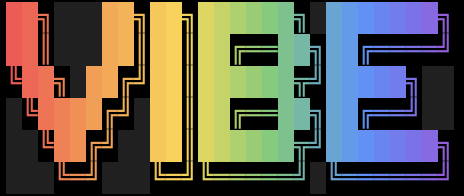

<div align="center">



**A self-hosting spec + workflow harness for coding with agents.**

[](https://github.com/LennardZuendorf/vibe/actions/workflows/ci.yml)
[](LICENSE)
[](spec/README.md)
[](flow/README.md)

</div>

---

**vibe is two halves that ship together but stand alone:**

- 🧭 **Vibe Spec** — a durable `.spec/` planning layer (product · tech · design ·
  plan · lessons) with templates and a validator. Pure `bash`, zero runtime.
  Works with **any** agent, or none.
- 🌀 **Vibe Flow** — a 15-state workflow for **Claude Code**, shipped as the
  `vibe` CLI. It routes each phase to the right skills and subagents, injects
  per-turn "orders", and guards its own write invariants with hooks.

The repo builds itself with its own harness (it is **self-hosting**), so what you
install is exactly what is dogfooded here.

## Contents

- [Which half do you want?](#which-half-do-you-want)
- [Install](#install)
- [Vibe Spec](#vibe-spec)
- [Vibe Flow](#vibe-flow)
- [Dependencies](#dependencies)
- [Platform support](#platform-support)
- [Health & updates](#health--updates)
- [Layout](#layout)
- [Documentation](#documentation)

## Which half do you want?

| You want… | Half | Install | Needs Claude Code? |
|---|---|---|---|
| **Durable, validated planning docs** for any project (any agent, or solo) | Spec | `vibe init --only spec` | No |
| **The full workflow harness** — flow machine, per-turn routing, hooks | Spec + Flow | `vibe init` | Yes, for the hooks |

Read the first two screens and you will know which command to run.

## Install

The flow half ships as a Python CLI; install it once, globally, so its hooks
resolve on `PATH`:

```bash
uv tool install vibe-flow      # the `vibe` + `vibe-hook` commands (persistent)

vibe init                      # provision the current project (full: spec + flow)
vibe init --only spec          # the spec framework alone — no flow, no hooks
vibe init --dry-run            # print the plan, write nothing
```

`vibe init` copies the skills into `.agents/skills/`, registers the three hooks
in `.claude/settings.json` (they fire next session — no `/plugin` step), merges
your `AGENTS.md` inside managed markers (your prose is untouched), and seeds +
gitignores the flow cursor.

> **Requires** [`uv`](https://docs.astral.sh/uv/) (or `pipx`). An ephemeral run
> (`uvx vibe-flow init`) works for a trial, but the hooks call the bare
> `vibe-hook` binary, so `init` warns when it will not resolve on `PATH`.
>
> The legacy `./install.sh` (pure bash, no Python) still works but is
> **deprecated** — new installs should use `vibe init`.

## Vibe Spec

A durable planning layer for a codebase: design docs in `.spec/` that stay
*current*, not a backlog. Two layers — persistent **root** docs (product · tech ·
design · plan · lessons) and branch-scoped **`features/<name>/`** folders that
merge into root, then delete before the branch merges. **Code is truth.** It
ships as one bundled skill (`spec`) plus a validator, needs only `bash`, and
works with **any** agent — or none.

```bash
vibe spec setup        # initialise .spec/ from templates
vibe spec validate     # check structural consistency
# or drive it directly on any host: /spec setup · /spec strategy · /spec feature <name>
```

**Deep dive → [`spec/README.md`](spec/README.md)** — the two-layer model,
authoring ladder, and file map.

## Vibe Flow

A state-machine workflow for Claude Code. Everything starts at `idle`; the `vibe`
CLI moves the cursor (`.agents/skills/vibe/state.json` = `{flow, phase, feature}`)
through **legal transitions only** across three flows — **strategy** (brainstorm →
spec → compound), **feature** (design → plan → impl → verify → compound), and
**quick** (triage → fix → verify) — with human gates before impl and before ship.
Each state names its skill, delegates, caveman level, and write surface in
`state-machine.json`.

Drive it with the CLI:

```bash
vibe status            # where am I: flow / phase / feature + legal next states
vibe go feature.design # transition (refused unless it is a legal next state)
vibe orders            # print the current state's per-turn orders
vibe doctor            # install health; --exit-code for CI
```

Each turn, three hooks — wired in `.claude/settings.json`, run by the stdlib-only
`vibe-hook` fast entry — fire: **`inject`** prepends the current state's orders,
**`guard`** hard-blocks the three write invariants, **`gate`** runs warn-first
exit checks.

**Deep dive → [`flow/README.md`](flow/README.md)** · full CLI reference →
[`cli/README.md`](cli/README.md).

## Dependencies

vibe bundles only the `spec` skill. The flow *delegates* to external skills and
subagents, declared once in [`flow/reference/deps.json`](flow/reference/deps.json)
and reported by `vibe doctor`. **Every dependency degrades gracefully — a missing
one warns, never hard-fails.**

| Dependency | Kind | Source | If absent |
|---|---|---|---|
| superpowers | skill-collection | [obra/superpowers](https://github.com/obra/superpowers) | flow phases self-execute from their constraint documents |
| feature-dev | subagent-collection | Claude Code plugin: feature-dev | the orchestrator performs the explore / architect / review step inline |
| caveman | skill-collection | [JuliusBrussee/caveman](https://github.com/JuliusBrussee/caveman) | the caveman level is printed inline (output compression only) |

## Platform support

vibe is portable by design; capability scales with the host.

| Host | What works | What is absent |
|---|---|---|
| **Claude Code** | Everything: spec skill, flow CLI, per-turn inject, guard + gate hooks | — |
| **Other `AGENTS.md` readers** (Codex, etc.) | Spec framework + instructions; agents follow the written flow manually | Hooks (no per-turn inject / guard / gate) |
| **Bare git / any editor** | Spec framework: `.spec/` docs, templates, `validate.sh` | Flow automation, hooks |

## Health & updates

```bash
vibe doctor            # warn-only health report (skills, hooks, cursor, AGENTS.md, deps)
vibe update            # re-provision managed files; preserves the live cursor + your prose
vibe uninstall         # remove only what vibe installed (.spec/**, prose, cursor kept)
```

## Layout

```text
your-repo/                     # after `vibe init`
├── .agents/skills/
│   ├── spec/                  # bundled spec framework
│   └── vibe/                  # flow: router, phase files, state machine
├── .claude/settings.json      # three hooks → vibe-hook (flow half)
├── .spec/                     # your durable project memory
└── AGENTS.md                  # merged instructions (CLAUDE.md may symlink here)
```

In **this** repo the canonical halves live at [`spec/`](spec/) and
[`flow/`](flow/), with the CLI in [`cli/`](cli/); `.agents/skills/{spec,vibe}`
are compatibility symlinks the CLI dereferences into real directories in your
target.

## Documentation

- [`spec/README.md`](spec/README.md) — the spec framework, standalone.
- [`flow/README.md`](flow/README.md) — the flow: states, orders, hooks, degrade.
- [`cli/README.md`](cli/README.md) — the `vibe` CLI: commands, hooks, migration.
- [`.spec/product.md`](.spec/product.md) · [`.spec/tech.md`](.spec/tech.md) ·
  [`.spec/plan.md`](.spec/plan.md) — the harness's own specs.
- [`examples/todo-api/`](examples/todo-api/.spec/) — a worked `.spec/` tree.
- [`CHANGELOG.md`](CHANGELOG.md) — release notes.

## License

[MIT](LICENSE) © 2026 Lennard Zündorf
