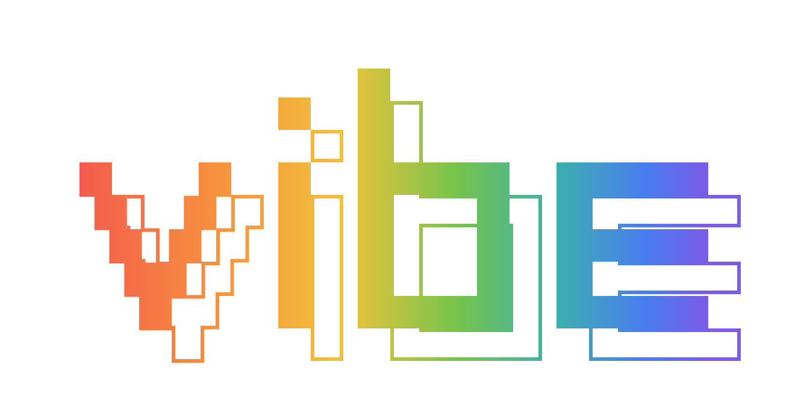
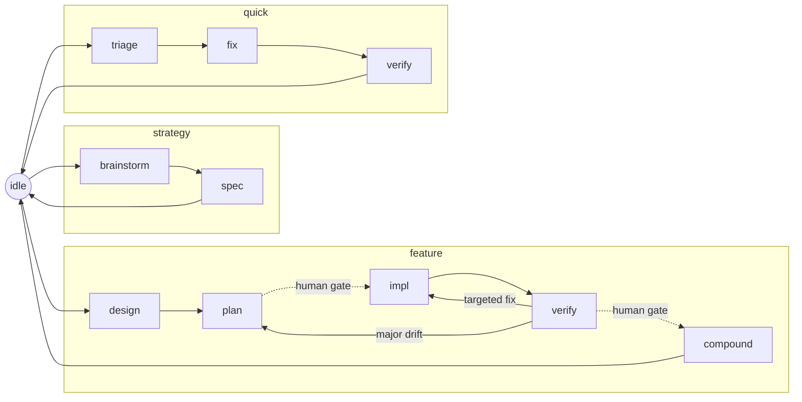

<div align="center">



**Spec-first structure for coding with agents.**

[](https://github.com/LennardZuendorf/vibe/actions/workflows/ci.yml)
[](LICENSE)


</div>

---

vibe is **two independent halves** and one script that installs them.

|  | **spec** | **flow** |
|---|---|---|
| **What it is** | A durable `.spec/` planning layer — product / tech / design / plan / lessons — with templates and a validator. | A state-machine workflow that routes each phase to the right skills, injects per-turn orders, and guards its own write invariants with hooks. |
| **Works with** | Any coding agent, or none. Plain bash + Markdown. | Claude Code, for the hooks and `/flow`. Other agents read the same rules as prose. |
| **Needs** | `bash` | `bash`, plus Node ≥18 for the engine |
| **Install** | `./install.sh <repo> --only spec` | `./install.sh <repo> --only flow` |
| **Deep dive** | [`spec/README.md`](spec/README.md) | [`flow/README.md`](flow/README.md) |

Neither half needs the other. **`install.sh` delivers both** by default: it copies
the halves you asked for into a target repo, merges `AGENTS.md` inside managed
markers, and — for the flow half — wires the Claude Code hooks. Re-running it is
idempotent, and it never touches your own prose.

This repo builds itself with its own harness, so what you install is what is
dogfooded here.

## Install

**Prerequisites:** `bash` and `curl` (or `wget`), plus `git` for the target repo.
[`jq`](https://jqlang.github.io/jq/) and [Node](https://nodejs.org) ≥18 are
recommended: both halves degrade without them, but with no Node on `PATH` the
flow's hooks fall back to bash (guard, Stop gate) or go quiet (per-turn inject,
session doctrine). The `claude` CLI is needed only for `--global`.

### One command

No clone required. Run it from inside the repo you want vibe in:

```bash
curl -fsSL https://raw.githubusercontent.com/LennardZuendorf/vibe/main/install.sh | bash
```

It fetches a snapshot (override with `VIBE_REF=<branch|tag>`) and installs into
the enclosing repo. Pass flags after `bash -s --`. Or, from a clone:

```bash
git clone https://github.com/LennardZuendorf/vibe.git && cd vibe
./install.sh <target-repo>
```

A bare run searches upward for the enclosing repo (a `.spec`/`.git` marker) and,
on a terminal, asks which mode you want.

### Modes

| Mode | Command | What you get |
|---|---|---|
| **local** (default) | `./install.sh <repo>` | The full **stateful** kit in that repo: both skills, the `/flow` command, the engine, and the four Claude Code hooks wired via `.claude/settings.json`. Self-contained — teammates get it through git. |
| **global** | `./install.sh --global` | The **per-user plugin** (`vibe@vibe`): the portable, stateless surface only — both skills plus the doctrine hook — in **every** repo. Needs the `claude` CLI. |

```bash
./install.sh <repo> --only spec       # the spec framework alone
./install.sh <repo> --only flow       # the flow harness alone
./install.sh <repo> --adapters claude # symlink CLAUDE.md -> AGENTS.md (opt-in)
./install.sh <repo> --with-plugins    # also install companion plugins (superpowers)
./install.sh <repo> --dry-run         # print the plan, write nothing
```

The repo is its own plugin marketplace, if you would rather skip the installer:

```bash
claude plugin marketplace add LennardZuendorf/vibe
claude plugin install vibe@vibe
```

The plugin carries the skills and a self-detecting `SessionStart` doctrine hook —
**not** the stateful flow (`/flow`, cursor, guard hooks), which stays a local
install.

### Uninstall

Removes only what the installer created. Your `.spec/**`, your `AGENTS.md` prose,
unrelated hooks in `settings.json`, and the flow cursor (unless `--yes`) all
survive:

```bash
./install.sh <repo> --uninstall             # cursor kept; --dry-run to preview
./install.sh <repo> --uninstall --yes       # also remove the flow cursor
./install.sh <repo> --uninstall --only flow # remove one half, leave the other
```

## spec — the planning layer

Every vibe project gets a `.spec/` tree: the single source of truth for what you
are building, why, and how. It ships as a skill (`spec`) that works standalone or
drives the flow's authoring phases.

```text
.spec/
├── product.md, tech.md, design.md, plan.md, lessons.md   ← ROOT: persistent role, current content
└── features/<name>/
    ├── product.md    required     what this feature does (requirements + Scope)
    ├── tech.md       required     how it is built (paths, contracts, layout)
    ├── plan.md       recommended  stable <name>/n unit IDs; verification per unit
    ├── design.md     optional     UI/UX or design-system fragment
    └── research.md   optional     findings from spikes / investigations
```

Root files carry no backlog and no archaeology. Feature folders are branch-scoped:
written at design, consumed at impl, merged at compound, then deleted before the
branch merges. **Code is truth.**

```bash
/spec setup            # initialise .spec/ with templates
/spec strategy         # write root product/tech/design/plan
/spec feature <name>   # scope and design a named feature
/spec validate         # check structural consistency
```

Pure bash and Markdown — no runtime, no build step. Deep dive:
[`spec/README.md`](spec/README.md).

## flow — the workflow harness

Everything starts at `idle`. The cursor `.agents/skills/vibe/state.json` —
`{flow, phase, feature}` — points at one of 13 states in `state-machine.json`,
which is the source of truth for each state's skill, delegates, write surface, and
legal `next`.


```mermaid
flowchart LR
    I((idle)) --> SB
    subgraph strategy
        SB[brainstorm] --> SS[spec]
    end
    subgraph feature
        D[design] --> P[plan] -. human gate .-> IM[impl] --> V[verify]
        V -. human gate .-> C[compound]
        V -->|targeted fix| IM
        V -->|major drift| P
    end
    subgraph quick
        T[triage] --> F[fix] --> QV[verify]
    end
    I --> D
    I --> T
    SS --> I
    C --> I
    QV --> I
```

> Simplified — see [`flow/README.md`](flow/README.md) for the setup states.

### Driving it

`/flow` is the transition command. Pass the target state, plus a feature name when
entering a feature flow:

```text
/flow feature.design my-feature   # start a feature; names the feature
/flow feature.plan                # advance to planning
/flow idle                        # abort — always legal
```

It reads the cursor, refuses a target outside the current state's `next`, and
otherwise moves the cursor for you — you never hand-edit it. Most edges
**auto-advance**. The flow stops only at a **gated edge**, which needs an explicit
confirm token: `feature.plan → feature.impl` (approve the plan units, pick the
impl mode) and `feature.verify → feature.compound` (approve shipping). Escalating
`quick.triage → feature.design` confirms too, because it renames the work.

A scope edit is not a state: edit within the current write surface and stay put.

### The four hooks

| Hook | Does | Without Node |
|---|---|---|
| `SessionStart` | Re-injects the working-model doctrine each session (and on `compact`). | quiet |
| `UserPromptSubmit` | Injects the current state's orders — naming the literal transition command to run when the job is done — plus a `vibe-drift:` nudge when the working tree contradicts the cursor. | quiet |
| `PreToolUse` | Guards the write invariants. | **still blocks**, via `flow/hooks-fallback/` |
| `Stop` | Warn-first exit checks; blocks in `*.verify` without a fresh evidence receipt. | **still blocks**, via `flow/hooks-fallback/` |

### What actually enforces what

Only a few things are *hard*; the rest is convention the flow surfaces but does
not block on.

| Mechanism | Strength | What it does |
|---|---|---|
| `PreToolUse` guard — write invariants | **Hard block** (exit 2) | `state.json` only via the state writer; `.spec/lessons.md` and the root `.spec/{product,tech,design,plan}.md` are writable only in their flow-end states. The rules are data ([`flow/content/policy.json`](flow/content/policy.json)), read by the guard *and* by the prose that documents it. |
| `PreToolUse` guard — Bash sniffer | **Warning** | The hard block intercepts file-tool calls (Edit / Write / NotebookEdit) only; a raw `echo >> .spec/lessons.md` is caught by a text scan that warns, never blocks. |
| `Stop` gate — evidence receipt | **Hard block** (exit 2) | In a `*.verify` state, refuses to stop until a fresh `evidence/…` receipt exists (staleness is git-derived). Fires with or without `jq`. |
| the cursor writer | **Not a gate** | It validates the target state *name* and writes the cursor; edge legality and confirm tokens are `/flow` convention, not a hook. |
| everything else | **Warning** | Auto-advance nudges, stuck-phase smells, per-turn orders. Warnings appear at your **next** prompt, not mid-turn. |

A missing script or an unreadable cursor exits 0 and never ends the session.

### The engine

The flow half runs on a zero-dependency Node engine ([`flow/engine/`](flow/engine/)).
The hooks call it; so can you. In an installed repo that is
`node .agents/skills/vibe/engine/cli.mjs <command>` — shortened to `vibe` here:

```bash
vibe state get | vibe state set <target>   # read / move the cursor
vibe orders                                # the current state's orders
vibe doctor                                # install health report (warn-only, always exits 0)
vibe render --list                         # what each injection channel composes, and from where
vibe policy decide <path>                  # the write-invariant verdict for a path
```

### Injecting your own rules (`vibe.json`)

Beyond the flow's own orders, vibe injects **content blocks** — rules authored
once and composed into channels: every turn (`user-prompt`), once per session
(`session-start`), and into the `AGENTS.md` managed rules block (`agents-md`). A
root `vibe.json` — never rewritten by install or upgrade — turns any of it on or
off and adds your own:

```jsonc
{
  "channels": { "user-prompt": { "add": ["team.review"] } },
  "blocks": { "team.review": { "title": "Review rules", "summary": "review: name the failing case before proposing a fix" } }
}
```

Each channel is classed by a **trigger**, so the transcript does not pay for the
same lines every turn: `level` fires every turn, `edge` only on the turn after the
cursor moves, `event` only when something happened. Full reference:
[`flow/README.md` § Injection config](flow/README.md#injection-config-vibejson).

## Dependencies

vibe bundles the `spec` skill. The flow *delegates* to external skills and
subagents, declared once in [`flow/reference/deps.json`](flow/reference/deps.json)
and reported by `vibe doctor`. **Every dependency degrades gracefully — a missing
one warns, never hard-fails.**

| Dependency | Kind | Source | If absent |
|---|---|---|---|
| superpowers | skill-collection | [obra/superpowers](https://github.com/obra/superpowers) | flow phases self-execute from their constraint documents |
| feature-dev | subagent-collection | Claude Code plugin: feature-dev | the orchestrator performs the explore / architect / review step inline |

## Platform support

| Host | What works | What is absent |
|---|---|---|
| **Claude Code** | Everything: both skills, the flow, `/flow`, per-turn inject, guard + gate hooks | — |
| **Other `AGENTS.md` readers** (Codex, etc.) | spec framework + instructions; agents follow the written flow manually | Hooks (no per-turn inject / guard / gate) |
| **Bare git / any editor** | spec framework: `.spec/` docs, templates, `validate.sh` | Flow automation, hooks |

## Layout

```text
your-repo/                     # after install
├── .agents/skills/
│   ├── spec/                  # the spec framework
│   └── vibe/                  # the flow: router, phase files, state machine, engine
├── .claude/                   # Claude adapter: /flow + four hooks + settings.json (flow half)
├── .spec/                     # your durable project memory
└── AGENTS.md                  # merged instructions (CLAUDE.md may symlink here)
```

In **this** repo the canonical halves live at [`spec/`](spec/) and
[`flow/`](flow/); `.agents/skills/{spec,vibe}` are compatibility symlinks — the
portable runtime interface. The installer dereferences them into real directories
in your target.

## Tests

```bash
bash tests/run.sh   # spec + flow + adapters + engine suites
```

CI runs `shellcheck` on every tracked `*.sh`, the combined suite on Linux and on
macOS `bash` 3.2, the engine suite with `jq` stripped from `PATH` and from a path
containing a space, `spec/scripts/validate.sh`, and `spec/scripts/check-drift.sh`.

## Documentation

- [`spec/README.md`](spec/README.md) — the spec framework, standalone.
- [`flow/README.md`](flow/README.md) — the flow: states, orders, hooks, engine, degrade.
- [`.spec/product.md`](.spec/product.md) · [`.spec/tech.md`](.spec/tech.md) ·
  [`.spec/plan.md`](.spec/plan.md) — the harness's own specs, a living worked example.
- [`CHANGELOG.md`](CHANGELOG.md) — release notes.

## License

[MIT](LICENSE) © 2026 Lennard Zündorf
