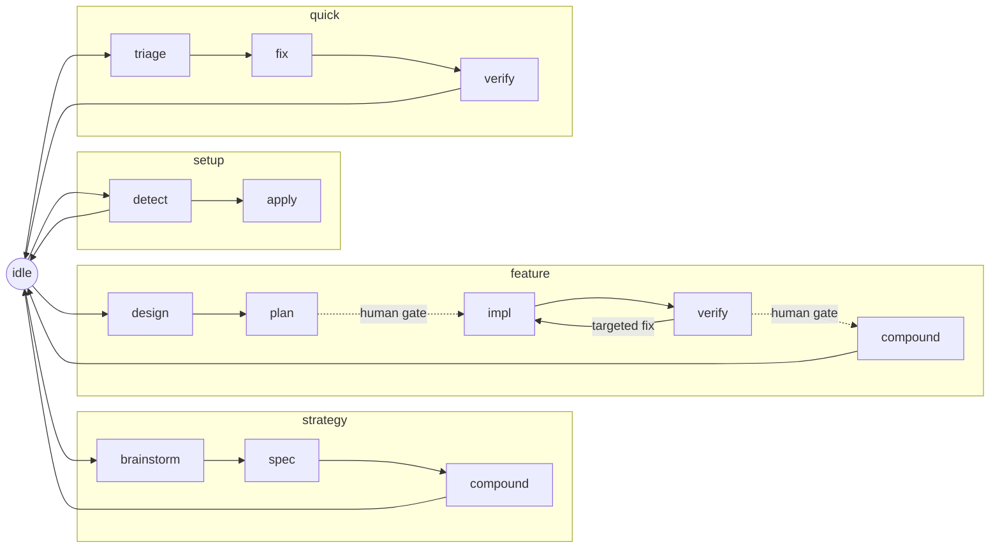

# The vibe flow

> **For humans.** This README is the standalone guide to the flow half of vibe.
> Agents route through [SKILL.md](SKILL.md) — the `vibe` skill router — instead.
> For the CLI's full command surface see [`../cli/README.md`](../cli/README.md).

The **vibe flow** is a state-machine workflow for **Claude Code**, shipped as the
`vibe` CLI. It turns a loose "coding with an agent" session into a disciplined
arc: it routes each phase (strategy / feature / quick) to the right skills and
subagents, injects per-turn "orders" so the agent always knows the one job for
the current state, and guards its own write invariants with hooks.

It is one of two halves. The other is [the spec framework](../spec/README.md),
which the flow drives for its authoring phases; the [root README](../README.md)
explains the split. This half needs Claude Code for the hooks to fire.

## Quickstart

```bash
uv tool install vibe-flow      # the `vibe` + `vibe-hook` commands (persistent PATH)
vibe init                      # provision this project: skills, hooks, AGENTS.md, cursor
```

`vibe init` copies the flow core into `<repo>/.agents/skills/vibe/`, merges the
`AGENTS.md` instructions block, seeds + gitignores the flow cursor, and registers
the three hooks in `.claude/settings.json` — they fire next session with **no
`/plugin` step**. A persistent install is required: the hooks invoke the bare
`vibe-hook` binary, so `init` warns when `vibe`/`vibe-hook` will not resolve on
`PATH`. Check health any time:

```bash
vibe doctor            # warn-only install health report; --exit-code for CI
```

## Day-to-day usage

A typical session:

1. You start at **`idle`** — no active flow.
2. Name the work; the agent picks a flow and transitions
   (`vibe go strategy.brainstorm` | `feature.design` | `quick.triage`).
3. **Each turn**, the inject hook prepends the current state's orders: the one
   job, what to delegate, what you may write, the caveman level, and the legal
   `next`. You do that job — nothing wider.
4. At a **human gate** (before impl, before ship) you approve, then
   `vibe go <flow.phase>` to the next state.
5. The flow ends back at **`idle`** after `*.compound` (or `quick.verify`).

You never hand-edit the cursor — `vibe go` is the one sanctioned writer.

## The state machine

The cursor `.agents/skills/vibe/state.json` = `{flow, phase, feature, updated}`
points at exactly one state in [state-machine.json](state-machine.json) — the
static source of truth for each state's `skill`, `delegates`, frozen `caveman`
level, write surface, and legal `next`. The machine has **15 state entries**:
three flows, plus `setup`, `idle`, and the `amend` modifier.



`amend` is **not** in the diagram on purpose: it is a modifier, not a flow — a
scoped edit invoked from any state that carries that state's write rules and
returns there.

**Transition only** via `vibe go`, which reads the current state, refuses if the
target is not in `next`, and otherwise moves the cursor for you:

```bash
vibe status                        # current state + legal next
vibe go feature.design my-feature  # transition (refused unless it is a legal next)
```

## Per-turn orders (D12)

The per-turn "orders" are not stored in the machine. Skill-owning states carry
`inject: null`; their orders live in the linked skill as byte-stable
`<!-- vibe:orders:<state> -->` blocks in [SKILL.md](SKILL.md) § Orders. Each turn
the inject hook resolves the current `<flow>.<phase>`, follows its `skill` link,
and emits the matching block verbatim — `<feature>` is the only interpolation, so
the inject stays prompt-cache stable. Resolve orders manually with:

```bash
vibe orders                # current state
vibe orders feature.impl   # an explicit state
```

Only `idle` keeps an inline inject, as the skill-less fallback.

## The three hooks

The CLI registers three hooks in `.claude/settings.json`; each calls the
stdlib-only `vibe-hook` fast entry, which imports no Typer/Rich (the per-edit
guard stays near bash latency). Each degrades warn-first and exits 0 on any
missing keystone.

| Hook | Event | `vibe-hook` verb | Does |
|---|---|---|---|
| inject | `UserPromptSubmit` | `vibe-hook inject` | injects the current state's orders every turn |
| guard | `PreToolUse` (Edit/Write/NotebookEdit) | `vibe-hook guard` | hard-blocks the three write invariants |
| gate | `Stop` | `vibe-hook gate` | warn-first exit checks for the state |

## Write invariants

Three hard blocks; everything else is allow or warn. Check any path before
writing with `vibe check <path>`:

1. **`.spec/lessons.md`** — writable only during a `*.compound` state.
2. **Root `.spec/{product,tech,design,plan}.md`** — writable only during
   `strategy.spec`, `feature.compound`, or `setup.apply`.
3. **`.agents/skills/vibe/state.json`** — never by direct edit; only via
   `vibe go`.

```bash
vibe check .spec/product.md    # allow / warn / block verdict for a path
```

## Driving the flow

The `vibe` CLI **is** the flow engine; it supersedes the earlier
`flow/scripts/*.sh` (kept only for parity tests and reference).

| Do | Command |
|---|---|
| Where am I / what's next | `vibe status` · `vibe next` |
| Transition | `vibe go <flow.phase> [--feature F]` |
| Per-turn orders | `vibe orders [state]` |
| Write-policy verdict | `vibe check <path>` |
| Regenerate active-rules digest | `vibe rules` |
| Install health | `vibe doctor` |

Full command reference and the bash→CLI migration table live in
[`../cli/README.md`](../cli/README.md).

## Dependencies & degrade

The flow *delegates* to external skills and subagents, declared once in
[reference/deps.json](reference/deps.json) and reported by `vibe doctor`. **Every
dependency degrades gracefully — a missing one warns, never hard-fails.**

| Dependency | Kind | If absent |
|---|---|---|
| [superpowers](https://github.com/obra/superpowers) | skill-collection | phases self-execute from their constraint documents |
| feature-dev | subagent-collection | the orchestrator does the explore / architect / review step inline |
| [caveman](https://github.com/JuliusBrussee/caveman) | skill-collection | the caveman level is printed inline (output compression only) |

## File map

The flow half. Addressed at runtime under `.agents/skills/vibe/`.

| Path | What it is |
|---|---|
| [SKILL.md](SKILL.md) | `vibe` router — routing table + the D12 orders blocks |
| [setup.md](setup.md), [strategy.md](strategy.md), [feature.md](feature.md), [quick.md](quick.md), [verify.md](verify.md), [compound.md](compound.md), [amend.md](amend.md) | per-phase procedure files |
| [state-machine.json](state-machine.json) | static machine — states, skills, caveman, `next` (data, not prose) |
| [state.example.json](state.example.json) | cursor template; the installer seeds `state.json` from it |
| `state.json` | runtime cursor — gitignored; created by `vibe init` / `vibe go` |
| [reference/deps.json](reference/deps.json) | dependency manifest (the table above) |
| [reference/adapters.json](reference/adapters.json) | adapter definitions consumed by init / merge |
| [reference/templates/AGENTS.md](reference/templates/AGENTS.md) | the merged instructions block template |
| [scripts/](scripts/) | the original bash flow engine — **deprecated**, superseded by the `vibe` CLI |

## More

- [`../README.md`](../README.md) — the umbrella: the spec/flow split and install.
- [`../spec/README.md`](../spec/README.md) — the other half: the spec framework.
- [`../cli/README.md`](../cli/README.md) — the `vibe` CLI reference and migration.
- [SKILL.md](SKILL.md) — the router agents actually follow.
