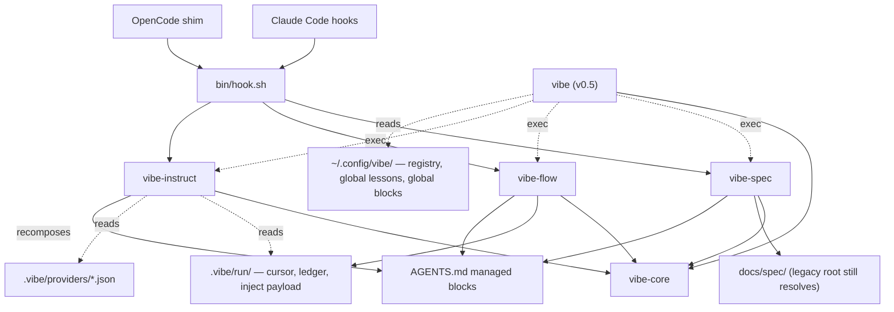

# Architecture Overview

```mermaid
flowchart TD
  CC["Claude Code hooks"] --> SHIM["bin/hook.sh"]
  OC["OpenCode shim"] --> SHIM
  SHIM --> SP["vibe-spec"]
  SHIM --> FL["vibe-flow"]
  SHIM --> IN["vibe-instruct"]
  SP --> CORE["vibe-core"]
  FL --> CORE
  IN --> CORE
  CLI["vibe (v0.5)"] --> CORE
  CLI -.exec.-> SP
  CLI -.exec.-> FL
  CLI -.exec.-> IN
  FL --> RUN[".vibe/run/ — cursor, ledger, inject payload"]
  IN -.reads.-> RUN
  IN -.reads.-> PROV[".vibe/providers/*.json"]
  SP --> DOCS["docs/spec/ (legacy root still resolves)"]
  SP --> MD["AGENTS.md managed blocks"]
  FL --> MD
  IN -->|recomposes| MD
  CLI -.reads.-> GLOB["~/.config/vibe/ — registry, global lessons, global blocks"]
```
