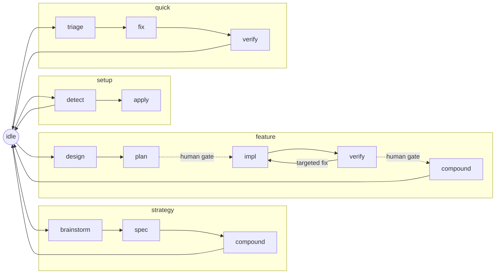

# The vibe flow

> **For humans.** This README is the standalone guide to the flow half of vibe.
> Agents route through [SKILL.md](SKILL.md) — the `vibe` skill router — instead.

The **vibe flow** is a state-machine workflow for **Claude Code**. It turns a
loose "coding with an agent" session into a disciplined arc: it routes each phase
(strategy / feature / quick) to the right skills and subagents, injects per-turn
"orders" so the agent always knows the one job for the current state, and guards
its own write invariants with hooks. It is bash, Markdown, and JSON — no runtime.

It is one of two halves. The other is [the spec framework](../spec/README.md),
which the flow drives for its authoring phases; the [root README](../README.md)
explains the split. This half needs Claude Code for the hooks to fire.

## Quickstart

```bash
# Install the flow half into your project:
./install.sh /path/to/your/repo --only flow
```

The installer copies the flow core into `<repo>/.agents/skills/vibe/`, merges the
`AGENTS.md` instructions block, seeds + gitignores the flow cursor, and writes
`.claude/settings.json` with three auto-wired hooks (`UserPromptSubmit`,
`PreToolUse`, `Stop`). The `vibe` skill works as plain project files immediately;
the flow hooks activate as soon as the settings.json wiring is in place. `/flow`
is a native project command — no plugin registration required. Check health any time:

```bash
bash .agents/skills/vibe/scripts/doctor.sh   # warn-only, always exits 0
```

## Day-to-day usage

A typical session:

1. You start at **`idle`** — no active flow.
2. Name the work; the agent picks a flow and transitions
   (`/flow strategy.brainstorm` | `feature.design` | `quick.triage` | `setup.detect`).
3. **Each turn**, the inject hook prepends the current state's orders: the one
   job, what to delegate, what you may write, the caveman level, and the legal
   `next`. You do that job — nothing wider.
4. At a **human gate** (before impl, before ship) you approve, then transition
   with `/flow <flow.phase>` to the next state.
5. The flow ends back at **`idle`** after `*.compound` (or `quick.verify`).

You never hand-edit the cursor — `/flow` calls the one sanctioned writer for you.

## The state machine

The cursor `.agents/skills/vibe/state.json` = `{flow, phase, feature, updated}`
points at exactly one state in
[state-machine.json](state-machine.json) — the static source of truth for each
state's `skill`, `delegates`, frozen `caveman` level, write surface, and legal
`next`. The machine has **15 state entries**: three flows, plus `setup`, `idle`,
and the `amend` modifier.



`amend` is **not** in the diagram on purpose: it is a modifier, not a flow — a
scoped edit invoked from any state that carries that state's write rules and
returns there. `set-state.sh` refuses `amend` as a cursor value.

**Transition only** via the one sanctioned writer — never edit `state.json` by
hand:

```bash
bash .agents/skills/vibe/scripts/set-state.sh feature.design my-feature
```

The `/flow` command wraps this: it reads the current state, refuses if the target
is not in `next`, and otherwise calls `set-state.sh` for you.

## Per-turn orders (D12)

The per-turn "orders" are not stored in the machine. Skill-owning states carry
`inject: null`; their orders live in the linked skill as byte-stable
`<!-- vibe:orders:<state> -->` blocks in [SKILL.md](SKILL.md) § Orders. Each turn
the inject hook resolves the current `<flow>.<phase>`, follows its `skill` link,
and emits the matching block verbatim — `<feature>` is the only interpolation, so
the inject stays prompt-cache stable. Resolve orders manually with:

```bash
bash .agents/skills/vibe/scripts/orders.sh            # current state
bash .agents/skills/vibe/scripts/orders.sh feature.impl  # an explicit state
```

Only `idle` keeps an inline inject, as the skill-less fallback.

## The three hooks

Thin shells over `scripts/`; the allow/warn/block policy lives once in
`detect-context.sh`. Each degrades warn-first and exits 0 on any missing keystone.

| Hook | Event | Does |
|---|---|---|
| `user-prompt-submit-inject.sh` | `UserPromptSubmit` | injects the current state's orders every turn |
| `pre-tool-use-guard.sh` | `PreToolUse` (Edit/Write/NotebookEdit) | hard-blocks the three write invariants |
| `stop-gate.sh` | `Stop` | warn-first exit checks for the state |

Wired automatically by `install.sh` into `.claude/settings.json`; hook scripts resolve their data via `$CLAUDE_PROJECT_DIR`.

## Write invariants

Three hard blocks enforced by
[scripts/detect-context.sh](scripts/detect-context.sh) `decide`; everything else
is allow or warn:

1. **`.spec/lessons.md`** — writable only during a `*.compound` state.
2. **Root `.spec/{product,tech,design,plan}.md`** — writable only during
   `strategy.spec`, `feature.compound`, or `setup.apply`.
3. **`.agents/skills/vibe/state.json`** — never by direct edit; only via
   `set-state.sh`.

Check any path before writing:

```bash
bash .agents/skills/vibe/scripts/detect-context.sh decide .spec/product.md
```

## Scripts

All under `.agents/skills/vibe/scripts/` at runtime.

| Script | Role |
|---|---|
| [set-state.sh](scripts/set-state.sh) | the only sanctioned cursor writer (validates the target state name; `/flow` enforces the graph edge) |
| [validate-state.sh](scripts/validate-state.sh) | check the cursor is a legal state in the machine |
| [detect-context.sh](scripts/detect-context.sh) | write policy (allow/warn/block) + state snapshot |
| [orders.sh](scripts/orders.sh) | resolve the D12 per-turn orders from the linked skill |
| [check-skills.sh](scripts/check-skills.sh) | dependency presence + degrade / caveman fallback |
| [regen-active-rules.sh](scripts/regen-active-rules.sh) | render `lessons.md` → the `AGENTS.md` active-rules digest |
| [doctor.sh](scripts/doctor.sh) | warn-only install health report (always exits 0) |
| [merge-agents.sh](scripts/merge-agents.sh) | `AGENTS.md` marker merge / unmerge + adapter symlinks |

## Dependencies & degrade

The flow *delegates* to external skills and subagents, declared once in
[reference/deps.json](reference/deps.json) and reported by `doctor.sh`. **Every
dependency degrades gracefully — a missing one warns, never hard-fails.**

| Dependency | Kind | If absent |
|---|---|---|
| [superpowers](https://github.com/obra/superpowers) | skill-collection | phases self-execute from their constraint documents |
| feature-dev | subagent-collection | the orchestrator does the explore / architect / review step inline |
| [caveman](https://github.com/JuliusBrussee/caveman) | skill-collection | `check-skills.sh` prints the caveman level inline (output compression only) |

## File map

The flow half. Addressed at runtime under `.agents/skills/vibe/`.

| Path | What it is |
|---|---|
| [SKILL.md](SKILL.md) | `vibe` router — routing table + the D12 orders blocks |
| [setup.md](setup.md), [strategy.md](strategy.md), [feature.md](feature.md), [quick.md](quick.md), [verify.md](verify.md), [compound.md](compound.md), [amend.md](amend.md) | per-phase procedure files |
| [state-machine.json](state-machine.json) | static machine — states, skills, caveman, `next` (data, not prose) |
| [state.example.json](state.example.json) | cursor template; copy to `state.json` to test transitions |
| `state.json` | runtime cursor — gitignored; created by the installer / `set-state.sh` |
| [scripts/](scripts/) | the eight scripts above |
| [reference/deps.json](reference/deps.json) | dependency manifest (the table above) |
| [reference/adapters.json](reference/adapters.json) | adapter definitions consumed by setup / merge |
| [reference/templates/AGENTS.md](reference/templates/AGENTS.md) | the merged instructions block template |

## More

- [`../README.md`](../README.md) — the umbrella: the spec/flow split and install.
- [`../spec/README.md`](../spec/README.md) — the other half: the spec framework.
- [SKILL.md](SKILL.md) — the router agents actually follow.
