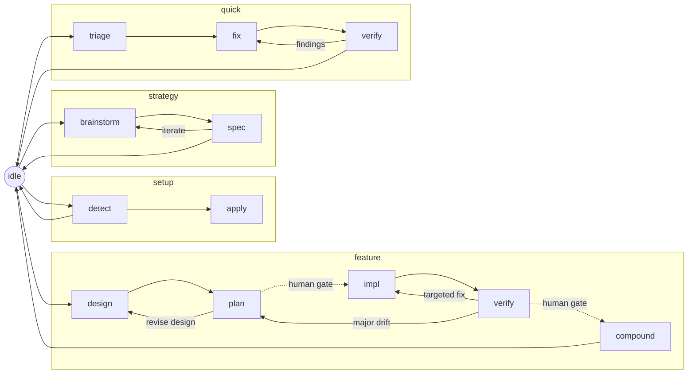

# The vibe flow

> **For humans.** This README is the standalone guide to the flow half of vibe kit.
> Agents route through [SKILL.md](SKILL.md) — the `vibe` skill router — instead.

The **vibe flow** is a state-machine workflow for **Claude Code**. It turns a
loose "coding with an agent" session into a disciplined arc: it routes each phase
(strategy / feature / quick) to the right skills and subagents, injects per-turn
"orders" so the agent always knows the one job for the current state, and guards
its own write invariants with hooks. It is bash, Markdown, and JSON — no runtime.

It is one of two halves. The other is [the spec framework](../spec/README.md),
which the flow drives for its authoring phases; the [root README](../README.md)
explains the split. This half needs Claude Code for the hooks to fire.

## Quickstart

```bash
# Install the flow half into your project:
./install.sh /path/to/your/repo --only flow
```

The installer copies the flow core into `<repo>/.agents/skills/vibe/`, merges the
`AGENTS.md` instructions block, seeds + gitignores the flow cursor, and writes
`.claude/settings.json` with four auto-wired hooks (`SessionStart`,
`UserPromptSubmit`, `PreToolUse`, `Stop`). The `vibe` skill works as plain project
files immediately;
the flow hooks activate as soon as the settings.json wiring is in place. `/flow`
is a native project command — the local install needs no plugin registration (a
per-user plugin is available separately: `install.sh --global`). Check health any time:

```bash
bash .agents/skills/vibe/scripts/doctor.sh   # warn-only, always exits 0
```

## Day-to-day usage

A typical session:

1. You start at **`idle`** — no active flow.
2. Name the work; the agent picks a flow and transitions
   (`/flow strategy.brainstorm` | `feature.design` | `quick.triage` | `setup.detect`).
3. **Each turn**, the inject hook prepends the current state's orders: the one
   job, what to delegate, what you may write, and the **imperative** transition
   command to run when done (`done → set-state.sh quick.fix`, or `on ship → /flow
   feature.compound confirm` at a gate) — not just a `next:` label. A `vibe-drift:`
   correction line is prepended ahead of the orders **only** when working-tree
   activity contradicts the cursor. You do that job — nothing wider.
4. At a **human gate** (before impl, before ship) you approve, then transition
   with `/flow <flow.phase>` to the next state.
5. The flow ends back at **`idle`** after `feature.compound` (or after
   `strategy.spec` / `quick.verify`, which record an optional lesson inline).

You never hand-edit the cursor — `/flow` calls the one sanctioned writer for you.

## The state machine

The cursor `.agents/skills/vibe/state.json` = `{flow, phase, feature, updated}`
points at exactly one state in
[state-machine.json](state-machine.json) — the static source of truth for each
state's `skill`, `delegates`, write surface, and legal `next`. The machine has
**13 state entries**: three flows, plus `setup` and `idle`. Output density is
governed by one machine-level `style` note, not a per-state level.


```mermaid
flowchart LR
    I((idle))
    subgraph setup
        SD[detect] --> SA[apply]
    end
    subgraph strategy
        SB[brainstorm] --> SS[spec]
        SS -->|iterate| SB
    end
    subgraph feature
        D[design] --> P[plan] -. human gate .-> IM[impl] --> V[verify]
        V -. human gate .-> C[compound]
        V -->|targeted fix| IM
        V -->|major drift| P
        P -->|revise design| D
    end
    subgraph quick
        T[triage] --> F[fix] --> QV[verify]
        QV -->|findings| F
    end
    I --> SD --> I
    I --> SB
    I --> D
    I --> T
    SS --> I
    C --> I
    QV --> I
```

A scope edit is **not** a state: edit within the current state's write surface
and stay put. `set-state.sh idle` is always legal — abort ends any flow.

**Transition only** via the one sanctioned writer — never edit `state.json` by
hand:

```bash
bash .agents/skills/vibe/scripts/set-state.sh feature.design my-feature
```

The `/flow` command wraps this: it reads the current state, refuses if the target
is not in `next`, and otherwise calls `set-state.sh` for you.

## Per-turn orders

The per-turn "orders" are not stored in the machine. Skill-owning states carry
`inject: null`; their orders live in the linked skill as byte-stable
`<!-- vibe:orders:<state> -->` blocks in [SKILL.md](SKILL.md) § Orders. Each turn
the inject hook resolves the current `<flow>.<phase>`, follows its `skill` link,
and emits the matching block verbatim. Each block is **imperative** — it names the
literal transition command to run (`done → set-state.sh quick.fix`, or a gated
`on ship → /flow feature.compound confirm`), not just a `next:` label — and
`<feature>` is the only interpolation, so the inject stays prompt-cache stable. A
`vibe-drift:` correction line is prepended ahead of the orders only when
working-tree activity contradicts the cursor (git-derived), leaving the orders
block byte-stable on every no-drift turn. Resolve orders manually with:

```bash
bash .agents/skills/vibe/scripts/orders.sh            # current state
bash .agents/skills/vibe/scripts/orders.sh feature.impl  # an explicit state
```

Only `idle` keeps an inline inject, as the skill-less fallback.

## Injection config (`vibe.json`)

The orders above are the *flow's* words. Everything else vibe injects — the
per-turn style rule, session-start rules, and the standing rules rendered into
`AGENTS.md` — is **content**: blocks authored once, composed into channels,
configured as data. Shipped defaults live in
[`content/vibe.default.json`](content/vibe.default.json) +
[`content/blocks/**`](content/blocks); a project overrides any of it from a root
`vibe.json` that install never rewrites.

Every channel declares a **trigger** — the cadence that decides whether it is
injected on *this* turn. Three classes, and a channel that declares none is
`level` (nothing silently stops being injected because a field was misspelled):

| Trigger | Fires | Why |
|---|---|---|
| `level` | **every turn** | standing facts. This is the only payload that pays prompt-cache rent on every turn, so it stays tiny and byte-stable |
| `edge` | only on the turn **after the flow cursor moves** | the expensive payload — the full orders. The cursor key of the last inject is recorded in `.vibe/last-inject`; a missing or unreadable marker means "everything is an edge", so a first inject after install still carries the orders |
| `event` | only on a turn where **something happened** | a drift nudge or queued warnings. Worth saying when it occurred, worth nothing when it did not |

| Channel | Trigger | Form | Default blocks |
|---|---|---|---|
| `user-prompt.level` | `level` | summary, ≤2 lines | `flow.level` — `state=<state> · transition: <command>` |
| `user-prompt.edge` | `edge` | summary, ≤15 lines | `flow.edge` — `{{orders}}`, delegates, matching lessons |
| `user-prompt.event` | `event` | summary, ≤10 lines | — (empty by default) |
| `user-prompt` | `level` | summary, ≤6 lines | `style.ste100` — brief technical English (ASD-STE100) |
| `session-start` | `level` | summary, ≤15 lines | — (no live state: this output replays stale after `--resume`) |
| `agents-md` | — | prose body, ≤80 lines | `flow.invariants` (write policy, rendered from `content/policy.json`), `delegation.subagents` (model tiers), `delegation.workflows` (dynamic workflows) |

**One hard rule the hook enforces.** The inject hook stops emitting the per-turn
orders separately only when an edge-classed channel actually *delivers* them —
it decides that from the composed text, at inject time. So an edge-classed
channel that composes any block **MUST** carry `{{orders}}` in one of them, or
the turn silently loses its imperative. `render --check` states the same rule at
config time, where you can still act on it, and **errors** (exit 1) when a
channel breaks it. An edge channel with no blocks claims nothing and is exempt.

```bash
node .agents/skills/vibe/engine/cli.mjs render --list     # resolved channels, blocks, sources
node .agents/skills/vibe/engine/cli.mjs render --check    # lint: unknown ids, budgets, placeholders
node .agents/skills/vibe/engine/cli.mjs render user-prompt        # see exactly what a turn injects
node .agents/skills/vibe/engine/cli.mjs render agents-md --write  # sync the AGENTS.md vibe:rules block
```

```jsonc
// vibe.json — project layer, merged over the shipped defaults
{
  "channels": {
    "user-prompt": { "remove": ["style.ste100"], "add": ["team.review"] },
    "session-start": { "add": ["team.review"] },
    "team.oncall": { "trigger": "event", "budget": 4, "blocks": ["team.pager"] }
  },
  "blocks": {
    "team.review": {
      "title": "Review rules",
      "summary": "review: name the failing case before proposing a fix",
      "body": "Longer prose for document channels…"      // or "file": ".vibe/blocks/review.md"
    }
  },
  "placeholders": { "team": "platform" }
}
```

A block is a markdown file with frontmatter (`id`, `title`, `channels`), a
`<!-- vibe:summary -->` block for prompt channels, and prose below it for document
channels — one author point, two verbosities. Text may interpolate `{{state}}`,
`{{flow}}`, `{{phase}}`, `{{feature}}`, `{{next}}`, `{{transition}}` (`{{next}}`'s
imperative twin — the commands that cross those edges), `{{writes}}`, `{{reads}}`,
`{{delegates}}`, `{{exit}}`, `{{orders}}`, `{{doctrine}}`, `{{invariants}}` (the
write policy, rendered from `content/policy.json`), `{{lessons:TAG}}`, and any name
under `placeholders`. An unknown placeholder stays literal and `--check` reports it.

Degrade: no content tree, a malformed `vibe.json`, or no `node` means less
injected text — never a failed hook. `--check` is the only place those errors
become a non-zero exit. Edge detection fails **open**: an absent, unreadable,
empty or corrupt `.vibe/last-inject` reads as "the cursor moved", so the worst
case is one extra turn of the full orders. `install.sh` gitignores that marker
alongside the cursor, the evidence receipts and the warnings log.

The `agents-md` channel is the one that must survive a **node-less** target,
because on a hookless host `AGENTS.md` is the only carrier there is. So
[the instructions template](reference/templates/AGENTS.md) ships a
**pre-rendered copy** of the block and `merge-agents.sh` seeds it when a target
has none — byte-identical to what `render agents-md` composes (a test fails if
the two ever drift), so an install *with* node re-renders it to `no change` and
a project's own customization, once rendered, is never overwritten by a merge.

## The four hooks

Thin shells over `scripts/`; the allow/warn/block policy lives once in
`detect-context.sh`. Each degrades warn-first and exits 0 on any missing keystone.

| Hook | Event | Does |
|---|---|---|
| `session-start-doctrine.sh` | `SessionStart` (all sources, incl. `compact` re-inject) | emits the working-model doctrine each session, single-sourced from the `<!-- vibe:doctrine -->` block via `doctrine.sh`; wired with no matcher (all sources). Carries **no live state** — this output replays verbatim after `--resume`, so a cursor line printed here is stale by construction |
| `user-prompt-submit-inject.sh` | `UserPromptSubmit` | injects the trigger-classed channels: the two-line level payload every turn, the full orders on the turn after the cursor moves, event text only when an event occurred |
| `pre-tool-use-guard.sh` | `PreToolUse` (Edit/Write/NotebookEdit/Bash) | hard-blocks the three write invariants on **file-tool** calls; on `Bash` it only **warns** when a command looks like it writes a guarded path (see caveats below) |
| `stop-gate.sh` | `Stop` | warn-first exit checks; blocks in `*.verify` without a fresh evidence receipt — with or without `jq` |

Wired automatically by `install.sh` into `.claude/settings.json`; hook scripts resolve their data via `$CLAUDE_PROJECT_DIR`.

The `SessionStart` hook single-sources the doctrine from the
`<!-- vibe:doctrine -->` block in [SKILL.md](SKILL.md) — the one surface that
still states the write rules by hand, and a discriminating parity test fails if
it disagrees with what `decide` enforces. (The `AGENTS.md` side stopped being
hand-authored: its rules block is rendered from `content/policy.json`.) So on
**Claude Code** the `AGENTS.md` managed block becomes a redundant adapter rather
than the only carrier. Scope this honestly: the hook ships two ways — through the
committed `.claude/settings.json` a local install writes, and through the
**per-user plugin** (`install.sh --global` / `claude plugin install vibe@vibe`),
whose self-detecting SessionStart hook carries the doctrine in every vibe-enabled
repo. So `AGENTS.md` is optional **on Claude Code**; on hookless hosts (Codex,
Warp) there are no hooks at all, so `AGENTS.md` stays the carrier there.

## Write invariants (`content/policy.json`)

The write policy is **data**, not code and not prose:
[`content/policy.json`](content/policy.json) holds one rule per guarded path —
three that block, three that warn. Both halves of the harness read that one
file: [scripts/detect-context.sh](scripts/detect-context.sh) `decide` (which the
`PreToolUse` guard translates into its allow/warn/block verdict) and the
`{{invariants}}` placeholder that renders the rules as prose into `AGENTS.md`.
Neither restates the other, so the shipped text cannot drift from the enforcer.

```jsonc
{
  "id": "lessons",
  "match": ".spec/lessons.md",              // a literal path or a glob; an array is allowed
  "arms": [                                  // read top to bottom, first match wins
    { "states": ["feature.compound", "setup.apply", "strategy.spec", "quick.verify"],
      "verdict": "allow", "reason": "" },
    { "states": "*",                         // "*" is the else arm
      "verdict": "block", "reason": "…lessons are written at flow end… (current: {state})" }
  ]
}
```

Ask the policy anything, without a hook in the loop:

```bash
node .agents/skills/vibe/engine/cli.mjs policy decide .spec/lessons.md          # verdict for the CURRENT cursor
node .agents/skills/vibe/engine/cli.mjs policy decide .spec/product.md feature.impl  # …or for a named state
node .agents/skills/vibe/engine/cli.mjs policy list                             # the loaded rules, one per line
node .agents/skills/vibe/engine/cli.mjs policy render                           # the {{invariants}} prose
```

`policy decide` prints `allow` / `warn:<reason>` / `block:<reason>` and exits 0
for **every answered verdict** — the verdict is never the exit code; translating
it is the caller's job. It exits **2** only when the policy could not be loaded
as a usable rule set (malformed file, unknown version, zero rules), because a
policy that degraded to "no rules" would answer `allow` for every path on earth.
That refusal is what lets `detect-context.sh` fall back to its own bash branch,
which carries the same rules hardcoded and cannot be corrupted by a data file —
so the guard keeps its teeth with a broken `policy.json`, and with no `node` at
all.

The shipped rules, in one sentence each:

1. **`.agents/skills/vibe/state.json`** — blocked in every state; the cursor is
   written only by `set-state.sh`.
2. **`.spec/lessons.md`** — blocked outside the flow-end states that carry the
   conditional lesson step.
3. **Root `.spec/{product,tech,design,plan}.md`** — blocked outside the states
   that own the root specs.
4. **`.spec/features/*`**, **`CLAUDE.md` / `AGENTS.md`**, **`src/*` + `tests/*`** —
   warn-only bands.

The *authoritative* state lists are in the file, and `policy render` prints them;
this README deliberately does not copy them.

```bash
bash .agents/skills/vibe/scripts/detect-context.sh decide .spec/product.md
```

**What the teeth actually reach — three honest caveats:**

1. **File tools only, plus a Bash warn.** The three hard blocks intercept
   `Edit` / `Write` / `NotebookEdit`. A raw shell write (`echo >> .spec/lessons.md`,
   `sed -i`, `tee`, `mv`/`cp`/`rm`) does **not** hit that path, so the guard also
   runs a warn-only Bash **sniffer**: it text-scans the command for a write-shaped
   op aimed at a guarded path and nudges. It never blocks (false positives are
   certain), a pure read like `grep .spec/lessons.md` never warns, and a command
   driving `set-state.sh` is never warned about `state.json`.
2. **`set-state.sh` is a writer, not a gate.** It validates the target state
   *name* and writes the cursor; it does not enforce which edges are legal. Edge
   legality (and which edges need a confirm token) is `/flow` convention — prose,
   not a hook.
3. **The receipt tooth is `jq`-optional.** In a `*.verify` state the `Stop` gate
   blocks on a missing / stale evidence receipt **with or without `jq`** — jq-less,
   it reads the flat cursor via sed and the block is byte-identical. Absent `jq`
   only costs the machine-derived warn nudges, never the block.

## Scripts

All under `.agents/skills/vibe/scripts/` at runtime.

| Script | Role |
|---|---|
| [set-state.sh](scripts/set-state.sh) | the only sanctioned cursor writer (validates the target state name; `/flow` enforces the graph edge) |
| [validate-state.sh](scripts/validate-state.sh) | check the cursor is a legal state in the machine |
| [detect-context.sh](scripts/detect-context.sh) | write policy (allow/warn/block) + state snapshot |
| [orders.sh](scripts/orders.sh) | resolve the D12 per-turn orders from the linked skill |
| [check-skills.sh](scripts/check-skills.sh) | delegate presence + degrade report per state |
| [regen-active-rules.sh](scripts/regen-active-rules.sh) | render `lessons.md` → the `AGENTS.md` active-rules digest |
| [doctor.sh](scripts/doctor.sh) | warn-only install health report (always exits 0) |
| [merge-agents.sh](scripts/merge-agents.sh) | `AGENTS.md` marker merge / unmerge + adapter symlinks |
| [merge-settings.sh](scripts/merge-settings.sh) | wires the four hooks into `.claude/settings.json` |

## Dependencies & degrade

The flow *delegates* to external skills and subagents, declared once in
[reference/deps.json](reference/deps.json) and reported by `doctor.sh`. **Every
dependency degrades gracefully — a missing one warns, never hard-fails.**

| Dependency | Kind | If absent |
|---|---|---|
| [superpowers](https://github.com/obra/superpowers) | skill-collection | phases self-execute from their constraint documents |
| feature-dev | subagent-collection | the orchestrator does the explore / architect / review step inline |

## File map

The flow half. Addressed at runtime under `.agents/skills/vibe/`.

| Path | What it is |
|---|---|
| [SKILL.md](SKILL.md) | `vibe` router — routing table + the D12 orders blocks |
| [setup.md](setup.md), [strategy.md](strategy.md), [feature.md](feature.md), [quick.md](quick.md), [verify.md](verify.md), [compound.md](compound.md) | per-phase procedure files |
| [state-machine.json](state-machine.json) | static machine — states, skills, `style`, `next` (data, not prose) |
| [state.example.json](state.example.json) | cursor template; copy to `state.json` to test transitions |
| `state.json` | runtime cursor — gitignored; created by the installer / `set-state.sh` |
| [content/policy.json](content/policy.json) | the write invariants as data — read by `decide` and by `{{invariants}}` |
| [content/vibe.default.json](content/vibe.default.json) | shipped channel + block defaults (a project's `vibe.json` merges over it) |
| [content/blocks/](content/blocks) | shipped content blocks (flow level/edge/invariants, style, delegation) |
| [engine/](engine) | the zero-dependency Node engine (`cli.mjs`: `state`, `orders`, `doctrine`, `doctor`, `render`, `policy`, `hook`) |
| `.vibe/last-inject` *(project root)* | edge-detection marker — gitignored runtime state, like the cursor |
| [scripts/](scripts/) | the nine scripts above |
| [reference/deps.json](reference/deps.json) | dependency manifest (the table above) |
| [reference/adapters.json](reference/adapters.json) | adapter definitions consumed by setup / merge |
| [reference/templates/AGENTS.md](reference/templates/AGENTS.md) | the merged instructions block template |

## More

- [`../README.md`](../README.md) — the umbrella: the spec/flow split and install.
- [`../spec/README.md`](../spec/README.md) — the other half: the spec framework.
- [SKILL.md](SKILL.md) — the router agents actually follow.
